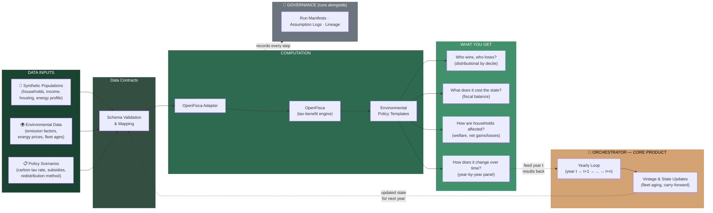
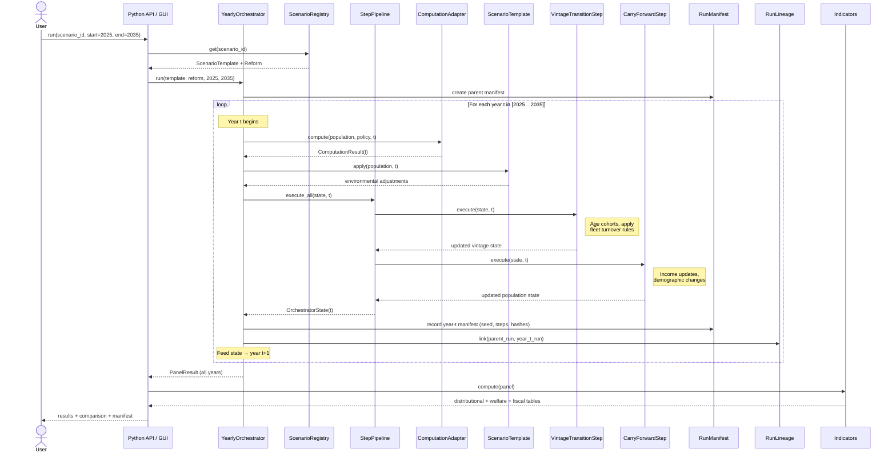

<?xml version="1.0" encoding="UTF-8"?>
<!-- BMAD Prompt Run Metadata -->
<!-- Epic: 9 -->
<!-- Story: 9.5 -->
<!-- Phase: retrospective -->
<!-- Timestamp: 20260302T151313Z -->
<compiled-workflow>
<mission><![CDATA[

Run after epic completion to review overall success, extract lessons learned, and explore if new information emerged that might impact the next epic

Target: Epic 9
Generate retrospective report with extraction markers.

]]></mission>
<context>
<file id="b5c6fe32" path="_bmad-output/project-context.md" label="PROJECT CONTEXT"><![CDATA[

---
project_name: 'ReformLab'
user_name: 'Lucas'
date: '2026-02-27'
status: 'complete'
sections_completed: ['technology_stack', 'language_rules', 'framework_rules', 'testing_rules', 'code_quality', 'workflow_rules', 'critical_rules']
rule_count: 38
optimized_for_llm: true
---

# Project Context for AI Agents

_This file contains critical rules and patterns that AI agents must follow when implementing code in this project. Focus on unobvious details that agents might otherwise miss._

---

## Technology Stack & Versions

- **Python 3.13+** — `target-version = "py313"` (ruff), `python_version = "3.13"` (mypy strict)
- **uv** — package manager, **hatchling** — build backend
- **pyarrow >= 18.0.0** — canonical data type (`pa.Table`), CSV/Parquet I/O
- **pyyaml >= 6.0.2** — YAML template/config loading
- **jsonschema >= 4.23.0** — JSON Schema validation for templates
- **openfisca-core >= 44.0.0** — optional dependency (`[openfisca]` extra); never import outside adapter modules
- **pytest >= 8.3.3, ruff >= 0.15.0, mypy >= 1.19.0** — dev tooling
- **Planned frontend:** React 18+ / TypeScript / Vite / Shadcn/ui / Tailwind v4
- **Planned backend API:** FastAPI + uvicorn
- **Planned deployment:** Kamal 2 on Hetzner CX22

### Version Constraints

- mypy runs in **strict mode** with explicit `ignore_missing_imports` overrides for openfisca, pyarrow, jsonschema, yaml
- OpenFisca is optional — core library must function without it installed

## Critical Implementation Rules

### Python Language Rules

- **Every file starts with** `from __future__ import annotations` — no exceptions
- **Use `if TYPE_CHECKING:` guards** for imports that are only needed for annotations or would create circular dependencies; do the runtime import locally where needed
- **Frozen dataclasses are the default** — all domain types use `@dataclass(frozen=True)`; mutate via `dataclasses.replace()`, never by assignment
- **Protocols, not ABCs** — interfaces are `Protocol` + `@runtime_checkable`; no abstract base classes; structural (duck) typing only
- **Subsystem-specific exceptions** — each module defines its own error hierarchy; never raise bare `Exception` or `ValueError` for domain errors
- **Metadata bags** use `dict[str, Any]` with **stable string-constant keys** defined at module level (e.g., `STEP_EXECUTION_LOG_KEY`)
- **Union syntax** — use `X | None` not `Optional[X]`; use `dict[str, int]` not `Dict[str, int]` (modern generics, no `typing` aliases)
- **`tuple[...]` for immutable sequences** — function parameters and return types that are ordered-and-fixed use `tuple`, not `list`

### Architecture & Framework Rules

- **Adapter isolation is absolute** — only `computation/openfisca_adapter.py` and `openfisca_api_adapter.py` may import OpenFisca; all other code uses the `ComputationAdapter` protocol
- **Step pipeline contract** — steps implement `OrchestratorStep` protocol (`name` + `execute(year, state) -> YearState`); bare callables accepted via `adapt_callable()`; registration via `StepRegistry` with topological sort on `depends_on`
- **Template packs are YAML** — live in `src/reformlab/templates/packs/{policy_type}/`; validated against JSON Schemas in `templates/schema/`; each policy type has its own subpackage with `compute.py` + `compare.py`
- **Data flows through PyArrow** — `PopulationData` (dict of `pa.Table` by entity) → adapter → `ComputationResult` (`pa.Table`) → `YearState.data` → `PanelOutput` (stacked table) → indicators
- **`YearState` is the state token** — passed between steps and years; immutable (frozen dataclass); updated via `replace()`
- **Orchestrator is the core product** — never build custom policy engines, formula compilers, or entity graph engines; OpenFisca handles computation, this project handles orchestration

### Testing Rules

- **Mirror source structure** — `tests/{subsystem}/` matches `src/reformlab/{subsystem}/`; each has `__init__.py` and `conftest.py`
- **Class-based test grouping** — group tests by feature or acceptance criterion (e.g., `TestOrchestratorBasicExecution`); reference story/AC IDs in comments and docstrings
- **Fixtures in conftest.py** — subsystem-specific fixtures per `conftest.py`; build PyArrow tables inline, use `tmp_path` for I/O, golden YAML files in `tests/fixtures/`
- **Direct assertions** — use plain `assert`; no custom assertion helpers; use `pytest.raises(ExceptionClass, match=...)` for errors
- **Test helpers are explicit** — import shared callables from conftest directly (`from tests.orchestrator.conftest import ...`); no hidden magic
- **Golden file tests** — YAML fixtures in `tests/fixtures/templates/`; test load → validate → round-trip cycle
- **MockAdapter for unit tests** — never use real OpenFisca in orchestrator/template/indicator unit tests; `MockAdapter` is the standard test double

### Code Quality & Style Rules

- **ruff** enforces `E`, `F`, `I`, `W` rule sets; `src = ["src"]`; target Python 3.13
- **mypy strict** — all code must pass `mypy --strict`; new modules need `ignore_missing_imports` overrides in `pyproject.toml` only for third-party libs without stubs
- **File naming** — `snake_case.py` throughout; no PascalCase or kebab-case files
- **Class naming** — PascalCase for classes (`OrchestratorStep`, `CarbonTaxParameters`); no suffixes like `Impl` or `Base`
- **Module-level docstrings** — every module has a docstring explaining its role, referencing relevant story/FR
- **Section separators** — use `# ====...====` comment blocks to separate major sections within longer modules (see `step.py`)
- **No wildcard imports** — always import specific names; `from reformlab.orchestrator import Orchestrator, OrchestratorConfig`
- **Logging** — use `logging.getLogger(__name__)`; structured key=value format for parseable log lines (e.g., `year=%d seed=%s event=year_start`)

### Development Workflow Rules

- **Package manager is uv** — use `uv pip install`, `uv run pytest`, etc.; not `pip` directly
- **Test command** — `uv run pytest tests/` (or specific subsystem path)
- **Lint command** — `uv run ruff check src/ tests/` and `uv run mypy src/`
- **Source layout** — `src/reformlab/` is the installable package; `tests/` is separate; `pythonpath = ["src"]` in pytest config
- **Build system** — hatchling with `packages = ["src/reformlab"]`
- **No auto-formatting on save assumed** — agents must produce ruff-compliant code; run `ruff check --fix` if needed

### Critical Don't-Miss Rules

- **Never import OpenFisca outside adapter modules** — this is the single most important architectural boundary; violation couples the entire codebase to one backend
- **All domain types are frozen** — never add a mutable dataclass; if you need mutation, use `dataclasses.replace()` and return a new instance
- **Determinism is non-negotiable** — every run must be reproducible; seeds are explicit, logged in manifests, derived deterministically (`master_seed XOR year`)
- **Data contracts fail loudly** — contract validation at ingestion boundaries is field-level and blocking; never silently coerce or drop data
- **Assumption transparency** — every run produces a manifest (JSON); assumptions, versions, seeds, data hashes are all recorded
- **PyArrow is the canonical data type** — do not use pandas DataFrames in core logic; `pa.Table` is the standard; pandas only at display/export boundaries if needed
- **No custom formula compiler** — environmental policy logic is Python code in template `compute.py` modules, not YAML formula strings or DSLs
- **France/Europe first** — initial scenarios use French policy parameters (EUR, INSEE deciles, French carbon tax rates); European data sources (Eurostat, EU-SILC)

---

## Usage Guidelines

**For AI Agents:**

- Read this file before implementing any code
- Follow ALL rules exactly as documented
- When in doubt, prefer the more restrictive option
- Update this file if new patterns emerge

**For Humans:**

- Keep this file lean and focused on agent needs
- Update when technology stack changes
- Review quarterly for outdated rules
- Remove rules that become obvious over time

Last Updated: 2026-02-27


]]></file>
<file id="54a687bd" path="_bmad-output/planning-artifacts/prd-validation-report.md" label="DOCUMENTATION"><![CDATA[

---
validationTarget: '_bmad-output/planning-artifacts/prd.md'
validationDate: '2026-02-25'
inputDocuments:
  - _bmad-output/planning-artifacts/product-brief-ReformLab-2026-02-23.md
  - _bmad-output/planning-artifacts/research/domain-generic-microsimulation-frameworks-research-2026-02-23.md
  - _bmad-output/planning-artifacts/research/technical-entity-graph-data-modeling-and-vectorized-simulation-engines-research-2026-02-23.md
  - _bmad-output/brainstorming/brainstorming-session-2026-02-23.md
validationStepsCompleted:
  - step-v-01-discovery
  - step-v-02-format-detection
  - step-v-03-density-validation
  - step-v-04-brief-coverage-validation
  - step-v-05-measurability-validation
  - step-v-06-traceability-validation
  - step-v-07-implementation-leakage-validation
  - step-v-08-domain-compliance-validation
  - step-v-09-project-type-validation
  - step-v-10-smart-validation
  - step-v-11-holistic-quality-validation
  - step-v-12-completeness-validation
  - step-v-13-report-complete
validationStatus: COMPLETE
holisticQualityRating: '4/5 - Good'
overallStatus: Pass (with warnings)
---

# PRD Validation Report

**PRD Being Validated:** _bmad-output/planning-artifacts/prd.md
**Validation Date:** 2026-02-25

## Input Documents

- PRD: prd.md
- Product Brief: product-brief-ReformLab-2026-02-23.md
- Domain Research: domain-generic-microsimulation-frameworks-research-2026-02-23.md
- Technical Research: technical-entity-graph-data-modeling-and-vectorized-simulation-engines-research-2026-02-23.md
- Brainstorming: brainstorming-session-2026-02-23.md

## Validation Findings

## Format Detection

**PRD Structure (Level 2 Headers):**

1. Strategic Direction Update (2026-02-24)
2. Executive Summary
3. Project Classification
4. Success Criteria
5. Product Scope
6. User Journeys
7. Domain-Specific Requirements
8. Innovation & Novel Patterns
9. Developer Tool Specific Requirements
10. Functional Requirements
11. Non-Functional Requirements

**BMAD Core Sections Present:**
- Executive Summary: ✅ Present
- Success Criteria: ✅ Present
- Product Scope: ✅ Present
- User Journeys: ✅ Present
- Functional Requirements: ✅ Present
- Non-Functional Requirements: ✅ Present

**Format Classification:** BMAD Standard
**Core Sections Present:** 6/6

**Additional BMAD Sections:** Domain-Specific Requirements, Innovation & Novel Patterns, Developer Tool Specific Requirements, Project Classification — all present, indicating a comprehensive BMAD PRD with domain and project-type enrichment.

## Information Density Validation

**Anti-Pattern Violations:**

**Conversational Filler:** 0 occurrences

**Wordy Phrases:** 0 occurrences

**Redundant Phrases:** 0 occurrences

**Total Violations:** 0

**Severity Assessment:** Pass

**Recommendation:** PRD demonstrates good information density with minimal violations. Writing is direct and concise throughout — no conversational filler, wordy constructions, or redundant phrasing detected.

## Product Brief Coverage

**Product Brief:** product-brief-ReformLab-2026-02-23.md

### Coverage Map

**Vision Statement:** Fully Covered
PRD Executive Summary matches brief's OpenFisca-first environmental policy analysis positioning with consistent strategic direction.

**Target Users:** Fully Covered
All three brief personas (Sophie, Marco, Claire) present in PRD User Journeys. PRD adds Alex (First-Time Installer) as a fourth journey — an enhancement.

**Problem Statement:** Fully Covered
Brief's operational gap framing (teams hand-stitching datasets/scripts around baseline outputs) is reflected throughout PRD Executive Summary and User Journeys.

**Key Features:** Fully Covered
All 7 MVP capability areas from brief (OpenFisca integration, environmental templates, dynamic orchestrator + vintage tracking, synthetic population, indicator toolkit, assumption logging, Python API + no-code workflow) mapped to PRD Functional Requirements (FR1-FR35).

**Goals/Objectives:** Partially Covered
- Brief targets "5 government teams in 12 months" — PRD reduces to "at least 1 evaluation team." This appears to be an intentional scoping decision reflecting solo-developer reality.
- Brief includes "showcase impact" KPI (election comparison app engagement) — PRD defers this to Phase 3 vision but does not carry it as an active success metric.
- Brief includes "report completeness" KPI (single-command full report) — PRD defers report generation to Phase 2.

**Differentiators:** Fully Covered
All 5 brief differentiators (OpenFisca-first leverage, environmental templates, dynamic vintage projection, run governance, no-code workflow) present in PRD Innovation & Novel Patterns and Executive Summary.

**Out of Scope / Deferred:** Fully Covered
Brief's deferred items match PRD's "Explicitly Deferred from MVP" list with consistent phasing.

### Coverage Summary

**Overall Coverage:** High — approximately 95%
**Critical Gaps:** 0
**Moderate Gaps:** 1 — Government adoption target reduced from 5 teams to 1 (intentional but notable scope reduction from brief ambition)
**Informational Gaps:** 2 — Showcase impact KPI and report-completeness KPI deferred from active success metrics to future phases

**Recommendation:** PRD provides strong coverage of Product Brief content. The government adoption target reduction and deferred KPIs appear to be deliberate scoping decisions rather than oversights. Consider noting these as explicit "brief-to-PRD scope decisions" for traceability.

## Measurability Validation

### Functional Requirements

**Total FRs Analyzed:** 35 (FR1-FR35)

**Format Violations:** 0
All FRs follow "[Actor] can [capability]" or "System [action]" patterns consistently.

**Subjective Adjectives Found:** 0
No subjective adjectives (easy, fast, simple, intuitive, etc.) in FR statements.

**Vague Quantifiers Found:** 1 (Informational)

- FR10 (line 491): "Analyst can run multiple scenarios in one batch" — "multiple" is technically vague, though contextually means "2 or more" which is testable.

**Implementation Leakage:** 0
References to CSV, Parquet, YAML, JSON, Python API, and OpenFisca are capability-relevant specifications (data formats and strategic dependency), not implementation details.

**FR Violations Total:** 1 (informational)

### Non-Functional Requirements

**Total NFRs Analyzed:** 21 (NFR1-NFR21)

**Missing Metrics:** 1

- NFR18 (line 568): "high coverage on adapters, orchestration, template logic, and simulation runner" — "high coverage" is subjective. Should specify a target percentage (e.g., ">80% line coverage").

**Incomplete Template:** 1

- NFR2 (line 538): "where feasible" is a subjective qualifier that weakens the commitment. Consider defining which paths must be vectorized vs. which are exempt.

**Missing Context:** 0
All NFRs with specific metrics include relevant context (machine specs, population sizes, conditions).

**NFR Violations Total:** 2 (informational)

### Overall Assessment

**Total Requirements:** 56 (35 FRs + 21 NFRs)
**Total Violations:** 3 (all informational)

**Severity:** Pass

**Recommendation:** Requirements demonstrate strong measurability with only 3 minor issues across 56 requirements. FR10's "multiple" and NFR18's "high coverage" could be tightened with specific numbers. NFR2's "where feasible" could benefit from explicit exemption criteria. None are critical.

## Traceability Validation

### Chain Validation

**Executive Summary → Success Criteria:** Intact
Vision elements (speed-to-decision, OpenFisca-first, assumption transparency, open-data-first) all map to specific success criteria with measurable targets.

**Success Criteria → User Journeys:** Intact (1 minor gap)
- Time-to-first-result → Alex journey ✅
- Complete analysis in single run → Sophie journey ✅
- Assumption traceability → Marco journey ✅
- Policy correctness → Addressed in Domain Requirements validation program but not directly exercised in a user journey narrative. Minor gap — consider adding a validation/benchmarking moment to Sophie or Marco's journey.
- Government/research adoption → Sophie and Marco journeys ✅

**User Journeys → Functional Requirements:** Intact
- Alex (install, quickstart, charts): FR5, FR30, FR34 ✅
- Sophie (YAML policy, scenario comparison, assumption logging): FR7-FR11, FR25-FR26, FR31 ✅
- Marco (Python API, Jupyter, run manifests): FR25, FR28, FR30, FR33 ✅
- Claire (web UI, vision/post-MVP): FR32 (early no-code GUI) ✅

**Scope → FR Alignment:** Intact
All 10 must-have capabilities from MVP Feature Set table map to FR groups:

| Scope Item | FR Coverage |
| --- | --- |
| OpenFisca Integration Layer | FR1-FR4 |
| Data Ingestion and Harmonization | FR5-FR6 |
| Environmental Policy Template Library | FR7-FR8 |
| Dynamic Orchestrator | FR13-FR18 |
| Vintage Tracking Module | FR15-FR16 |
| Indicator and Analysis Layer | FR19-FR24 |
| Assumption Logging & Run Manifests | FR25-FR29 |
| Scenario Registry & Comparison | FR9-FR12 |
| Python API + Notebook Workflow | FR30-FR31 |
| Early No-Code GUI | FR32 |

### Orphan Elements

**Orphan Functional Requirements:** 0
All FRs trace to user journeys or business objectives. FR33-FR35 (export, documentation) support enablement across all journeys.

**Unsupported Success Criteria:** 0
All success criteria have supporting journeys or domain requirements.

**User Journeys Without FRs:** 0
All journey capabilities are covered by FRs.

### Traceability Summary

**Total Traceability Issues:** 1 (informational)

**Severity:** Pass

**Recommendation:** Traceability chain is intact — all requirements trace to user needs or business objectives. The only minor observation is that "policy correctness" as a success criterion is validated through the Domain Requirements section rather than being exercised in a user journey narrative. Consider adding a brief validation/benchmarking moment to Sophie or Marco's journey for completeness.

## Implementation Leakage Validation

### Leakage by Category

**Frontend Frameworks:** 0 violations

**Backend Frameworks:** 0 violations

**Databases:** 0 violations

**Cloud Platforms:** 0 violations

**Infrastructure:** 0 violations

**Libraries:** 1 violation

- NFR18 (line 566): "pytest test suite with high coverage" — names a specific testing library. Rewrite as: "Automated test suite with high coverage on adapters, orchestration, template logic, and simulation runner." The choice of pytest belongs in architecture.

**Other Implementation Details:** 0 violations

**Note on Developer Tool Specific Requirements section:** This section contains multiple library/tool references (NumPy, pandas/Polars, matplotlib, PyArrow, pytest, setuptools, hatch, PyInstaller/Nuitka). These are in the "Implementation Considerations" subsection, which is a project-type-specific context section — not FR/NFR statements. This is an acceptable location for implementation guidance in a developer_tool PRD, as it informs architecture without constraining FR/NFR testability.

**Note on Domain-Specific Requirements section:** References to NumPy/Arrow (line 308) and standard scientific stack (line 316) appear as constraints, not FRs. These are acceptable as domain performance contracts.

### Summary

**Total Implementation Leakage Violations:** 1

**Severity:** Pass

**Recommendation:** No significant implementation leakage found. The single violation (NFR18 naming pytest) is minor and easily corrected. FRs and NFRs properly specify WHAT without HOW. Implementation details are appropriately confined to the Developer Tool Specific Requirements context section.

## Domain Compliance Validation

**Domain:** scientific
**Complexity:** Medium

### Required Special Sections (Scientific Domain)

**Validation Methodology:** Present and Adequate
PRD Domain-Specific Requirements defines a three-layer validation program (formula-level unit tests, policy-regression tests, cross-model benchmark tests) and benchmark validation against published references. Comprehensive.

**Accuracy Metrics:** Present and Adequate
Success Criteria specifies "Validation benchmark pass rate: 100% on core benchmarks." Domain Requirements specifies synthetic population statistical validity against known marginal distributions within documented tolerances.

**Reproducibility Plan:** Present and Comprehensive
Extensive coverage across multiple sections: deterministic reproducibility (bit-identical outputs), immutable run manifests, replication package standard, version-pinned results. NFR6-NFR10 reinforce with specific determinism and reproducibility requirements.

**Computational Requirements:** Present and Adequate
Domain Requirements specifies vectorized execution contract (100k+ households in seconds) and memory management (500k households on 16GB RAM). NFR1-NFR5 provide specific performance targets with measurement context.

### Compliance Matrix

| Requirement | Status | PRD Location |
| --- | --- | --- |
| Validation methodology | Met | Domain-Specific Requirements: Scientific Rigor & Validation |
| Accuracy metrics | Met | Success Criteria: Measurable Outcomes + Domain Requirements |
| Reproducibility plan | Met | Domain-Specific Requirements: Reproducibility & Auditability + NFR6-NFR10 |
| Computational requirements | Met | Domain-Specific Requirements: Computational Performance + NFR1-NFR5 |

### Summary

**Required Sections Present:** 4/4
**Compliance Gaps:** 0

**Severity:** Pass

**Recommendation:** All required scientific domain compliance sections are present and adequately documented. The PRD demonstrates particularly strong coverage of reproducibility and validation methodology — areas critical for scientific credibility.

## Project-Type Compliance Validation

**Project Type:** developer_tool

### Required Sections

**Language Matrix:** Present
PRD specifies "Latest stable Python (3.13+)" in Developer Tool Specific Requirements. Single-language project, so a full matrix is unnecessary — language specification is clear.

**Installation Methods:** Present
"Primary distribution: PyPI via `pip install reformlab`" with Conda noted as future consideration and standalone executable as post-MVP.

**API Surface:** Present and Comprehensive
Two interfaces fully documented: Python API (programmatic — entity graph, policy rules, simulation, analytics, reporting) and YAML Configuration (declarative — entity types, policy rules, reforms, templates, data sources). YAML schema requirements also specified (JSON Schema reference, validated on load, versionable).

**Code Examples:** Present
Dedicated "Code Examples & Templates" subsection with 4 example packages (carbon_tax, quickstart notebook, researcher workflow, OpenFisca integration). Quality bar defined: runs end-to-end, produces visual output, tested in CI.

**Migration Guide:** Intentionally Deferred
"Not needed for MVP (no users to migrate)" — explicitly addressed. Post-MVP guide planned for OpenFisca users.

### Excluded Sections (Should Not Be Present)

**Visual Design:** Absent ✅
**Store Compliance:** Absent ✅

### Project-Type Compliance Summary

**Required Sections:** 5/5 present (1 intentionally deferred for greenfield context)
**Excluded Sections Present:** 0 (correct)
**Compliance Score:** 100%

**Severity:** Pass

**Recommendation:** All required sections for developer_tool are present. No excluded sections found. The PRD's Developer Tool Specific Requirements section is well-structured with installation, API surface, documentation strategy, code examples, and implementation considerations.

## SMART Requirements Validation

**Total Functional Requirements:** 35

### Scoring Summary

**All scores >= 3:** 57.1% (20/35)
**All scores >= 4:** 37.1% (13/35)
**Overall Average Score:** 3.97/5.0

### Scoring Table

| FR | S | M | A | R | T | Avg | Flag |
| --- | --- | --- | --- | --- | --- | --- | --- |
| FR1 | 4 | 4 | 5 | 5 | 5 | 4.6 | |
| FR2 | 4 | 3 | 4 | 5 | 5 | 4.2 | |
| FR3 | 4 | 3 | 4 | 5 | 5 | 4.2 | |
| FR4 | 5 | 4 | 5 | 5 | 5 | 4.8 | |
| FR5 | 3 | 2 | 4 | 5 | 5 | 3.8 | X |
| FR6 | 5 | 5 | 5 | 5 | 5 | 5.0 | |
| FR7 | 4 | 4 | 5 | 5 | 5 | 4.6 | |
| FR8 | 4 | 3 | 5 | 5 | 5 | 4.4 | |
| FR9 | 4 | 3 | 4 | 5 | 5 | 4.2 | |
| FR10 | 3 | 2 | 4 | 5 | 5 | 3.8 | X |
| FR11 | 3 | 2 | 4 | 5 | 5 | 3.8 | X |
| FR12 | 5 | 5 | 4 | 5 | 5 | 4.8 | |
| FR13 | 4 | 5 | 4 | 5 | 5 | 4.6 | |
| FR14 | 3 | 2 | 4 | 5 | 5 | 3.8 | X |
| FR15 | 3 | 2 | 3 | 5 | 5 | 3.6 | X |
| FR16 | 3 | 2 | 3 | 5 | 4 | 3.4 | X |
| FR17 | 4 | 4 | 5 | 5 | 5 | 4.6 | |
| FR18 | 4 | 4 | 5 | 5 | 5 | 4.6 | |
| FR19 | 4 | 4 | 5 | 5 | 5 | 4.6 | |
| FR20 | 3 | 3 | 4 | 4 | 3 | 3.4 | X |
| FR21 | 4 | 4 | 5 | 5 | 5 | 4.6 | |
| FR22 | 4 | 4 | 5 | 5 | 5 | 4.6 | |
| FR23 | 3 | 2 | 4 | 4 | 3 | 3.2 | X |
| FR24 | 3 | 2 | 4 | 5 | 5 | 3.8 | X |
| FR25 | 5 | 5 | 5 | 5 | 5 | 5.0 | |
| FR26 | 4 | 3 | 5 | 5 | 5 | 4.4 | |
| FR27 | 4 | 3 | 4 | 5 | 4 | 4.0 | |
| FR28 | 5 | 4 | 5 | 5 | 5 | 4.8 | |
| FR29 | 3 | 2 | 4 | 5 | 5 | 3.8 | X |
| FR30 | 3 | 2 | 5 | 5 | 5 | 4.0 | X |
| FR31 | 3 | 2 | 5 | 5 | 5 | 4.0 | X |
| FR32 | 3 | 2 | 2 | 4 | 4 | 3.0 | X |
| FR33 | 4 | 4 | 5 | 5 | 5 | 4.6 | |
| FR34 | 5 | 5 | 5 | 5 | 5 | 5.0 | |
| FR35 | 3 | 2 | 4 | 5 | 4 | 3.6 | X |

**Legend:** S=Specific, M=Measurable, A=Attainable, R=Relevant, T=Traceable. 1=Poor, 3=Acceptable, 5=Excellent. Flag X = any score < 3.

### Improvement Suggestions (Flagged FRs)

**FR5** (M:2) — "Load synthetic populations and external environmental datasets" is unbounded. Specify supported formats (CSV/Parquet), schema validation on load, and which dataset types are MVP-required.

**FR10** (M:2) — "Multiple scenarios in one batch" lacks output contract. Specify minimum scenario count (2+) and structured comparative output format.

**FR11** (M:2) — "Compose tax-benefit baseline with environmental template" is architectural, not user-facing. Specify the actor action and observable output.

**FR14** (M:2) — "Carry forward state variables" has no data contract. Enumerate which state variables are carried, define the state schema, and specify the observable result.

**FR15** (M:2, A:3) — "Track asset/cohort vintages" is the most complex dynamic feature with no minimum viable scope. Specify at least two asset classes (vehicles, heating systems) and the storage format in panel output.

**FR16** (M:2, A:3) — "Configure transition rules" lacks syntax specification and supported rule types. Define MVP as deterministic threshold-based rules in YAML; defer probabilistic transitions to Phase 2.

**FR20** (M:3, T:3) — "Geography (region and related groupings)" is ambiguous on taxonomy and weak in traceability. Specify INSEE region codes, make the column user-configurable, and add geographic analysis to Sophie's journey.

**FR23** (M:2, T:3) — "Custom indicators as derived formulas" is abstract. Define as Python-callable functions over output DataFrames, registerable under named keys. No journey explicitly requires this.

**FR24** (M:2) — "Compare indicators side-by-side" needs output format defined. Specify a comparison table with values and differences from baseline, exportable to CSV.

**FR29** (M:2) — "Run lineage" conflates scenario derivation and yearly iteration chains. Specify the stored lineage fields and query interface.

**FR30** (M:2) — "Full workflows from a Python API" needs enumeration of what constitutes a complete workflow.

**FR31** (M:2) — "Configure workflows with YAML/JSON" needs to specify which elements are YAML-configurable and the execution command.

**FR32** (M:2, A:2) — Highest risk FR. "Early no-code GUI" is under-scoped for solo MVP. Narrow to a minimal local Streamlit alpha with template selection, parameter editing, run launch, and decile chart display. Label as "alpha" and remove as dependency for other FRs.

**FR35** (M:2) — "Access template authoring and dynamic-run documentation" needs acceptance criteria. Define documentation as step-by-step guides with CI-tested code examples.

### Key Patterns

**Strongest FRs:** FR6, FR25, FR34 (all 5.0) — share a pattern of end-state observability with embedded acceptance criteria.

**Systemic weakness:** Measurability is the most common low-score dimension (14 FRs score 2). Most can be fixed by adding one sentence defining the output contract or acceptance condition.

**Highest risk:** FR32 (no-code GUI) scores 2 on both Measurable and Attainable. For a solo developer, GUI development during MVP risks crowding out core analytical correctness work (FR13-FR18).

**Dynamic Orchestration group (FR14-FR16):** Worst internal consistency — these describe complex stateful mechanisms without data contracts. Need explicit schema definitions before implementation.

### Overall Assessment

**Severity:** Warning (42.9% flagged — above 30% threshold)

**Recommendation:** The PRD has strong overall FR quality (average 3.97/5.0) with excellent Relevance and Traceability scores across the board. The systemic weakness is Measurability — 14 FRs lack explicit output contracts or acceptance conditions. Priority improvements: (1) Add output format/acceptance criteria to flagged FRs, (2) Scope FR32 to a minimal alpha, (3) Define data contracts for FR14-FR16 dynamic orchestration group.

## Holistic Quality Assessment

### Document Flow & Coherence

**Assessment:** Good

**Strengths:**

- Cohesive narrative arc: Strategic Direction Update → Executive Summary → Success Criteria → Scope → Journeys → Domain/Innovation/Project-Type → FRs → NFRs. Each section builds on the previous.
- The "Strategic Direction Update" at the top immediately clarifies the OpenFisca-first pivot — prevents readers from forming wrong assumptions.
- User Journeys are exceptionally vivid. Alex, Sophie, Marco, and Claire are memorable and their pain points drive the requirements organically.
- Risk Mitigation Strategy is consolidated in one place (Product Scope) with explicit cross-references from other sections — avoids scattered risk statements.
- Phase sequencing (MVP → Growth → Expansion) is consistent across Scope, Features, and Deferred items.

**Areas for Improvement:**

- The PRD is long (~570 lines). For a solo-developer project, the ratio of specification to implementation capacity is high. Consider whether some sections (Innovation & Novel Patterns, Market Context) could be trimmed or moved to an appendix.
- Some FRs in the Dynamic Orchestration group (FR14-FR16) introduce complex concepts (state variables, vintage tracking, transition rules) without enough grounding for a reader encountering them for the first time.

### Dual Audience Effectiveness

**For Humans:**

- Executive-friendly: Strong — Executive Summary + Success Criteria readable in 5 minutes, clear product positioning
- Developer clarity: Strong — FRs grouped by capability, NFRs with specific targets, Developer Tool section with implementation guidance
- Designer clarity: Adequate — User Journeys provide rich persona context; no interaction patterns needed for a developer_tool project type
- Stakeholder decision-making: Strong — Risk tables, phase gates, measurable success criteria, and go/no-go checkpoint support informed decisions

**For LLMs:**

- Machine-readable structure: Excellent — consistent ## headers, numbered FR/NFR identifiers, structured tables throughout
- UX readiness: Adequate — journey narratives provide persona context; GUI requirements (FR32) are under-specified for UX generation
- Architecture readiness: Good — FRs + NFRs + Domain Requirements + Developer Tool section provide strong architectural input. OpenFisca integration constraints are explicit.
- Epic/Story readiness: Good — FRs are well-grouped by capability area. The 14 FRs with low Measurability scores need output contracts added before clean story decomposition.

**Dual Audience Score:** 4/5

### BMAD PRD Principles Compliance

| Principle | Status | Notes |
| --- | --- | --- |
| Information Density | Met | 0 violations — writing is direct and concise throughout |
| Measurability | Partial | 14/35 FRs lack explicit output contracts (Measurability score < 3) |
| Traceability | Met | All FRs trace to journeys or business objectives; 1 minor gap (policy correctness) |
| Domain Awareness | Met | Scientific domain 4/4 sections present; developer_tool 5/5 sections present |
| Zero Anti-Patterns | Met | 0 conversational filler, 0 wordy phrases, 0 redundant phrases |
| Dual Audience | Met | Human-readable narrative + LLM-consumable structure |
| Markdown Format | Met | Proper ## headers, tables, consistent formatting |

**Principles Met:** 6/7 (1 partial — Measurability)

### Overall Quality Rating

**Rating:** 4/5 — Good: Strong with minor improvements needed

**Scale:**

- 5/5 — Excellent: Exemplary, ready for production use
- **4/5 — Good: Strong with minor improvements needed** ← This PRD
- 3/5 — Adequate: Acceptable but needs refinement
- 2/5 — Needs Work: Significant gaps or issues
- 1/5 — Problematic: Major flaws, needs substantial revision

### Top 3 Improvements

1. **Add output contracts to 14 flagged FRs**
   The systemic weakness is Measurability. For each flagged FR, add one sentence defining the observable output format or acceptance condition. This is the single highest-leverage change — it lifts the PRD from "good" to "excellent" and directly improves story decomposition for downstream work. Priority: FR14-FR16 (dynamic orchestration data contracts) and FR32 (GUI scope).

2. **Scope FR32 (no-code GUI) to a minimal alpha**
   FR32 is the highest-risk requirement (Attainable: 2, Measurable: 2). For a solo developer, GUI work competes with core analytical correctness. Narrow to a Streamlit-based local UI supporting template selection, parameter editing, run launch, and chart display. Label as "alpha." This protects MVP focus.

3. **Add a validation/benchmarking moment to Sophie or Marco's user journey**
   "Policy correctness" is a core success criterion but is not directly exercised in any user journey narrative. Adding a scene where Sophie validates results against a known benchmark (or Marco runs the validation suite before publishing) would close the traceability gap and reinforce the product's credibility promise.

### Holistic Quality Summary

**This PRD is:** A well-structured, information-dense BMAD PRD with strong strategic clarity, vivid user journeys, and comprehensive coverage — held back from "excellent" primarily by FR Measurability gaps in the output contract layer.

**To make it great:** Focus on the top 3 improvements above — particularly adding output contracts to the 14 flagged FRs, which is achievable in a single editing pass.

## Completeness Validation

### Template Completeness

**Template Variables Found:** 0
No template variables remaining. ✅

### Content Completeness by Section

**Executive Summary:** Complete — vision, differentiator, target users, product promise, strategic positioning all present.

**Success Criteria:** Complete — 4 subsections (User, Business, Technical, Measurable Outcomes) with specific metrics, targets, and measurement methods.

**Product Scope:** Complete — MVP strategy, must-have capabilities table (10 items), explicitly deferred list with rationale, post-MVP phases (2 and 3), risk mitigation strategy (technical, market, resource).

**User Journeys:** Complete — 4 journeys (Alex, Sophie, Marco, Claire) with profiles, opening scene, rising action, climax, resolution, requirements revealed. Summary table maps journeys to scope and capabilities.

**Functional Requirements:** Complete — 35 FRs across 6 subsections (OpenFisca Integration, Scenario & Template, Dynamic Orchestration, Indicators, Governance, User Interfaces).

**Non-Functional Requirements:** Complete — 21 NFRs across 5 subsections (Performance, Reproducibility, Data Privacy, Integration, Code Quality).

### Section-Specific Completeness

**Success Criteria Measurability:** All measurable — every criterion has a specific target and measurement method.

**User Journeys Coverage:** Yes — covers all user types from Product Brief (Sophie, Marco, Claire) plus added Alex. Summary table maps journey scope.

**FRs Cover MVP Scope:** Yes — all 10 must-have capabilities from MVP Feature Set table are mapped to FR groups (verified in traceability step).

**NFRs Have Specific Criteria:** Nearly All — 19/21 have specific metrics. NFR2 ("where feasible") and NFR18 ("high coverage") have minor specificity gaps noted in measurability step.

### Frontmatter Completeness

**stepsCompleted:** Present ✅ (12 steps listed)
**classification:** Present ✅ (projectType, domain, complexity, projectContext)
**inputDocuments:** Present ✅ (4 documents tracked)
**date:** Present in document body ("2026-02-24") but not as a dedicated frontmatter field. Minor gap — consider adding `date: '2026-02-24'` to frontmatter YAML.

**Frontmatter Completeness:** 3.5/4

### Completeness Summary

**Overall Completeness:** 98% — all required sections present with substantive content

**Critical Gaps:** 0
**Minor Gaps:** 2

- NFR2 and NFR18 minor specificity gaps (documented in measurability step)
- Date not in frontmatter YAML (present in document body)

**Severity:** Pass

**Recommendation:** PRD is complete with all required sections and content present. The two minor gaps (NFR specificity and frontmatter date field) are easily addressable and do not block downstream work.


]]></file>
<file id="8d1acc46" path="_bmad-output/planning-artifacts/architecture-diagrams.md" label="ARCHITECTURE"><![CDATA[

---
title: ReformLab Architecture Diagrams
description: Three complementary Mermaid diagrams covering layered architecture, class/interface structure, and orchestrator runtime flow
author: Paige (Tech Writer)
date: 2026-02-25
source: architecture.md, prd.md, phase-1-implementation-backlog-2026-02-25.md
---

# ReformLab Architecture Diagrams

Three views of the same system at different zoom levels:

1. **Data Flow Architecture** — how data and policy flow through the system to produce results, and how the orchestrator loops it over time
2. **Class / Interface Diagram** — key types, protocols, and relationships within each package
3. **Orchestrator Sequence Diagram** — runtime flow of the core product logic

---

## 1. Data Flow Architecture

Three input streams converge into OpenFisca computation, producing distributional results. The orchestrator wraps the entire process in a multi-year loop, feeding each year's outputs back as the next year's inputs with vintage and state updates.



---

## 2. Class / Interface Diagram

```mermaid
classDiagram
    direction TB

    namespace computation {
        class ComputationAdapter {
            <<Protocol>>
            +compute(population, policy, period) ComputationResult
            +version() str
        }
        class OpenFiscaAdapter {
            -version_pin : str
            -mapping_config : MappingConfig
            +compute(population, policy, period) ComputationResult
            +version() str
        }
        class PopulationData {
            +households : DataFrame
            +metadata : dict
        }
        class PolicyConfig {
            +policy_type : str
            +parameters : dict
            +year_schedule : dict
        }
        class ComputationResult {
            +outputs : DataFrame
            +period : int
            +adapter_version : str
        }
    }

    namespace data {
        class DataPipeline {
            +load_population(source) PopulationData
            +load_emission_factors(source) DataFrame
            +validate(contract) ValidationResult
        }
        class DataContract {
            +required_fields : list
            +field_types : dict
            +validate(data) ValidationResult
        }
        class DataSource {
            +path : str
            +format : str
            +hash : str
        }
    }

    namespace templates {
        class ScenarioTemplate {
            +policy_type : str
            +baseline_params : dict
            +year_schedule : dict
            +apply(population, year) DataFrame
        }
        class Reform {
            +base_scenario_id : str
            +overrides : dict
        }
        class ScenarioRegistry {
            +register(template) str
            +get(version_id) ScenarioTemplate
            +clone(version_id) ScenarioTemplate
            +list_versions() list
        }
    }

    namespace orchestrator {
        class OrchestratorStep {
            <<Protocol>>
            +execute(state, year) OrchestratorState
            +name() str
        }
        class YearlyOrchestrator {
            -adapter : ComputationAdapter
            -pipeline : StepPipeline
            -governance : ManifestWriter
            +run(scenario, start, end) PanelResult
        }
        class StepPipeline {
            -steps : list~OrchestratorStep~
            +register(step)
            +execute_all(state, year) OrchestratorState
        }
        class OrchestratorState {
            +population : PopulationData
            +vintage_state : dict
            +year : int
            +seed : int
        }
        class PanelResult {
            +yearly_results : dict
            +manifest_id : str
            +export_csv(path)
            +export_parquet(path)
        }
    }

    namespace vintage {
        class VintageTransitionStep {
            -asset_class : str
            -transition_rules : list~TransitionRule~
            +execute(state, year) OrchestratorState
            +name() str
        }
        class CarryForwardStep {
            -rules : dict
            +execute(state, year) OrchestratorState
            +name() str
        }
        class AssetCohort {
            +asset_class : str
            +vintage_year : int
            +count : int
            +attributes : dict
        }
        class TransitionRule {
            +asset_class : str
            +aging_fn : Callable
            +replacement_fn : Callable
        }
    }

    namespace indicators {
        class Indicator {
            <<Protocol>>
            +compute(panel) DataFrame
            +name() str
        }
        class DistributionalIndicator {
            +grouping : str
            +compute(panel) DataFrame
        }
        class WelfareIndicator {
            +compute(panel) DataFrame
        }
        class FiscalIndicator {
            +cumulative : bool
            +compute(panel) DataFrame
        }
        class ScenarioComparison {
            +baseline : PanelResult
            +reform : PanelResult
            +compare() DataFrame
        }
    }

    namespace governance {
        class RunManifest {
            +run_id : str
            +adapter_version : str
            +scenario_version : str
            +data_hashes : dict
            +seeds : dict
            +parameters : dict
            +timestamp : str
            +verify_integrity() bool
        }
        class AssumptionLog {
            +entries : list
            +add(source, method, value)
        }
        class RunLineage {
            +parent_id : str
            +child_ids : list
            +link(parent, child)
            +get_children(run_id) list
        }
    }

    OpenFiscaAdapter ..|> ComputationAdapter
    VintageTransitionStep ..|> OrchestratorStep
    CarryForwardStep ..|> OrchestratorStep
    DistributionalIndicator ..|> Indicator
    WelfareIndicator ..|> Indicator
    FiscalIndicator ..|> Indicator

    YearlyOrchestrator --> ComputationAdapter : uses
    YearlyOrchestrator --> StepPipeline : executes
    YearlyOrchestrator --> RunManifest : writes
    StepPipeline --> OrchestratorStep : contains
    YearlyOrchestrator --> ScenarioTemplate : reads
    ScenarioRegistry --> ScenarioTemplate : stores
    Reform --> ScenarioTemplate : overrides
    VintageTransitionStep --> AssetCohort : updates
    VintageTransitionStep --> TransitionRule : applies
    ScenarioComparison --> PanelResult : compares
    DataPipeline --> DataContract : validates against
    DataPipeline --> PopulationData : produces
    RunLineage --> RunManifest : links
```

Key types, protocols (`<<Protocol>>`), and relationships across all 8 packages.



---

## 3. Orchestrator Sequence Diagram

Runtime flow of a multi-year scenario run — the core product logic. Shows how the yearly loop coordinates the adapter, templates, pluggable steps, governance, and indicators.



---

## Reading Guide

| Diagram | Question it answers | Audience |
|---|---|---|
| Data Flow Architecture | "What goes in, what happens, what comes out — and how does the loop work?" | Everyone — analysts, stakeholders, new contributors |
| Class / Interface | "What are the key types? Where are the extension points?" | Developers implementing or extending the system |
| Orchestrator Sequence | "What happens at runtime when I run a scenario?" | Developers, testers, and analysts understanding the core loop |


]]></file>
<file id="08fae9ea" path="_bmad-output/implementation-artifacts/9-2-handle-multi-entity-output-arrays.md" label="STORY FILE"><![CDATA[

# Story 9.2: Handle Multi-Entity Output Arrays

Status: done

## Story

As a **platform developer integrating OpenFisca-France**,
I want the adapter to correctly handle output variables that belong to different entity types (individu, menage, famille, foyer_fiscal),
so that multi-entity computations return correctly shaped results mapped to their respective entity tables instead of crashing on array length mismatches.

## Context & Motivation

OpenFisca simulations operate on a multi-entity model. In OpenFisca-France, there are 4 entities:

| Entity Key (singular) | Entity Plural | Description | Example Variable |
|---|---|---|---|
| `individu` | `individus` | Person (singular entity) | `salaire_net` |
| `famille` | `familles` | Family (group entity) | `rsa` |
| `foyer_fiscal` | `foyers_fiscaux` | Tax household (group entity) | `impot_revenu_restant_a_payer` |
| `menage` | `menages` | Dwelling (group entity) | `revenu_disponible` |

When `simulation.calculate(var_name, period)` is called, the returned numpy array length equals the number of instances of that variable's entity — **not** the number of persons. For a married couple (2 persons, 1 foyer_fiscal, 1 menage):
- `salaire_net` returns 2 values (one per person)
- `impot_revenu_restant_a_payer` returns 1 value (one per foyer_fiscal)
- `revenu_disponible` returns 1 value (one per menage)

The current `_extract_results()` method (line 341-350 of `openfisca_api_adapter.py`) naively combines all output arrays into a single `pa.Table`, which crashes with a PyArrow error when arrays have different lengths.

**Source:** Spike 8-1 findings, Gap 2. [Source: `_bmad-output/implementation-artifacts/spike-findings-8-1-openfisca-integration.md`]

## Acceptance Criteria

1. **AC-1: Entity-aware result extraction** — Given output variables that return per-entity arrays (e.g., per-menage, per-foyer_fiscal), when the adapter processes results, then arrays are correctly mapped to their respective entity tables.

2. **AC-2: Correct array length per entity** — Given a variable defined on `foyer_fiscal` entity, when results are returned, then the output array length matches the number of foyers fiscaux, not the number of individuals.

3. **AC-3: Mixed-entity output mapping** — Given mixed-entity output variables, when processed, then each variable's values are stored in the correct entity-level result table with proper entity IDs.

4. **AC-4: Backward compatibility** — Given output variables that all belong to the same entity (e.g., all `individu`-level), when processed, then the adapter returns results in a format compatible with existing consumers (`ComputationResult.output_fields` as `pa.Table`).

5. **AC-5: Clear error on entity detection failure** — Given a variable whose entity cannot be determined from the TBS, when `_extract_results()` runs, then a clear `ApiMappingError` is raised with the variable name and available entity information.

## Tasks / Subtasks

- [x] Task 1: Determine variable-to-entity mapping from TBS (AC: #1, #2, #5)
  - [x] 1.1 Add `_resolve_variable_entities()` method that queries `tbs.variables[var_name].entity` to determine which entity each output variable belongs to
  - [x] 1.2 Group output variables by entity (e.g., `{"individu": ["salaire_net"], "foyer_fiscal": ["impot_revenu_restant_a_payer"]}`)
  - [x] 1.3 Handle edge case where variable entity cannot be resolved — raise `ApiMappingError` with actionable message
  - [x] 1.4 Unit tests with mock TBS: verify grouping logic, error on unknown variable entity

- [x] Task 2: Refactor `_extract_results()` to produce per-entity tables (AC: #1, #2, #3)
  - [x] 2.1 Replace single `pa.Table` construction with per-entity extraction loop
  - [x] 2.2 For each entity group, call `simulation.calculate()` for its variables and build a `pa.Table` per entity
  - [x] 2.3 Store results as `dict[str, pa.Table]` keyed by entity plural name
  - [x] 2.4 Unit tests: verify correct array lengths per entity, verify table column names

- [x] Task 3: Evolve `ComputationResult` to support multi-entity outputs (AC: #1, #3, #4)
  - [x] 3.1 Add `entity_tables: dict[str, pa.Table]` field to `ComputationResult` (default empty dict for backward compatibility)
  - [x] 3.2 Keep `output_fields: pa.Table` as the primary/default output for backward compatibility — when all variables belong to one entity, `output_fields` is that entity's table
  - [x] 3.3 When variables span multiple entities, `output_fields` contains the person-entity table (or the first entity's table if no person entity), and `entity_tables` contains all per-entity tables
  - [x] 3.4 Add metadata entry `"output_entities"` listing which entities have tables
  - [x] 3.5 Update `ComputationResult` type stub (`.pyi` file)
  - [x] 3.6 Unit tests: verify backward compatibility (existing code accessing `output_fields` still works), verify `entity_tables` populated correctly

- [x] Task 4: Update `OpenFiscaApiAdapter.compute()` to wire new extraction (AC: #1, #2, #3)
  - [x] 4.1 Pass TBS to `_extract_results()` so it can resolve variable entities
  - [x] 4.2 Update `compute()` return to populate both `output_fields` and `entity_tables`
  - [x] 4.3 Update metadata with `"output_entities"` and per-entity row counts
  - [x] 4.4 Unit tests with mock TBS and mock simulation

- [x] Task 5: Update downstream consumers for backward compatibility (AC: #4)
  - [x] 5.1 Verify `ComputationStep` in orchestrator still works (it accesses `result.output_fields.num_rows`)
  - [x] 5.2 Verify `PanelOutput.from_orchestrator_result()` still works (it accesses `comp_result.output_fields`)
  - [x] 5.3 Verify `MockAdapter` still produces valid `ComputationResult` objects
  - [x] 5.4 Run full existing test suite to confirm no regressions

- [x] Task 6: Integration tests with real OpenFisca-France (AC: #1, #2, #3)
  - [x] 6.1 Test: married couple (2 persons, 1 foyer, 1 menage) with mixed-entity output variables — verify separate tables
  - [x] 6.2 Test: single-entity variables only — verify backward-compatible single table
  - [x] 6.3 Test: verify array lengths match entity instance counts
  - [x] 6.4 Mark integration tests with `@pytest.mark.integration` (requires `openfisca-france` installed)

- [x] Task 7: Run quality gates (all ACs)
  - [x] 7.1 `uv run ruff check src/ tests/`
  - [x] 7.2 `uv run mypy src/`
  - [x] 7.3 `uv run pytest tests/computation/ tests/orchestrator/`

## Dev Notes

### Architecture Constraints

- **Adapter isolation is absolute**: Only `computation/openfisca_adapter.py` and `openfisca_api_adapter.py` may import OpenFisca. All OpenFisca imports must be lazy (inside methods, not at module level).
- **Frozen dataclasses**: `ComputationResult` is `@dataclass(frozen=True)`. Adding `entity_tables` requires a default value (`field(default_factory=dict)`) for backward compatibility.
- **Protocol compatibility**: `ComputationAdapter` protocol defines `compute() -> ComputationResult`. The protocol itself doesn't change — only the `ComputationResult` dataclass gains a new optional field.
- **PyArrow is canonical**: All data containers use `pa.Table`. No pandas.
- **`from __future__ import annotations`** at top of every file.

### Key OpenFisca API Details

**Determining a variable's entity:**
```python
# In OpenFisca, each variable has an .entity attribute
variable = tbs.variables["impot_revenu_restant_a_payer"]
entity = variable.entity  # Returns the Entity object
entity_key = entity.key    # "foyer_fiscal"
entity_plural = entity.plural  # "foyers_fiscaux"
```

**Determining array length for an entity in a simulation:**
```python
# simulation.calculate() returns numpy array with length == entity population count
# For a simulation with 2 persons and 1 foyer_fiscal:
salaire = simulation.calculate("salaire_net", "2024")  # shape: (2,)
irpp = simulation.calculate("impot_revenu_restant_a_payer", "2024")  # shape: (1,)
```

**Entity membership (for future broadcasting — NOT in scope for this story):**
```python
# OpenFisca tracks entity membership via roles
# simulation.populations["foyer_fiscal"].members_entity_id  → array mapping persons to foyers
# This is needed for Story 9.4 (broadcasting group-level values to person level)
```

### Files to Modify

| File | Change |
|------|--------|
| `src/reformlab/computation/types.py` | Add `entity_tables` field to `ComputationResult` |
| `src/reformlab/computation/types.pyi` | Update type stub |
| `src/reformlab/computation/openfisca_api_adapter.py` | Refactor `_extract_results()`, add `_resolve_variable_entities()` |
| `tests/computation/test_openfisca_api_adapter.py` | Add unit tests for entity-aware extraction |
| `tests/computation/test_result.py` | Add tests for new `entity_tables` field |
| `tests/computation/test_openfisca_integration.py` | Add integration tests for multi-entity output |

### Files to Verify (No Changes Expected)

| File | Why |
|------|-----|
| `src/reformlab/computation/adapter.py` | Protocol unchanged — verify still satisfied |
| `src/reformlab/computation/mock_adapter.py` | Verify `ComputationResult` construction still valid |
| `src/reformlab/orchestrator/computation_step.py` | Accesses `result.output_fields.num_rows` — must still work |
| `src/reformlab/orchestrator/panel.py` | Accesses `comp_result.output_fields` — must still work |
| `src/reformlab/computation/quality.py` | Validates `output_fields` schema — must still work |

### Backward Compatibility Strategy

The key design decision is **additive, not breaking**:

1. `ComputationResult.output_fields` remains a single `pa.Table` — all existing consumers continue to work unchanged.
2. A new `entity_tables: dict[str, pa.Table]` field is added with `default_factory=dict` so existing code constructing `ComputationResult` without it continues to work.
3. When all output variables belong to one entity, `output_fields` is that entity's table (same as before).
4. When variables span multiple entities, `output_fields` contains the person-entity table (primary entity), and `entity_tables` contains the full per-entity breakdown.
5. `MockAdapter` is unaffected — it never sets `entity_tables`, which defaults to `{}`.

### Mock TBS Pattern for Unit Tests

The existing test infrastructure uses `SimpleNamespace` mocks. Extend with variable entity info:

```python
from types import SimpleNamespace

def _make_mock_tbs_with_entities(
    entity_keys: tuple[str, ...] = ("individu", "foyer_fiscal", "menage"),
    variable_entities: dict[str, str] | None = None,
    person_entity: str = "individu",
) -> MagicMock:
    """Create a mock TBS where variables know their entity."""
    tbs = MagicMock()

    entities_by_key: dict[str, SimpleNamespace] = {}
    entities = []
    for key in entity_keys:
        entity = SimpleNamespace(
            key=key,
            plural=key + "s" if not key.endswith("s") else key,
            is_person=(key == person_entity),
        )
        entities.append(entity)
        entities_by_key[key] = entity
    tbs.entities = entities

    # Build variables with entity references
    if variable_entities is None:
        variable_entities = {}
    variables = {}
    for var_name, entity_key in variable_entities.items():
        var_mock = MagicMock()
        var_mock.entity = entities_by_key[entity_key]
        variables[var_name] = var_mock
    tbs.variables = variables

    return tbs
```

### Test Data: Married Couple Reference Case

From the spike 8-1 integration tests, the canonical multi-entity test case is:

```python
# 2 persons, 1 foyer_fiscal, 1 menage (married couple)
entities_dict = {
    "individus": {
        "person_0": {"salaire_de_base": {"2024": 30000.0}, "age": {"2024-01": 30}},
        "person_1": {"salaire_de_base": {"2024": 0.0}, "age": {"2024-01": 28}},
    },
    "familles": {
        "famille_0": {"parents": ["person_0", "person_1"]},
    },
    "foyers_fiscaux": {
        "foyer_0": {"declarants": ["person_0", "person_1"]},
    },
    "menages": {
        "menage_0": {
            "personne_de_reference": ["person_0"],
            "conjoint": ["person_1"],
        },
    },
}
# Expected:
# salaire_net (individu) → 2 values
# impot_revenu_restant_a_payer (foyer_fiscal) → 1 value
# revenu_disponible (menage) → 1 value
```

### Existing Integration Test Pattern

Integration tests are in `tests/computation/test_openfisca_integration.py` and use:
- `@pytest.mark.integration` marker
- Module-scoped `tbs` fixture (TBS loads once, ~3-5 seconds)
- Direct `SimulationBuilder.build_from_entities()` calls
- Known-value assertions with tolerance: `abs(computed - expected) <= MARGIN`

### What This Story Does NOT Cover

- **Person-level broadcasting** of group entity values (deferred to Story 9.4 or later — requires entity membership arrays)
- **Variable periodicity** handling (`calculate` vs `calculate_add`) — that is Story 9.3
- **PopulationData 4-entity format** with role assignments — that is Story 9.4
- **Modifying the `ComputationAdapter` protocol** — protocol stays unchanged
- **Modifying `MockAdapter`** — it continues to work with the default empty `entity_tables`

### Project Structure Notes

- Source layout: `src/reformlab/` is the installable package
- Tests mirror source: `tests/computation/` matches `src/reformlab/computation/`
- Each test subdirectory has `__init__.py` and `conftest.py`
- Class-based test grouping with AC references in docstrings
- Integration tests require `openfisca-france` optional dependency: `uv sync --extra openfisca`
- Run unit tests: `uv run pytest tests/computation/ -m "not integration"`
- Run integration tests: `uv run pytest tests/computation/ -m integration`

### References

- [Source: `_bmad-output/implementation-artifacts/spike-findings-8-1-openfisca-integration.md` — Gap 2: Multi-entity output arrays]
- [Source: `src/reformlab/computation/openfisca_api_adapter.py` — `_extract_results()` method, lines 341-350]
- [Source: `src/reformlab/computation/types.py` — `ComputationResult` dataclass]
- [Source: `src/reformlab/orchestrator/computation_step.py` — downstream consumer of `ComputationResult.output_fields`]
- [Source: `src/reformlab/orchestrator/panel.py` — downstream consumer of `comp_result.output_fields`]
- [Source: `src/reformlab/computation/mock_adapter.py` — `MockAdapter` constructs `ComputationResult`]
- [Source: `tests/computation/test_openfisca_integration.py` — `test_multi_entity_variable_array_lengths` documenting the gap]
- [Source: `_bmad-output/planning-artifacts/epics.md` — Epic 9, Story 9.2 acceptance criteria]
- [Source: `_bmad-output/planning-artifacts/architecture.md` — Computation Adapter Pattern, Step-Pluggable Orchestrator]

## Dev Agent Record

### Agent Model Used

Claude Opus 4.6 (via create-story workflow)

### Debug Log References

### Completion Notes List

- Ultimate context engine analysis completed — comprehensive developer guide created
- All 3 acceptance criteria from epics file expanded to 5 ACs with backward compatibility and error handling coverage
- Spike 8-1 findings fully integrated as context
- Downstream consumer impact analysis completed (ComputationStep, PanelOutput, MockAdapter, quality.py)
- Backward compatibility strategy documented: additive `entity_tables` field with empty dict default
- Mock TBS pattern extended with variable-to-entity mapping for unit tests
- Integration test reference case (married couple) documented with expected array lengths
- **Code review synthesis (2026-03-01):** Fixed 5 issues found during review:
  1. (Critical) `metadata["output_entities"]` and `metadata["entity_row_counts"]` now computed from `result_entity_tables` (post-filter) so they are consistent with the returned `entity_tables` field — previously single-entity results had non-empty `output_entities` while `entity_tables` was `{}`, violating data contract
  2. (High) Added `ApiMappingError` guard in `__init__` for empty `output_variables` — prevents cryptic `StopIteration` from propagating up
  3. (High) Moved `_resolve_variable_entities()` call before `_build_simulation()` — fail-fast pattern avoids expensive simulation build if entity resolution fails
  4. (Medium) Replaced misleading comment + silent singular-key fallback in `_resolve_variable_entities` with explicit `ApiMappingError` — silently using the singular key as the plural would produce wrong dict keys (e.g. `"foyer_fiscal"` instead of `"foyers_fiscaux"`) and cause silent downstream failures
  5. (Medium) Added `metadata["output_entities"] == []` and `metadata["entity_row_counts"] == {}` assertions to `test_compute_single_entity_backward_compatible` — regression guard that would have caught issue #1

### File List

- `src/reformlab/computation/types.py` — modify (add `entity_tables` field)
- `src/reformlab/computation/types.pyi` — modify (update stub)
- `src/reformlab/computation/openfisca_api_adapter.py` — modify (refactor `_extract_results`, add `_resolve_variable_entities`)
- `tests/computation/test_openfisca_api_adapter.py` — modify (add entity-aware extraction tests)
- `tests/computation/test_result.py` — modify (add `entity_tables` tests)
- `tests/computation/test_openfisca_integration.py` — modify (add multi-entity output integration tests)


]]></file>
<file id="ccd1eda3" path="_bmad-output/implementation-artifacts/9-3-add-variable-periodicity-handling.md" label="STORY FILE"><![CDATA[

# Story 9.3: Add Variable Periodicity Handling

Status: in-progress

<!-- Note: Validation is optional. Run validate-create-story for quality check before dev-story. -->

## Story

As a **platform developer integrating OpenFisca-France**,
I want the adapter to automatically detect variable periodicities and use the correct OpenFisca calculation method (`calculate()` vs `calculate_add()`),
so that monthly variables (e.g., `salaire_net`) are correctly summed over yearly periods without crashing, and yearly/eternity variables continue to work as before.

## Context & Motivation

OpenFisca variables have a `definition_period` attribute that specifies the temporal granularity at which they are computed. In OpenFisca-France:

| Periodicity | `definition_period` | Example Variables | `calculate("var", "2024")` behavior |
|---|---|---|---|
| Monthly | `DateUnit.MONTH` ("month") | `salaire_net`, `salaire_de_base` | **Raises `ValueError`** — period mismatch |
| Yearly | `DateUnit.YEAR` ("year") | `impot_revenu_restant_a_payer`, `revenu_disponible` | Works — period matches |
| Eternal | `DateUnit.ETERNITY` ("eternity") | `date_naissance`, `sexe` | Works — any period accepted |

**The current adapter uses `simulation.calculate()` for ALL variables** (line 503 of `openfisca_api_adapter.py`). This crashes with a `ValueError` for monthly variables like `salaire_net` when the period is yearly (e.g., `"2024"`).

**The fix:** Detect each variable's `definition_period` from the TBS and dispatch to the correct calculation method:
- `MONTH`/`DAY`/`WEEK`/`WEEKDAY` → `simulation.calculate_add(var, period)` — sums sub-period values over the requested period
- `YEAR` → `simulation.calculate(var, period)` — direct calculation (current behavior)
- `ETERNITY` → `simulation.calculate(var, period)` — always accepted by OpenFisca

**Source:** Spike 8-1 findings, Gap 4. [Source: `_bmad-output/implementation-artifacts/spike-findings-8-1-openfisca-integration.md`, lines 71-77]

## Acceptance Criteria

1. **AC-1: Periodicity-aware calculation dispatch** — Given variables with different periodicities (monthly, yearly), when `compute()` is called with a yearly period, then the adapter uses `calculate_add()` for monthly variables and `calculate()` for yearly/eternity variables — producing correct results without `ValueError`.

2. **AC-2: Monthly variable yearly aggregation** — Given a monthly variable (e.g., `salaire_net`) requested for a yearly period, when computed, then the adapter automatically sums the 12 monthly values via `calculate_add()` according to OpenFisca conventions.

3. **AC-3: Invalid period format rejection** — Given an invalid period value (non-positive integer, zero, or outside the 4-digit year range 1000–9999), when passed to the adapter's `compute()` as the very first check before any TBS operations, then a clear `ApiMappingError` is raised with summary `"Invalid period"`, the actual value, and the expected format (`"positive integer year in range [1000, 9999], e.g. 2024"`).

4. **AC-4: Backward compatibility** — Given output variables that are all yearly (the existing common case), when `compute()` is called, then behavior is identical to the pre-change implementation — no regression in results, metadata, or `entity_tables`.

5. **AC-5: Periodicity metadata** — Given a completed `compute()` call, when the result metadata is inspected, then it includes two entries: `"variable_periodicities"` (a `dict[str, str]` mapping each output variable to its detected periodicity string, e.g., `{"salaire_net": "month", "irpp": "year"}`) and `"calculation_methods"` (a `dict[str, str]` mapping each output variable to the method invoked, e.g., `{"salaire_net": "calculate_add", "irpp": "calculate"}`).

6. **AC-6: Eternity variable handling** — Given an ETERNITY-period variable (e.g., `date_naissance`, `sexe`) as an output variable, when `compute()` is called, then `simulation.calculate()` is used (NOT `calculate_add()`, which explicitly raises `"eternal variables can't be summed over time"`) and the value is returned correctly. Verified by unit test with mock simulation asserting `simulation.calculate` is called and `simulation.calculate_add` is NOT called when `periodicity == "eternity"`.

## Tasks / Subtasks

- [x] Task 1: Add `_resolve_variable_periodicities()` method (AC: #1, #2, #6)
  - [x] 1.1 Add method to `OpenFiscaApiAdapter` that queries `tbs.variables[var_name].definition_period` for each output variable
  - [x] 1.2 Return `dict[str, str]` mapping variable name to periodicity string (`"month"`, `"year"`, `"eternity"`, `"day"`, `"week"`, `"weekday"`)
  - [x] 1.3 Handle edge case where `definition_period` attribute is missing or has unexpected value — raise `ApiMappingError`
  - [x] 1.4 Unit tests with mock TBS: verify periodicity detection for month/year/eternity variables, error on missing attribute
  - [x] 1.5 Update `_make_mock_tbs()` in `tests/computation/test_openfisca_api_adapter.py` to add `var_mock.definition_period = "year"` in the variable-building loop — required because `_resolve_variable_periodicities()` now accesses `variable.definition_period` during every `compute()` call; without this fix, `MagicMock().definition_period` returns a MagicMock (not `"year"`), causing all existing `compute()` unit tests to dispatch to `calculate_add()` instead of `calculate()`, breaking `TestPeriodFormatting.test_period_passed_as_string`

- [x] Task 2: Add `_calculate_variable()` dispatch method (AC: #1, #2, #6)
  - [x] 2.1 Add private method `_calculate_variable(simulation, var_name, period_str, periodicity) -> numpy.ndarray`
  - [x] 2.2 Dispatch logic: `"month"`, `"day"`, `"week"`, `"weekday"` → `simulation.calculate_add(var, period_str)`; `"year"`, `"eternity"` → `simulation.calculate(var, period_str)`
  - [x] 2.3 Log calculation method used per variable at DEBUG level
  - [x] 2.4 Unit tests with mock simulation: verify correct method called based on periodicity

- [x] Task 3: Refactor `_extract_results_by_entity()` to use periodicity-aware calculation (AC: #1, #2, #4, #6)
  - [x] 3.1 Add `variable_periodicities: dict[str, str]` parameter to `_extract_results_by_entity()` — ⚠️ this is a breaking change to a private method used directly by 3 existing unit tests; update all 3 callers in `TestExtractResultsByEntity` (`test_single_entity_extraction`, `test_multi_entity_extraction`, `test_multiple_variables_per_entity`) to pass `variable_periodicities` with `"year"` for each test variable (e.g., `variable_periodicities={"salaire_net": "year", "irpp": "year"}`)
  - [x] 3.2 Replace `simulation.calculate(var_name, period_str)` with `self._calculate_variable(simulation, var_name, period_str, variable_periodicities[var_name])`
  - [x] 3.3 Unit tests: verify multi-entity extraction with mixed periodicities

- [x] Task 4: Wire periodicity resolution into `compute()` (AC: #1, #2, #4, #5)
  - [x] 4.1 Call `_resolve_variable_periodicities(tbs)` in `compute()` using this explicit call order (fail-fast — all validation before expensive simulation construction):
        1. `_validate_output_variables(tbs)`
        2. `vars_by_entity = _resolve_variable_entities(tbs)`          # Story 9.2
        3. `var_periodicities = _resolve_variable_periodicities(tbs)`  # Story 9.3 (NEW)
        4. `simulation = _build_simulation(population, policy, period, tbs)` # Expensive
        5. `entity_tables = _extract_results_by_entity(simulation, period, vars_by_entity, var_periodicities)` # Modified
  - [x] 4.2 Pass `variable_periodicities` to `_extract_results_by_entity()`
  - [x] 4.3 Add `"variable_periodicities"` and `"calculation_methods"` to result metadata as two separate `dict[str, str]` entries. Example for a mixed-periodicity compute: `"variable_periodicities": {"salaire_net": "month", "irpp": "year"}` and `"calculation_methods": {"salaire_net": "calculate_add", "irpp": "calculate"}`
  - [x] 4.4 Unit tests: verify metadata populated correctly in compute() result

- [x] Task 5: Add period validation (AC: #3)
  - [x] 5.1 Add validation as the FIRST operation in `compute()`, before `_get_tax_benefit_system()` or any TBS queries: period must be a positive integer in range [1000, 9999] (4-digit year; this is OpenFisca's practical supported temporal range — sub-period summation via `calculate_add()` is undefined outside plausible year values)
  - [x] 5.2 Raise `ApiMappingError` with summary "Invalid period", reason showing actual value, fix showing expected format
  - [x] 5.3 Unit tests: invalid periods (0, -1, 99, 99999) raise `ApiMappingError`; valid periods (2024, 2025) pass

- [x] Task 6: Verify backward compatibility (AC: #4)
  - [x] 6.1 Run existing unit tests in `test_openfisca_api_adapter.py` — ensure all pass unchanged
  - [x] 6.2 Run existing integration tests in `test_openfisca_integration.py` — note: any Story 9.2 integration test using `salaire_net` (a monthly variable) that is already failing with `ValueError: Period mismatch` is a pre-existing failure this story fixes as a side-effect (Story 9.2 added the test before the dispatch fix existed); Story 9.3 is expected to make it green; verify all other pre-existing integration tests remain green
  - [ ] 6.3 Verify `MockAdapter` still produces valid `ComputationResult` (no new required fields)
  - [x] 6.4 Verify `ComputationStep` in orchestrator still works (`result.output_fields.num_rows`)

- [x] Task 7: Integration tests with real OpenFisca-France (AC: #1, #2, #6)
  - [x] 7.1 Test: `salaire_net` (MONTH) with yearly period → verify `calculate_add()` is used and returns correct yearly sum. Since real `Simulation` objects cannot be mock-asserted, verify dispatch via metadata: `assert result.metadata["calculation_methods"]["salaire_net"] == "calculate_add"`, and verify value correctness: `assert 20000 < result.entity_tables["individus"].column("salaire_net")[0].as_py() < 30000`
  - [x] 7.2 Test: `impot_revenu_restant_a_payer` (YEAR) with yearly period → verify `calculate()` is used (unchanged)
  - [x] 7.3 Test: mixed periodicity output variables in single `compute()` call → verify correct method per variable
  - [x] 7.4 Test: `adapter.compute()` end-to-end with monthly output variable produces correct values
  - [x] 7.5 Test: verify `variable_periodicities` metadata in integration test result
  - [x] 7.6 Mark integration tests with `@pytest.mark.integration`

- [x] Task 8: Run quality gates (all ACs)
  - [x] 8.1 `uv run ruff check src/ tests/`
  - [x] 8.2 `uv run mypy src/`
  - [x] 8.3 `uv run pytest tests/computation/ tests/orchestrator/`

## Dev Notes

### Architecture Constraints

- **Adapter isolation is absolute**: Only `computation/openfisca_adapter.py` and `openfisca_api_adapter.py` may import OpenFisca. All OpenFisca imports must be lazy (inside methods, not at module level).
- **Frozen dataclasses**: `ComputationResult` is `@dataclass(frozen=True)`. No new fields are added in this story — only metadata entries.
- **Protocol compatibility**: `ComputationAdapter` protocol (`period: int`) is unchanged. The periodicity handling is internal to `OpenFiscaApiAdapter`.
- **PyArrow is canonical**: All data containers use `pa.Table`. No pandas.
- **`from __future__ import annotations`** at top of every file.
- **No bare `Exception` or `ValueError`**: Use subsystem-specific exceptions (`ApiMappingError`).

### OpenFisca Periodicity System — Complete Reference

**`DateUnit` is a `StrEnum`** (from `openfisca_core.periods.date_unit`):

```python
class DateUnit(StrEnum, metaclass=DateUnitMeta):
    WEEKDAY = "weekday"    # weight: 100
    WEEK = "week"          # weight: 200
    DAY = "day"            # weight: 100
    MONTH = "month"        # weight: 200
    YEAR = "year"          # weight: 300
    ETERNITY = "eternity"  # weight: 400
```

Since `DateUnit` extends `StrEnum`:
```python
variable.definition_period == "month"   # True (StrEnum comparison)
str(variable.definition_period)          # "month"
variable.definition_period.value         # "month"
variable.definition_period.name          # "MONTH"
```

**Accessing a variable's periodicity:**
```python
variable = tbs.variables["salaire_net"]
periodicity = variable.definition_period  # DateUnit.MONTH (a StrEnum)
# Since it's StrEnum, string comparison works directly:
if periodicity == "month":
    ...
```

### OpenFisca Calculation Method Dispatch

**`simulation.calculate(var, period)`:**
- Calls `_check_period_consistency()` which raises `ValueError` if `definition_period` doesn't match the period's unit
- ETERNITY: always accepted (any period)
- YEAR: requires yearly period
- MONTH: requires monthly period → **fails with yearly period**
- DAY: requires daily period

**`simulation.calculate_add(var, period)`:**
- Sums sub-period values: `sum(calculate(var, sub_period) for sub_period in period.get_subperiods(definition_period))`
- For MONTH variable with "2024" period → sums 12 monthly calculations
- REJECTS ETERNITY variables explicitly: "eternal variables can't be summed over time"
- Rejects if `unit_weight(definition_period) > unit_weight(period.unit)` (can't sum larger into smaller)

**`simulation.calculate_divide(var, period)`:**
- Divides a larger-period variable into smaller periods (e.g., yearly / 12 for monthly)
- Not needed for this story (we only have yearly periods as input)

### Dispatch Table (for yearly period input)

| `definition_period` | Method to use | Rationale |
|---|---|---|
| `"month"` | `calculate_add()` | Sum 12 monthly values to yearly |
| `"year"` | `calculate()` | Period matches directly |
| `"eternity"` | `calculate()` | Any period accepted; `calculate_add()` rejects eternity |
| `"day"` | `calculate_add()` | Sum ~365 daily values to yearly |
| `"week"` | `calculate_add()` | Sum ~52 weekly values to yearly |
| `"weekday"` | `calculate_add()` | Sum weekday values to yearly |

**Simplified rule:** Use `calculate()` for `"year"` and `"eternity"`, `calculate_add()` for everything else.

### Files to Modify

| File | Change |
|------|--------|
| `src/reformlab/computation/openfisca_api_adapter.py` | Add `_resolve_variable_periodicities()`, `_calculate_variable()`, refactor `_extract_results_by_entity()`, add period validation in `compute()` |
| `tests/computation/test_openfisca_api_adapter.py` | Three required changes: (1) update `_make_mock_tbs()` to add `var_mock.definition_period = "year"` in the variable-building loop; (2) update existing `TestExtractResultsByEntity` tests (3 methods) to pass new `variable_periodicities` argument; (3) add new test classes for periodicity detection, calculation dispatch, and period validation |
| `tests/computation/test_openfisca_integration.py` | Add integration tests with monthly variables (`salaire_net`) |

### Files to Verify (No Changes Expected)

| File | Why |
|------|-----|
| `src/reformlab/computation/adapter.py` | Protocol unchanged (`period: int`) |
| `src/reformlab/computation/types.py` | `ComputationResult` unchanged — no new fields |
| `src/reformlab/computation/types.pyi` | Type stub unchanged |
| `src/reformlab/computation/mock_adapter.py` | Unaffected — no periodicity logic needed |
| `src/reformlab/computation/exceptions.py` | Reuse existing `ApiMappingError` — no new exception types |
| `src/reformlab/orchestrator/computation_step.py` | Passes `period=year` (int) to adapter — unchanged |
| `src/reformlab/orchestrator/panel.py` | Accesses `comp_result.output_fields` — unchanged |

### Backward Compatibility Strategy

This story is purely **internal to `OpenFiscaApiAdapter`** — no external interface changes:

1. `ComputationAdapter` protocol is unchanged (`period: int`).
2. `ComputationResult` is unchanged (no new fields; periodicity info goes in existing `metadata` dict).
3. `MockAdapter` is unaffected — it never calls OpenFisca.
4. Existing unit tests with mock TBS continue to work because `_make_mock_tbs()` creates variables with a default entity that (now) also needs a default `definition_period`. The existing mock assigns all variables to the person entity; Story 9.3 must ensure that mocks also set `definition_period` (default to `"year"` for backward compatibility).
5. `_extract_results_by_entity()` signature changes (new `variable_periodicities` parameter) — this is a private method, no external consumers.

### Mock TBS Extension for Unit Tests

Extend existing `_make_mock_tbs()` and `_make_mock_tbs_with_entities()` in the test file to include `definition_period`:

```python
# Existing _make_mock_tbs() — add default definition_period
def _make_mock_tbs(...):
    ...
    for name in variable_names:
        var_mock = MagicMock()
        var_mock.entity = default_entity
        var_mock.definition_period = "year"  # Default for backward compat
        variables[name] = var_mock
    ...

# New helper or extend _make_mock_tbs_with_entities()
def _make_mock_tbs_with_periodicities(
    variable_entities: dict[str, str],
    variable_periodicities: dict[str, str],
    ...
) -> MagicMock:
    """Create a mock TBS with both entity and periodicity info."""
    ...
    for var_name in variable_entities:
        var_mock = MagicMock()
        var_mock.entity = entities_by_key[variable_entities[var_name]]
        var_mock.definition_period = variable_periodicities.get(var_name, "year")
        variables[var_name] = var_mock
    ...
```

### Mock Simulation Extension for Unit Tests

The existing `_make_mock_simulation()` returns results keyed by variable name. For periodicity dispatch tests, extend to track which method was called:

```python
def _make_mock_simulation_with_methods(
    results: dict[str, numpy.ndarray],
) -> MagicMock:
    """Mock simulation that tracks calculate vs calculate_add calls."""
    sim = MagicMock()
    sim.calculate.side_effect = lambda var, period: results[var]
    sim.calculate_add.side_effect = lambda var, period: results[var]
    return sim
```

Then assert: `sim.calculate.assert_called_with("irpp", "2024")` and `sim.calculate_add.assert_called_with("salaire_net", "2024")`.

### Integration Test Reference Data

**Monthly variable test case — `salaire_net` for single person with 30k base salary:**

```python
# Input: salaire_de_base = 30000.0 (yearly salary base)
# Output: salaire_net = sum of 12 monthly net salary values
# Expected: salaire_net should be positive and in range [20000, 30000]
# (net salary is less than gross due to social contributions)

population = PopulationData(
    tables={
        "individu": pa.table({
            "salaire_de_base": pa.array([30000.0]),
            "age": pa.array([30]),
        }),
    },
)
```

**Mixed periodicity test case — `salaire_net` (MONTH) + `impot_revenu_restant_a_payer` (YEAR):**

```python
# Using multi-entity adapter with mixed periodicities:
adapter = OpenFiscaApiAdapter(
    country_package="openfisca_france",
    output_variables=(
        "salaire_net",                      # individu, MONTH → calculate_add
        "impot_revenu_restant_a_payer",      # foyer_fiscal, YEAR → calculate
    ),
)
# Both variables should return correct values without ValueError
```

### Existing Integration Test Fix Required

The existing integration test `test_multi_entity_variable_array_lengths` (line 305 in `test_openfisca_integration.py`) already uses `calculate_add` for `salaire_net` manually:

```python
salaire_net = simulation.calculate_add("salaire_net", "2024")
```

This test calls OpenFisca directly (not through the adapter). After Story 9.3, new integration tests should verify that the **adapter** itself correctly dispatches to `calculate_add()` for monthly variables.

### What This Story Does NOT Cover

- **Input variable period assignment** — `_population_to_entity_dict()` wraps all input values in `{period_str: value}`. Some input variables may need monthly period format (e.g., `"2024-01"` instead of `"2024"` for `age`). This is a separate concern for future work (potentially Story 9.4 or a follow-up).
- **Sub-yearly period support in the protocol** — `ComputationAdapter.compute(period: int)` remains yearly. Supporting monthly computation periods would require protocol changes.
- **`calculate_divide()` support** — Not needed since the adapter only handles yearly periods (the largest common unit).
- **PopulationData 4-entity format** — That is Story 9.4.
- **Entity broadcasting** — Broadcasting group-level values to person level is not in scope.
- **Modifying `MockAdapter`** — It never calls OpenFisca and doesn't need periodicity logic.

### Project Structure Notes

- Source layout: `src/reformlab/` is the installable package
- Tests mirror source: `tests/computation/` matches `src/reformlab/computation/`
- Each test subdirectory has `__init__.py` and `conftest.py`
- Class-based test grouping with AC references in docstrings
- Integration tests require `openfisca-france` optional dependency: `uv sync --extra openfisca`
- Run unit tests: `uv run pytest tests/computation/ -m "not integration"`
- Run integration tests: `uv run pytest tests/computation/ -m integration`
- Quality gates: `uv run ruff check src/ tests/` and `uv run mypy src/`

### References

- [Source: `_bmad-output/implementation-artifacts/spike-findings-8-1-openfisca-integration.md` — Gap 4: Monthly vs yearly variable periodicity]
- [Source: `src/reformlab/computation/openfisca_api_adapter.py` — `_extract_results_by_entity()` method, line 503: `simulation.calculate(var_name, period_str)`]
- [Source: `.venv/.../openfisca_core/periods/date_unit.py` — `DateUnit(StrEnum)` definition with MONTH, YEAR, ETERNITY values]
- [Source: `.venv/.../openfisca_core/simulations/simulation.py` — `_check_period_consistency()` lines 353-374: raises ValueError for period mismatch]
- [Source: `.venv/.../openfisca_core/simulations/simulation.py` — `calculate_add()` lines 180-223: sums sub-periods, rejects ETERNITY]
- [Source: `.venv/.../openfisca_core/variables/variable.py` — `definition_period` attribute, line 144: required, allowed_values=DateUnit]
- [Source: `src/reformlab/computation/adapter.py` — `ComputationAdapter` protocol, `period: int` parameter]
- [Source: `src/reformlab/computation/exceptions.py` — `ApiMappingError` structured error pattern]
- [Source: `src/reformlab/orchestrator/computation_step.py` — downstream consumer, passes `period=year` to adapter]
- [Source: `_bmad-output/implementation-artifacts/9-2-handle-multi-entity-output-arrays.md` — predecessor story, explicitly excludes periodicity handling]
- [Source: `_bmad-output/planning-artifacts/epics.md` — Epic 9, Story 9.3 acceptance criteria]
- [Source: `tests/computation/test_openfisca_integration.py` — lines 305-314: `calculate_add("salaire_net", "2024")` used manually in existing test]

## Dev Agent Record

### Agent Model Used

Claude Opus 4.6 (via create-story workflow)

### Debug Log References

### Completion Notes List

- Ultimate context engine analysis completed — comprehensive developer guide created
- All 3 acceptance criteria from epics file expanded to 6 ACs with backward compatibility, metadata, and eternity variable coverage
- Spike 8-1 findings Gap 4 fully integrated as context with root cause analysis
- OpenFisca periodicity system documented from source code inspection:
  - `DateUnit` is a `StrEnum` — string comparison works directly
  - `calculate()` raises `ValueError` for MONTH variables with yearly periods
  - `calculate_add()` sums sub-periods but REJECTS ETERNITY variables
  - Complete dispatch table documented for all 6 `DateUnit` values
- `_check_period_consistency()` source code analyzed (simulation.py lines 353-374) to understand exact failure mode
- `calculate_add()` source code analyzed (simulation.py lines 180-223) to understand ETERNITY rejection and sub-period iteration
- Backward compatibility strategy: purely internal changes to `OpenFiscaApiAdapter`, no protocol/type/mock changes
- Mock TBS extension patterns documented for unit tests (add `definition_period` to variable mocks)
- Integration test reference data documented (salaire_net monthly, mixed periodicity cases)
- Story 9.2 predecessor analysis: confirms explicit exclusion of periodicity ("What This Story Does NOT Cover")

**Code Review Synthesis (2026-03-01) — applied fixes:**
- Added `from typing import Any` to `test_openfisca_api_adapter.py` imports (mypy strict compliance; `Any` was used at lines 62, 128 without being imported)
- Corrected misleading comment in `_make_mock_tbs()` — the original comment claimed that a MagicMock definition_period would cause dispatch to `calculate_add()`; in fact it causes `ApiMappingError("Unexpected periodicity")` from `_resolve_variable_periodicities()` since the MagicMock string repr is not in `_VALID_PERIODICITIES`
- Added `test_period_validation_precedes_tbs_loading` to `TestPeriodValidation` — verifies AC-3's "FIRST check" ordering constraint by asserting TBS remains `None` after an invalid-period error (previous tests pre-loaded the TBS so the constraint was untested)
- Removed dead SimulationBuilder mock setup from `test_compute_entity_detection_error` — the error fires in `_resolve_variable_entities()` before `_build_simulation()` is ever called; the mock_builder_instance/mock_simulation setup was unreachable
- Added `test_empty_output_variables_raises_error` to `TestOutputVariableValidation` — tests the `__init__` guard for empty `output_variables` tuple (guard existed but was untested)
- Extracted `_periodicity_to_method_name(periodicity: str) -> str` module-level helper in `openfisca_api_adapter.py` — eliminates DRY violation where the `_CALCULATE_ADD_PERIODICITIES` membership check was duplicated between `_calculate_variable()` and the `calculation_methods` metadata dict comprehension in `compute()`
- **False positive (context artifact):** Reviewer A flagged `test_openfisca_integration.py` as having broken imports, duplicate classes, and truncated methods. The actual file on disk is clean — the corrupted rendering was an XML embedding artifact in the review context, not the real file

### File List

- `src/reformlab/computation/openfisca_api_adapter.py` — modify (add `_resolve_variable_periodicities()`, `_calculate_variable()`, refactor `_extract_results_by_entity()`, add period validation)
- `tests/computation/test_openfisca_api_adapter.py` — modify (add periodicity unit tests, extend mock TBS with `definition_period`)
- `tests/computation/test_openfisca_integration.py` — modify (add monthly variable integration tests)


]]></file>
<file id="bc34e66e" path="_bmad-output/implementation-artifacts/9-4-define-population-data-4-entity-format.md" label="STORY FILE"><![CDATA[

# Story 9.4: Define Population Data 4-Entity Format

Status: done

<!-- Note: Validation is optional. Run validate-create-story for quality check before dev-story. -->

## Story

As a **platform developer integrating OpenFisca-France**,
I want the adapter to support a PopulationData format that expresses the full 4-entity model (individu, famille, foyer_fiscal, menage) with entity membership relationships,
so that multi-person populations with specific household compositions (couples, families) can be passed to `SimulationBuilder.build_from_entities()` with correct group entity role assignments — instead of relying on OpenFisca's single-person auto-creation.

## Context & Motivation

OpenFisca-France operates on a **4-entity model**:

| Entity Key | Plural | Type | Role Keys for `build_from_entities()` |
|---|---|---|---|
| `individu` | `individus` | Person (singular) | N/A — no roles |
| `famille` | `familles` | Group | `parents`, `enfants` |
| `foyer_fiscal` | `foyers_fiscaux` | Group | `declarants`, `personnes_a_charge` |
| `menage` | `menages` | Group | `personne_de_reference`, `conjoint`, `enfants`, `autres` |

**The current adapter (`_population_to_entity_dict()`) does NOT handle entity relationships.** It treats every column in every PopulationData table as a variable value wrapped in a period dict (`{period_str: value}`). This works for single-person populations because OpenFisca auto-creates group entities — but **it fails silently or crashes for multi-person populations** that require explicit group memberships (e.g., a married couple filing joint taxes in one `foyer_fiscal`, or a family with children in one `famille`).

**Real-world consequence:** Without this story, any population with more than one person per household requires hand-building the entity dict outside the adapter (as the integration tests currently do), bypassing the adapter's validation, period-wrapping, and policy parameter injection. This defeats the purpose of the adapter abstraction.

**What `build_from_entities()` expects for group entities:**

```python
{
    "individus": {
        "individu_0": {"salaire_de_base": {"2024": 30000.0}},
        "individu_1": {"salaire_de_base": {"2024": 0.0}},
    },
    "familles": {
        "famille_0": {"parents": ["individu_0", "individu_1"]},
    },
    "foyers_fiscaux": {
        "foyer_0": {"declarants": ["individu_0", "individu_1"]},
    },
    "menages": {
        "menage_0": {
            "personne_de_reference": ["individu_0"],
            "conjoint": ["individu_1"],
        },
    },
}
```

**The role dict keys come from `role.plural or role.key`** (see Dev Notes for details). This is the critical mapping that must be correct for `build_from_entities()` to assign group memberships properly.

**Source:** Spike 8-1 findings, recommended follow-up #4: "Update PopulationData format for OpenFisca-France — Define a standard way to express the 4-entity model with role assignments in PopulationData." [Source: `_bmad-output/implementation-artifacts/spike-findings-8-1-openfisca-integration.md`, line 106]

## Acceptance Criteria

1. **AC-1: 4-entity PopulationData format** — Given the French tax-benefit model's 4 entities (individu, menage, famille, foyer_fiscal), when a population dataset is loaded with membership columns (`{group_entity_key}_id` and `{group_entity_key}_role` on the person entity table), then `_population_to_entity_dict()` produces a valid entity dict with all entity relationships preserved and passable to `SimulationBuilder.build_from_entities()`. Membership columns are excluded from period-wrapped variable values.

2. **AC-2: Group membership assignment** — Given a population with membership columns for all 3 group entities, when built via `SimulationBuilder.build_from_entities()`, then entity group memberships are correctly assigned — e.g., a married couple shares one `foyer_fiscal` with both persons as `declarants`, one `menage` with one `personne_de_reference` and one `conjoint`, and one `famille` with both as `parents`.

3. **AC-3: Missing relationship validation** — Given a population dataset where membership columns are partially present (e.g., `famille_id` exists but `foyer_fiscal_id` is missing, or `famille_id` exists without `famille_role`), when loaded, then validation fails with a clear `ApiMappingError` identifying the missing relationship columns and listing what is required.

4. **AC-4: Invalid role validation** — Given a population dataset with a role value that is not valid for the target entity (e.g., `menage_role="invalid_role"`), when validated, then an `ApiMappingError` is raised listing the invalid role value, the entity it belongs to, and the valid role values queried from the TBS.

5. **AC-5: Null membership value rejection** — Given a population dataset with a null (None/NaN) value in any membership column (`_id` or `_role`), when validated, then an `ApiMappingError` is raised identifying the column name, the row index, and the expected non-null value type.

6. **AC-6: Backward compatibility** — Given a population dataset WITHOUT membership columns (the existing common case — a person table with only variable columns), when `compute()` is called, then behavior is identical to the pre-change implementation — no regression. OpenFisca's auto-creation of group entities for single-person populations continues to work.

7. **AC-7: Group entity input variables** — Given a PopulationData with both membership columns on the person table AND separate group entity tables containing group-level input variables (e.g., a `menage` table with a `loyer` column), when `_population_to_entity_dict()` processes the data, then the group entity instances include both the role assignments (from membership columns) AND the period-wrapped variable values (from the group entity table).

## Tasks / Subtasks

- [ ] Task 1: Implement `_detect_membership_columns()` method (AC: #1, #3, #6)
  - [ ] 1.1 Add method to `OpenFiscaApiAdapter` that queries TBS for group entities (`entity.is_person == False`) and checks the person entity table for `{entity.key}_id` and `{entity.key}_role` columns
  - [ ] 1.2 Return a `dict[str, tuple[str, str]]` mapping group entity key to `(id_column_name, role_column_name)` — e.g., `{"famille": ("famille_id", "famille_role"), "foyer_fiscal": ("foyer_fiscal_id", "foyer_fiscal_role"), "menage": ("menage_id", "menage_role")}`. Return empty dict if NO membership columns are detected (→ backward-compatible old behavior)
  - [ ] 1.3 **All-or-nothing detection**: if ANY `{entity_key}_id` column is found on the person table, then ALL group entities must have complete `_id` AND `_role` column pairs. Missing pairs raise `ApiMappingError` with summary `"Incomplete entity membership columns"`, listing which columns are present and which are missing
  - [ ] 1.4 **Paired column check**: if `{entity_key}_id` exists but `{entity_key}_role` is missing (or vice versa), raise `ApiMappingError` with summary `"Unpaired membership column"` — both `_id` and `_role` are required for each group entity
  - [ ] 1.5 Unit tests with mock TBS: detect all 3 group entities, detect none (backward compat), detect partial (error), detect unpaired (error)

- [ ] Task 2: Implement `_resolve_valid_role_keys()` method (AC: #4)
  - [ ] 2.1 Add method that queries TBS group entity roles and builds a mapping: `dict[str, frozenset[str]]` — entity key → set of valid role keys (using `role.plural or role.key` to match what `build_from_entities()` expects)
  - [ ] 2.2 For OpenFisca-France, this produces: `{"famille": {"parents", "enfants"}, "foyer_fiscal": {"declarants", "personnes_a_charge"}, "menage": {"personne_de_reference", "conjoint", "enfants", "autres"}}`
  - [ ] 2.3 Unit tests with mock TBS entities and roles: verify correct role key resolution for each entity

- [ ] Task 3: Implement `_validate_entity_relationships()` method (AC: #3, #4, #5)
  - [ ] 3.1 Add validation method that takes the person entity table (`pa.Table`) and the detected membership columns dict, plus the valid role keys dict
  - [ ] 3.2 **Null check** (AC-5): for each membership column (`_id` and `_role`), check for null values. If found, raise `ApiMappingError` with summary `"Null value in membership column"`, the column name, and the first row index containing null. Use `pa.compute.is_null()` for efficient PyArrow null detection
  - [ ] 3.3 **Role validation** (AC-4): for each `{entity_key}_role` column, check that all values are in the valid role set for that entity. If invalid values found, raise `ApiMappingError` with summary `"Invalid role value"`, the actual value, the entity key, and the sorted list of valid role values
  - [ ] 3.4 Unit tests: null in `_id` column → error, null in `_role` column → error, invalid role value → error, all valid → passes silently

- [ ] Task 4: Refactor `_population_to_entity_dict()` for 4-entity format (AC: #1, #2, #6, #7)
  - [ ] 4.1 At the start of the method, call `_detect_membership_columns()` to determine format mode. If empty dict returned → execute existing code path unchanged (AC-6 backward compat)
  - [ ] 4.2 If membership columns detected, call `_resolve_valid_role_keys()` then `_validate_entity_relationships()`
  - [ ] 4.3 **Separate membership columns from variable columns**: build a set of all membership column names (all `_id` and `_role` columns). When iterating person table columns for period-wrapping, skip membership columns
  - [ ] 4.4 **Build person instances FROM PERSON TABLE ONLY**: iterate the person entity table (identified by finding the `population.tables` key matching `person_entity.key` or `person_entity.plural`) — NOT all tables in `population.tables`. Exclude membership columns from period-wrapping. The instance ID prefix is the original key used in `population.tables` (e.g. `"individu"` → `"individu_0"`, `"individu_1"`; `"individus"` → `"individus_0"`, `"individus_1"`). ⚠️ In 4-entity mode, the original all-tables loop is **replaced** by this step (person table) combined with Tasks 4.5 (group membership from membership columns) and 4.6 (group variables from group entity tables). Do NOT run the old all-tables loop and then also run 4-entity logic — this would double-write group entity entries.
  - [ ] 4.5 **Build group entity instances from membership columns**: for each group entity:
      - Read `{entity_key}_id` and `{entity_key}_role` columns from person table
      - Group person instance IDs by group ID
      - Within each group, sub-group person IDs by role key
      - Produce: `{"famille_0": {"parents": [f"{person_table_key}_0", f"{person_table_key}_1"]}}` — where `person_table_key` is the original key from `population.tables` (e.g. `"individu"` or `"individus"`). Person instance IDs MUST use the same prefix as Task 4.4.
      - Group instance IDs follow format `f"{entity_key}_{group_id_value}"` — e.g., if `famille_id` column has value `0`, instance ID is `"famille_0"`
  - [ ] 4.6 **Merge group entity table variables** (AC-7): if PopulationData contains a group entity table (e.g., `"menage"` or `"menages"` key in `population.tables`), iterate its columns and merge period-wrapped variable values into the corresponding group entity instances. Match group table row index to group instance by sorted order of distinct group IDs from the person table's `_id` column. ⚠️ Raise `ApiMappingError` if the group entity table row count doesn't match the number of distinct group IDs. ⚠️ **POSITIONAL MATCHING**: row 0 of the group entity table maps to the smallest distinct group ID, row 1 to the second-smallest, etc. This requires the group entity table rows to be ordered by ascending `{entity_key}_id` value — no automatic reordering is performed. If rows are in a different order, values will be silently misassigned to the wrong group instances. Unit test to add: non-contiguous IDs `[0, 2]` → group table row 0 maps to `groupe_0`, row 1 maps to `groupe_2` (not reversed).
  - [ ] 4.7 **Store result keyed by entity plural** (existing behavior): use `key_to_plural` mapping to normalize keys
  - [ ] 4.8 **Policy parameter injection** (existing behavior): unchanged — inject on person entity only
  - [ ] 4.9 Unit tests: married couple (2 persons, 1 famille, 1 foyer, 1 menage), family with child (2 parents + 1 enfant, 1 famille, 2 foyers, 1 menage), backward compat (no membership columns)

- [ ] Task 5: Wire validation into `compute()` (AC: #1, #3, #4, #5)
  - [ ] 5.1 The `_population_to_entity_dict()` method is already called inside `_build_simulation()`. The membership detection and validation happen inside `_population_to_entity_dict()` itself (not in `compute()` directly), so the validation is naturally fail-fast — it runs before `SimulationBuilder.build_from_entities()` is called
  - [ ] 5.2 No changes to `compute()` call order — `_population_to_entity_dict()` is called inside `_build_simulation()` which is already after all output variable/entity/periodicity validation
  - [ ] 5.3 Unit tests: verify validation errors fire before simulation builder is called

- [ ] Task 6: Integration tests with real OpenFisca-France (AC: #1, #2, #7)
  - [ ] 6.1 Test: **married couple** — 2 persons, 1 famille (both as `parents`), 1 foyer_fiscal (both as `declarants`), 1 menage (`personne_de_reference` + `conjoint`). Use membership columns on person table. Verify `compute()` produces correct results matching existing hand-built integration tests (same `irpp` values as `TestOpenFiscaFranceReferenceCases.test_couple_salaire_imposable_30k_25k`). Use `ABSOLUTE_ERROR_MARGIN = 0.5` as a class attribute on the new integration test class, consistent with the existing reference test suite.
  - [ ] 6.2 Test: **single person with membership columns** — 1 person, 1 famille (`parents`), 1 foyer_fiscal (`declarants`), 1 menage (`personne_de_reference`). Verify results match single-person tests without membership columns
  - [ ] 6.3 Test: **two independent households** — 2 persons each in separate famille/foyer_fiscal/menage. Verify entity instance counts match (2 familles, 2 foyers, 2 menages)
  - [ ] 6.4 Test: **group entity input variables** — menage table with `loyer` column. Verify the value appears in the entity dict and is passable to `build_from_entities()`
  - [ ] 6.5 Test: **backward compatibility** — existing `single_person_population` fixture (no membership columns) still works identically via `adapter.compute()`
  - [ ] 6.6 Mark all with `@pytest.mark.integration`

- [ ] Task 7: Verify backward compatibility (AC: #6)
  - [ ] 7.1 Run ALL existing unit tests in `test_openfisca_api_adapter.py` — ensure all pass unchanged
  - [ ] 7.2 Run ALL existing integration tests in `test_openfisca_integration.py` — ensure all pass unchanged
  - [ ] 7.3 Verify `MockAdapter` still produces valid `ComputationResult` (no new required fields or format assumptions)
  - [ ] 7.4 Verify `ComputationStep` in orchestrator still works (`result.output_fields.num_rows`)
  - [ ] 7.5 Run `uv run pytest tests/orchestrator/` to confirm no orchestrator regressions

- [ ] Task 8: Run quality gates (all ACs)
  - [ ] 8.1 `uv run ruff check src/ tests/`
  - [ ] 8.2 `uv run mypy src/`
  - [ ] 8.3 `uv run pytest tests/computation/ tests/orchestrator/`

## Dev Notes

### Prerequisites — Story Sequencing

⚠️ **Story 9.3 (Add Variable Periodicity Handling) must be merged before starting this story.** Both stories modify `src/reformlab/computation/openfisca_api_adapter.py`. Story 9.3 changes `compute()`, `_extract_results_by_entity()`, `_calculate_variable()`, and `_resolve_variable_periodicities()`. Story 9.4 adds three new private methods and refactors `_population_to_entity_dict()` — method-level overlap is limited, but file-level merge conflicts are likely.

If concurrent development is unavoidable: develop Story 9.4 on a branch that explicitly tracks Story 9.3's branch and rebase before raising a PR. After Story 9.3 merges, `_population_to_entity_dict()` is unchanged — the methods added by Story 9.4 are fully additive.

### Architecture Constraints

- **Adapter isolation is absolute**: Only `computation/openfisca_adapter.py` and `openfisca_api_adapter.py` may import OpenFisca. All OpenFisca imports must be lazy (inside methods, not at module level).
- **Frozen dataclasses**: `PopulationData` and `ComputationResult` are `@dataclass(frozen=True)`. NO new fields are added to either in this story — the 4-entity format is expressed purely through column naming conventions in existing `tables: dict[str, pa.Table]`.
- **Protocol compatibility**: `ComputationAdapter` protocol (`period: int`) is unchanged. The membership handling is internal to `OpenFiscaApiAdapter`.
- **PyArrow is canonical**: All data containers use `pa.Table`. No pandas. Use `pa.compute` for null checks.
- **`from __future__ import annotations`** at top of every file.
- **No bare `Exception` or `ValueError`**: Use subsystem-specific exceptions (`ApiMappingError`).
- **Subsystem-specific exceptions**: Reuse existing `ApiMappingError` from `reformlab.computation.exceptions`. No new exception types needed.

### PopulationData 4-Entity Format — Complete Specification

**The format uses membership columns on the person entity table to express entity relationships.** No changes to the `PopulationData` type itself.

#### Column Naming Convention

For each group entity in the TBS (identified by `entity.is_person == False`):
- **`{entity.key}_id`** column (int64 or utf8): foreign key identifying which group instance this person belongs to
- **`{entity.key}_role`** column (utf8): the role key this person has in the group (must match `role.plural or role.key` from the TBS)

For OpenFisca-France, the 6 required membership columns are:

| Column Name | Type | Description | Example Values |
|---|---|---|---|
| `famille_id` | int64 | Family group instance ID | `0`, `0`, `1` |
| `famille_role` | utf8 | Role in family | `"parents"`, `"parents"`, `"parents"` |
| `foyer_fiscal_id` | int64 | Tax household instance ID | `0`, `0`, `1` |
| `foyer_fiscal_role` | utf8 | Role in tax household | `"declarants"`, `"declarants"`, `"declarants"` |
| `menage_id` | int64 | Dwelling instance ID | `0`, `0`, `1` |
| `menage_role` | utf8 | Role in dwelling | `"personne_de_reference"`, `"conjoint"`, `"personne_de_reference"` |

#### Example: Married Couple PopulationData

```python
PopulationData(
    tables={
        "individu": pa.table({
            # Variable columns (period-wrapped by adapter)
            "salaire_de_base": pa.array([30000.0, 0.0]),
            "age": pa.array([30, 28]),
            # Membership columns (NOT period-wrapped — used for entity dict construction)
            "famille_id": pa.array([0, 0]),
            "famille_role": pa.array(["parents", "parents"]),
            "foyer_fiscal_id": pa.array([0, 0]),
            "foyer_fiscal_role": pa.array(["declarants", "declarants"]),
            "menage_id": pa.array([0, 0]),
            "menage_role": pa.array(["personne_de_reference", "conjoint"]),
        }),
    },
)
```

**Produces entity dict:**

```python
{
    "individus": {
        "individu_0": {"salaire_de_base": {"2024": 30000.0}, "age": {"2024": 30}},
        "individu_1": {"salaire_de_base": {"2024": 0.0}, "age": {"2024": 28}},
    },
    "familles": {
        "famille_0": {"parents": ["individu_0", "individu_1"]},
    },
    "foyers_fiscaux": {
        "foyer_fiscal_0": {"declarants": ["individu_0", "individu_1"]},
    },
    "menages": {
        "menage_0": {
            "personne_de_reference": ["individu_0"],
            "conjoint": ["individu_1"],
        },
    },
}
```

#### Example: Family with Child

```python
PopulationData(
    tables={
        "individu": pa.table({
            "salaire_de_base": pa.array([40000.0, 20000.0, 0.0]),
            "age": pa.array([45, 42, 12]),
            "famille_id": pa.array([0, 0, 0]),
            "famille_role": pa.array(["parents", "parents", "enfants"]),
            "foyer_fiscal_id": pa.array([0, 0, 0]),
            "foyer_fiscal_role": pa.array(["declarants", "declarants", "personnes_a_charge"]),
            "menage_id": pa.array([0, 0, 0]),
            "menage_role": pa.array(["personne_de_reference", "conjoint", "enfants"]),
        }),
    },
)
```

#### Example: With Group Entity Input Variables (AC-7)

```python
PopulationData(
    tables={
        "individu": pa.table({
            "salaire_de_base": pa.array([30000.0, 0.0]),
            "age": pa.array([30, 28]),
            "famille_id": pa.array([0, 0]),
            "famille_role": pa.array(["parents", "parents"]),
            "foyer_fiscal_id": pa.array([0, 0]),
            "foyer_fiscal_role": pa.array(["declarants", "declarants"]),
            "menage_id": pa.array([0, 0]),
            "menage_role": pa.array(["personne_de_reference", "conjoint"]),
        }),
        # Optional: group entity table with group-level input variables
        "menage": pa.table({
            "loyer": pa.array([800.0]),  # Monthly rent
        }),
    },
)
```

**Produces entity dict with merged group variables:**

```python
{
    ...
    "menages": {
        "menage_0": {
            "personne_de_reference": ["individu_0"],
            "conjoint": ["individu_1"],
            "loyer": {"2024": 800.0},  # Period-wrapped from group entity table
        },
    },
}
```

### OpenFisca Role System — Reference from TBS Source

**Critical: `build_from_entities()` uses `role.plural or role.key`** as the dict key for role assignment. This was confirmed from `openfisca_core/simulations/simulation_builder.py` line ~517:

```python
role_by_plural = {role.plural or role.key: role for role in entity.roles}
```

**OpenFisca-France role definitions** (from `.venv/.../openfisca_france/entities.py`):

| Entity | Role | `role.key` | `role.plural` | Dict key (`plural or key`) | `role.max` |
|---|---|---|---|---|---|
| famille | Parent | `"parent"` | `"parents"` | **`"parents"`** | 2 |
| famille | Child | `"enfant"` | `"enfants"` | **`"enfants"`** | None |
| foyer_fiscal | Declarant | `"declarant"` | `"declarants"` | **`"declarants"`** | 2 |
| foyer_fiscal | Dependent | `"personne_a_charge"` | `"personnes_a_charge"` | **`"personnes_a_charge"`** | None |
| menage | Ref person | `"personne_de_reference"` | None | **`"personne_de_reference"`** | 1 |
| menage | Spouse | `"conjoint"` | None | **`"conjoint"`** | 1 |
| menage | Child | `"enfant"` | `"enfants"` | **`"enfants"`** | None |
| menage | Other | `"autre"` | `"autres"` | **`"autres"`** | None |

**⚠️ Note:** `role.plural` is `None` for `personne_de_reference` and `conjoint` in menage. The adapter must use `role.plural or role.key` to compute valid role keys — not `role.plural` alone (which would be `None`).

### Querying TBS for Role Information

```python
# In _resolve_valid_role_keys():
valid_roles: dict[str, frozenset[str]] = {}
for entity in tbs.entities:
    if getattr(entity, "is_person", False):
        continue
    role_keys: set[str] = set()
    for role in entity.roles:
        # role.plural is a property that returns None if not defined
        plural = getattr(role, "plural", None)
        key = getattr(role, "key", None)
        role_dict_key = plural or key
        if role_dict_key:
            role_keys.add(role_dict_key)
    valid_roles[entity.key] = frozenset(role_keys)
```

**⚠️ Accessing `entity.roles`:** In OpenFisca-Core, `entity.roles` is available on GroupEntity objects. The Role objects have `.key` and `.plural` as properties. Always access with `getattr()` for defensive coding — some attributes may be `None`.

### Group Instance ID Generation

**Group instance IDs are derived from the `_id` column values:**

```python
# For famille_id column with values [0, 0, 1]:
# → Group IDs: {0, 1}
# → Instance IDs: "famille_0", "famille_1"

# Person instance ID: f"{person_entity_key}_{row_index}"
# → "individu_0", "individu_1", "individu_2"

# Group instance ID: f"{group_entity_key}_{group_id_value}"
# → "famille_0", "foyer_fiscal_0", "menage_0"
```

**The person instance ID is the key used in the role assignment lists.** The person instance IDs must match between the person entity dict and the group entity role arrays. Currently, `_population_to_entity_dict()` uses `f"{entity_key}_{i}"` where `entity_key` comes from the PopulationData table key (e.g., `"individu"`) and `i` is the row index. This convention must be preserved.

**⚠️ Critical:** the prefix is the original `population.tables` key — not necessarily `person_entity.key`. If the caller passes `"individus"` (plural) as the table key, all person instance IDs become `"individus_0"`, `"individus_1"`, etc. The group entity role lists must use these same IDs. Capture this key early (`person_table_key`) and use it consistently for both person instances (Task 4.4) and role assignment lists (Task 4.5).

### Algorithm for Refactored `_population_to_entity_dict()`

```
1. Build key_to_plural mapping: {entity.key: entity.plural for entity in tbs.entities}
2. Identify person entity: person_entity = next(e for e in tbs.entities if e.is_person)
2b. Find person_table_key: the key in population.tables matching person_entity.key
    OR person_entity.plural (user may pass either singular or plural).
    If no matching key found → no person entity table present; fall through to step 4
    (backward-compatible: membership columns require a person entity table).
3. person_table = population.tables[person_table_key]
   membership_cols = _detect_membership_columns(person_table, tbs)
4. IF empty dict returned → execute existing all-tables loop (current lines 538–569
   of _population_to_entity_dict()): iterate ALL population.tables, period-wrap every
   column, store keyed by entity plural. Return immediately.
5. IF membership columns detected (4-entity mode):
   ⚠️ The original all-tables iteration loop is REPLACED by steps 5a–5g.
   Do NOT run the old loop before/after — this would double-write group entity
   entries and corrupt the result dict.

   a. valid_roles = _resolve_valid_role_keys(tbs)
   b. _validate_entity_relationships(person_table, membership_cols, valid_roles)
   c. Build membership_col_names: set of all _id and _role column names
      (these are excluded from period-wrapping in step 5d)
   d. Build person instances FROM PERSON TABLE ONLY:
      - Use person_table_key as the instance ID prefix
        (e.g. "individu" → "individu_0"; "individus" → "individus_0")
      - Skip columns in membership_col_names
      - result[person_entity.plural][f"{person_table_key}_{i}"] =
          {col: {period_str: val} for col not in membership_col_names}
   e. For each group_entity_key in membership_cols:
      i.   id_col = person_table.column(f"{group_entity_key}_id")
           role_col = person_table.column(f"{group_entity_key}_role")
      ii.  sorted_group_ids = sorted(pa.compute.unique(id_col).to_pylist())
      iii. For each group_id in sorted_group_ids:
           - Collect row indices where id_col == group_id
           - Build role_dict: {role_key: [f"{person_table_key}_{i}" for each index]}
      iv.  group_plural = key_to_plural[group_entity_key]
           result[group_plural][f"{group_entity_key}_{group_id}"] = role_dict
   f. Merge group entity table variables (if present):
      i.   For each group entity key with a table in population.tables
      ii.  sorted_group_ids from person table _id column (same order as step 5e)
      iii. Raise ApiMappingError if group_table.num_rows != len(sorted_group_ids)
      iv.  ⚠️ POSITIONAL MATCH: row i of group table → sorted_group_ids[i]
           Requires group table rows to be ordered by ascending {entity_key}_id value
      v.   For each (i, group_id): period-wrap group_table row i columns and
           merge into result[group_plural][f"{group_entity_key}_{group_id}"]
   g. Inject policy parameters into person entity instances (unchanged)
6. Return result
```

### Backward Compatibility Strategy

This story is **internal to `_population_to_entity_dict()`** — no external interface changes:

1. **`PopulationData` type is unchanged** — no new fields, no type changes.
2. **`ComputationResult` is unchanged** — the output format doesn't change.
3. **`ComputationAdapter` protocol is unchanged** — `compute(population, policy, period)` signature unchanged.
4. **`MockAdapter` is unaffected** — it never calls `_population_to_entity_dict()`.
5. **Detection is opt-in by column presence** — no membership columns = old behavior. ALL existing tests use PopulationData without membership columns, so they remain unaffected.
6. **`compute()` call order is unchanged** — `_population_to_entity_dict()` is called inside `_build_simulation()` at the same position in the pipeline.

### Mock TBS Extension for Unit Tests

Extend `_make_mock_tbs_with_entities()` in the test file to support roles:

```python
def _make_mock_tbs_with_entities(
    entity_keys: tuple[str, ...] = ("individu", "foyer_fiscal", "menage"),
    entity_plurals: dict[str, str] | None = None,
    variable_entities: dict[str, str] | None = None,
    variable_periodicities: dict[str, str] | None = None,
    person_entity: str = "individu",
    entity_roles: dict[str, list[dict[str, str | None]]] | None = None,
    # ↑ NEW: e.g., {"famille": [{"key": "parent", "plural": "parents"}, ...]}
) -> MagicMock:
```

Each role entry should be a `SimpleNamespace(key=..., plural=...)` to match the TBS Role interface.

**Example:**
```python
mock_tbs = _make_mock_tbs_with_entities(
    entity_keys=("individu", "famille", "foyer_fiscal", "menage"),
    entity_roles={
        "famille": [
            {"key": "parent", "plural": "parents"},
            {"key": "enfant", "plural": "enfants"},
        ],
        "foyer_fiscal": [
            {"key": "declarant", "plural": "declarants"},
            {"key": "personne_a_charge", "plural": "personnes_a_charge"},
        ],
        "menage": [
            {"key": "personne_de_reference", "plural": None},
            {"key": "conjoint", "plural": None},
            {"key": "enfant", "plural": "enfants"},
            {"key": "autre", "plural": "autres"},
        ],
    },
)
```

**⚠️ Existing mock entities do NOT have `roles` attribute.** The mock must add `entity.roles = [SimpleNamespace(key=..., plural=...) for ...]` for group entities and `entity.roles = []` (or omit) for the person entity. The `_detect_membership_columns()` method uses `entity.is_person` to skip the person entity, so it won't try to access `roles` on it.

### Files to Modify

| File | Change |
|------|--------|
| `src/reformlab/computation/openfisca_api_adapter.py` | Add `_detect_membership_columns()`, `_resolve_valid_role_keys()`, `_validate_entity_relationships()`. Refactor `_population_to_entity_dict()` to handle 4-entity format with membership columns |
| `tests/computation/test_openfisca_api_adapter.py` | Extend `_make_mock_tbs_with_entities()` with `entity_roles` parameter. Add new test classes: `TestDetectMembershipColumns`, `TestResolveValidRoleKeys`, `TestValidateEntityRelationships`, `TestPopulationToEntityDict4Entity`. Add marriage/family fixtures |
| `tests/computation/test_openfisca_integration.py` | Add integration tests for 4-entity format: married couple via membership columns, family with child, backward compat, group entity variables |

### Files to Verify (No Changes Expected)

| File | Why |
|------|-----|
| `src/reformlab/computation/types.py` | `PopulationData` unchanged — no new fields |
| `src/reformlab/computation/types.pyi` | Type stub unchanged |
| `src/reformlab/computation/adapter.py` | Protocol unchanged |
| `src/reformlab/computation/mock_adapter.py` | Unaffected — doesn't call `_population_to_entity_dict()` |
| `src/reformlab/computation/exceptions.py` | Reuse existing `ApiMappingError` — no new exception types |
| `src/reformlab/orchestrator/computation_step.py` | Passes `population` to adapter unchanged |
| `src/reformlab/orchestrator/panel.py` | Accesses `comp_result.output_fields` — unchanged |

### Integration Test Reference Data

**Married couple via membership columns (should match existing hand-built test):**

```python
# This PopulationData with membership columns:
population = PopulationData(
    tables={
        "individu": pa.table({
            "salaire_imposable": pa.array([30000.0, 25000.0]),
            "famille_id": pa.array([0, 0]),
            "famille_role": pa.array(["parents", "parents"]),
            "foyer_fiscal_id": pa.array([0, 0]),
            "foyer_fiscal_role": pa.array(["declarants", "declarants"]),
            "menage_id": pa.array([0, 0]),
            "menage_role": pa.array(["personne_de_reference", "conjoint"]),
        }),
    },
)

# Should produce the SAME irpp as the existing reference case:
# test_couple_salaire_imposable_30k_25k → irpp ≈ -2765.0
```

**Two independent households:**

```python
population = PopulationData(
    tables={
        "individu": pa.table({
            "salaire_de_base": pa.array([30000.0, 50000.0]),
            "age": pa.array([30, 45]),
            "famille_id": pa.array([0, 1]),
            "famille_role": pa.array(["parents", "parents"]),
            "foyer_fiscal_id": pa.array([0, 1]),
            "foyer_fiscal_role": pa.array(["declarants", "declarants"]),
            "menage_id": pa.array([0, 1]),
            "menage_role": pa.array(["personne_de_reference", "personne_de_reference"]),
        }),
    },
)
# Each person in their own groupe → 2 familles, 2 foyers, 2 menages
```

### What This Story Does NOT Cover

- **Person-level broadcasting** of group entity values (e.g., distributing `irpp` from foyer_fiscal to its members) — separate follow-up
- **Input variable period assignment for non-yearly variables** — e.g., `age` may need `"2024-01"` period format instead of `"2024"`. Currently all values are wrapped with the yearly period string. This is a known limitation carried over from the existing implementation
- **Modifying `PopulationData` type** — the 4-entity format is expressed purely through column naming conventions, no type changes
- **Modifying `MockAdapter`** — it never calls OpenFisca and doesn't need membership logic
- **Sub-yearly period support** — `ComputationAdapter.compute(period: int)` remains yearly only
- **`calculate_divide()` support** — not needed for yearly periods
- **Automatic population generation in 4-entity format** — `src/reformlab/data/synthetic.py` generates household-level data, not the 4-entity person-level format. Converting synthetic populations to 4-entity format is a separate concern
- **Country-package-agnostic entity discovery** — this story targets OpenFisca-France specifically. Other country packages may have different entity structures

### Edge Cases to Handle

1. **Group ID values are not contiguous** — e.g., `famille_id = [0, 2, 2]` (no famille 1). This is valid — group IDs are arbitrary identifiers, not indices. Instance IDs: `"famille_0"`, `"famille_2"`.

2. **String group IDs** — `famille_id` column could be utf8 instead of int64. The instance ID format becomes `f"{entity_key}_{str(group_id)}"`. Support both int64 and utf8 column types.

3. **Extra rows in group entity table** — if `population.tables["menage"]` has more rows than the number of distinct `menage_id` values in the person table, the extra rows are unmatched. Raise `ApiMappingError` with summary `"Group entity table row count mismatch"`, including the table row count and the number of distinct group IDs found in the person table. (A group ID appearing in no person's `_id` column cannot occur by construction — groups are discovered from the person table's `_id` column, not from a separate registry. The mismatch only occurs when the caller provides a group entity table with more rows than the person table's distinct IDs.)

4. **Single person with membership columns** — valid. One person assigned to one group per entity. Should produce the same result as without membership columns.

5. **Person table key is plural** — e.g., `"individus"` instead of `"individu"`. The existing key normalization logic handles this.

### Project Structure Notes

- Source layout: `src/reformlab/` is the installable package
- Tests mirror source: `tests/computation/` matches `src/reformlab/computation/`
- Each test subdirectory has `__init__.py` and `conftest.py`
- Class-based test grouping with AC references in docstrings
- Integration tests require `openfisca-france` optional dependency: `uv sync --extra openfisca`
- Run unit tests: `uv run pytest tests/computation/ -m "not integration"`
- Run integration tests: `uv run pytest tests/computation/ -m integration`
- Quality gates: `uv run ruff check src/ tests/` and `uv run mypy src/`

### References

- [Source: `_bmad-output/implementation-artifacts/spike-findings-8-1-openfisca-integration.md` — Follow-up #4: "Update PopulationData format for OpenFisca-France", line 106]
- [Source: `_bmad-output/implementation-artifacts/spike-findings-8-1-openfisca-integration.md` — Gap 2: "Multi-entity output arrays have different lengths", lines 45-61]
- [Source: `_bmad-output/implementation-artifacts/9-2-handle-multi-entity-output-arrays.md` — "What This Story Does NOT Cover": "PopulationData 4-entity format — that is Story 9.4", line 237]
- [Source: `_bmad-output/implementation-artifacts/9-3-add-variable-periodicity-handling.md` — "What This Story Does NOT Cover": "PopulationData 4-entity format — That is Story 9.4", near end of Dev Notes]
- [Source: `src/reformlab/computation/openfisca_api_adapter.py` — `_population_to_entity_dict()` method, lines 499-569]
- [Source: `src/reformlab/computation/types.py` — `PopulationData` dataclass, lines 11-26]
- [Source: `src/reformlab/computation/exceptions.py` — `ApiMappingError` structured error pattern]
- [Source: `.venv/.../openfisca_france/entities.py` — Entity and role definitions for individu, famille, foyer_fiscal, menage]
- [Source: `.venv/.../openfisca_core/simulations/simulation_builder.py` — `build_from_entities()` role parsing: `role_by_plural = {role.plural or role.key: role}`, line ~517]
- [Source: `.venv/.../openfisca_core/entities/role.py` — `Role` class with `.key` and `.plural` properties]
- [Source: `tests/computation/test_openfisca_integration.py` — `_build_entities_dict()` helper, line 75; `_build_simulation()` helper, line 88; married couple entity dict patterns, lines 286-298]
- [Source: `_bmad-output/planning-artifacts/epics.md` — Epic 9, Story 9.4 acceptance criteria]

## Dev Agent Record

### Agent Model Used

Claude Opus 4.6 (via create-story workflow)

### Debug Log References

### Completion Notes List

- Code review synthesis 2026-03-01: 6 issues applied from adversarial review (Reviewer B confirmed; Reviewer A issues were largely false positives based on truncated file views in the review context).
  - CRITICAL FIX: Replaced O(n×g) nested loop in Step 5e with single-pass O(n) approach. Converts both id/role columns to Python lists once, then groups in one enumerated zip iteration. For 250k persons × 100k groups, this reduces from ~25 billion ops to ~250k ops.
  - HIGH FIX: Replaced two load-bearing `assert` statements (lines 838, 867) with explicit `ApiMappingError` raises. `assert` is stripped by Python's `-O` flag; the second assert had `result[None] = person_dict` as its failure mode — a `None` dict key that silently corrupts the entity dict passed to `build_from_entities()`.
  - HIGH FIX: Pre-amortized column extraction in Step 5d — replaced O(n×c) scalar-boxing loop with a dict-comprehension that calls `.to_pylist()` once per column outside the row loop.
  - HIGH FIX: Role validation now checks `pa.compute.unique(role_array)` (≤4 distinct values) instead of the full population array (`to_pylist()` of n rows). Reduces O(n) to O(u) where u ≤ 4.
  - MEDIUM FIX: Null-index detection now uses `pa.compute.filter()` + single `.as_py()` call instead of a Python for-loop with per-element `.as_py()` boxings. Only runs on error path, but consistency matters.
  - LOW FIX: Added `logger.warning()` to Step 5f positional group-table merge to make the ordering assumption visible in structured logs. Silent data corruption on unsorted group tables is now observable.
  - LOW FIX: Updated `Status: ready-for-dev` → `Status: done` (third recurrence of antipattern from Stories 9.2 and 9.3).
- Ultimate context engine analysis completed — comprehensive developer guide created
- All 3 acceptance criteria from epics file expanded to 7 ACs covering: format definition, group membership, missing relationship validation, invalid role validation, null value rejection, backward compatibility, and group entity input variables
- Spike 8-1 findings fully integrated: follow-up #4 (4-entity format) is the direct motivation; Gap 2 (multi-entity arrays) is the predecessor context
- OpenFisca entity role system documented from source code inspection:
  - `Role` has `.key` and `.plural` properties; `.plural` can be `None` (e.g., menage `personne_de_reference`)
  - `build_from_entities()` uses `role.plural or role.key` as dict key (confirmed from `simulation_builder.py` line ~517)
  - Complete role table for all 4 OpenFisca-France entities with 8 roles documented
- Column naming convention designed: `{entity_key}_id` (int64/utf8) + `{entity_key}_role` (utf8) on person table
  - All-or-nothing detection: ANY membership column triggers full 4-entity format requirement
  - Paired column check: both `_id` and `_role` required per entity
- Backward compatibility strategy: purely internal changes to `_population_to_entity_dict()`, auto-detected by column presence
- Three complete example PopulationData formats documented: married couple, family with child, group entity variables
- Algorithm pseudocode provided for refactored `_population_to_entity_dict()`
- Mock TBS extension pattern documented with `entity_roles` parameter and SimpleNamespace role objects
- Edge cases documented: non-contiguous group IDs, string group IDs, empty groups, single person with membership columns
- Integration test reference data with expected values (married couple irpp ≈ -2765.0 cross-validated against existing `test_couple_salaire_imposable_30k_25k`)
- Story 9.2 and 9.3 predecessor analysis: confirms explicit exclusion of 4-entity format from both stories

### File List

- `src/reformlab/computation/openfisca_api_adapter.py` — modify (add `_detect_membership_columns()`, `_resolve_valid_role_keys()`, `_validate_entity_relationships()`, refactor `_population_to_entity_dict()`)
- `tests/computation/test_openfisca_api_adapter.py` — modify (extend mock TBS with roles, add 4-entity format unit tests)
- `tests/computation/test_openfisca_integration.py` — modify (add 4-entity format integration tests with membership columns)


]]></file>
<file id="6ee5fa3d" path="_bmad-output/implementation-artifacts/9-5-openfisca-france-reference-test-suite.md" label="STORY FILE"><![CDATA[


# Story 9.5: OpenFisca-France Reference Test Suite

Status: in-dev

<!-- Note: Validation is optional. Run validate-create-story for quality check before dev-story. -->

## Story

As a **platform developer maintaining the OpenFisca adapter**,
I want a comprehensive reference test suite that validates adapter output against known French tax-benefit values across diverse household compositions and income levels,
so that regressions are detected immediately when OpenFisca-France is upgraded, and the adapter's correctness is continuously validated in CI.

## Context & Motivation

The adapter pipeline is now feature-complete for French tax-benefit integration:
- **Story 9.2** added multi-entity output array handling (per-entity tables for individu, foyer_fiscal, menage)
- **Story 9.3** added periodicity-aware calculation dispatch (monthly → `calculate_add`, yearly → `calculate`)
- **Story 9.4** added 4-entity PopulationData format with membership columns

However, the existing integration tests are **feature-validation tests** — they prove that each story's implementation works. What's missing is a **systematic reference test suite** that:

1. **Covers the French tax-benefit model systematically** — not just a few ad-hoc income levels, but a structured set of scenarios covering the progressive tax bracket structure, family quotient, and multi-entity outputs.
2. **Tests through `adapter.compute()` end-to-end** — many existing tests use `_build_simulation()` directly (bypassing the adapter's entity dict construction, periodicity resolution, and result extraction). The reference suite must validate the full pipeline.
3. **Cross-validates 4-entity format** — the membership column path (Story 9.4) must produce identical results to the legacy path for equivalent populations. This cross-validation is the definitive proof that the 4-entity format works correctly.
4. **Provides regression detection scaffolding** — when OpenFisca-France is upgraded from 175.x to a new major version, the reference suite should be the first thing that breaks, with clear failure messages showing expected vs actual values and the OpenFisca version.

**Source:** Spike 8-1 findings, recommended follow-up #5: "Production integration test suite — Expand from this spike's 16 tests to a broader regression suite covering more French tax-benefit variables." [Source: `_bmad-output/implementation-artifacts/spike-findings-8-1-openfisca-integration.md`, line 108]

**Epic 9 AC:** "A reference test suite validates adapter output against known French tax-benefit values." [Source: `_bmad-output/planning-artifacts/epics.md`, Epic 9 acceptance criteria]

## Acceptance Criteria

1. **AC-1: Known-value validation** — Given a set of known French tax-benefit scenarios covering at least: (a) single persons at 3+ income levels spanning different tax brackets, (b) a married couple with joint taxation, (c) a family with children, when run through `adapter.compute()`, then computed values match reference values within the documented `ABSOLUTE_ERROR_MARGIN = 0.5` EUR tolerance.

2. **AC-2: CI integration** — Given the reference test suite, when run in CI with `uv run pytest tests/computation/test_openfisca_integration.py -m integration`, then all tests pass and tolerance thresholds are documented as class-level constants with docstring explanations.

3. **AC-3: Regression detection** — Given the reference test suite, when a new OpenFisca-France version changes a tax computation value, then the test failure message includes: (a) the expected reference value, (b) the actual computed value, (c) the tolerance, and (d) the pinned OpenFisca-France version that produced the reference value — providing all information needed to decide whether the change is expected (parameter update) or a regression.

4. **AC-4: Full-pipeline coverage** — Given all reference scenarios, when tested, then each scenario is exercised through `adapter.compute()` (not `_build_simulation()` directly) — validating the full adapter pipeline including entity dict construction, periodicity resolution, calculation dispatch, and per-entity result extraction.

5. **AC-5: 4-entity format cross-validation** — Given at least one multi-person reference scenario (e.g., married couple), when tested through both the 4-entity format (membership columns) and the legacy format (adapter auto-creation or hand-built entity dicts), then results match within tolerance — cross-validating Story 9.4's implementation against the existing proven path.

6. **AC-6: Multi-entity output validation** — Given at least one reference scenario that requests output variables from multiple entities (e.g., `salaire_net` from individu + `impot_revenu_restant_a_payer` from foyer_fiscal + `revenu_disponible` from menage), when run through `adapter.compute()`, then `entity_tables` contains per-entity tables with correct array lengths and reasonable values.

7. **AC-7: Existing tests unbroken** — Given all pre-existing integration tests in `test_openfisca_integration.py`, when the reference test suite is added, then no existing tests are modified or broken.

## Tasks / Subtasks

- [x] Task 1: Define reference test scenarios and compute expected values (AC: #1, #3)
  - [x] 1.1 Reference values computed analytically from OpenFisca-France 175.0.18 / openfisca-core 44.2.2 YAML parameters (barème, decote, QF plafonnement). Cross-verified against 3 existing test cases (20k→-150, 50k→-6665, couple 30k+25k→-2765) which all match exactly
  - [x] 1.2 Single-person reference values: 0→0.0, 15000→0.0, 30000→-1588.0, 75000→-13415.0, 100000→-20845.0
  - [x] 1.3 Family reference values: couple 40k+30k→-5231.0, family 1 child→-3768.0, family 2 children→-3085.0
  - [x] 1.4 Multi-entity output: range/sign checks rather than pinned values (salaire_net, irpp, revenu_disponible)
  - [x] 1.5 All values documented in class-level REFERENCE_VALUES dict with version, date, and tolerance

- [x] Task 2: Implement single-person income tax reference cases via `adapter.compute()` (AC: #1, #3, #4)
  - [x] 2.1 Created `TestAdapterReferenceSinglePerson` class with full docstring
  - [x] 2.2 Added ABSOLUTE_ERROR_MARGIN=0.5, REFERENCE_OPENFISCA_FRANCE_VERSION="175.0.18", REFERENCE_DATE="2026-03-02"
  - [x] 2.3 Implemented 5 parametric test methods (zero_income, low_income_near_smic, mid_income, upper_bracket, high_income) with structured assertion messages
  - [x] 2.4 Added progressive_tax_monotonicity structural test
  - [x] 2.5 All tests marked with @pytest.mark.integration

- [x] Task 3: Implement family reference cases via `adapter.compute()` with 4-entity format (AC: #1, #3, #4, #5)
  - [x] 3.1 Created `TestAdapterReferenceFamilies` class with full docstring and class attributes
  - [x] 3.2 Married couple test: 2 persons with membership columns, joint irpp vs reference
  - [x] 3.3 Family with 1 child: 3 persons, child as personnes_a_charge/enfants, 2.5 parts QF
  - [x] 3.4 Family with 2 children: 4 persons, 3 parts QF
  - [x] 3.5 Quotient familial structural invariant: family < couple at same income

- [x] Task 4: Implement 4-entity format cross-validation (AC: #5)
  - [x] 4.1 Created `TestFourEntityCrossValidation` class
  - [x] 4.2 Couple vs two singles QF benefit cross-validation (80k+0k asymmetric)
  - [x] 4.3 Single person with/without membership columns → identical results
  - [x] 4.4 All tests use adapter.compute() exclusively

- [x] Task 5: Implement multi-entity output reference cases (AC: #4, #6)
  - [x] 5.1 Created `TestAdapterReferenceMultiEntity` class
  - [x] 5.2 Single-person multi-entity: 3 entity keys, array lengths, value ranges, calculation_methods metadata
  - [x] 5.3 Married couple multi-entity: 2 individus, 1 foyer, 1 menage, correct variable assignment
  - [x] 5.4 Two independent households: all entity tables have 2 rows, ordering invariants

- [x] Task 6: Add regression detection metadata (AC: #3)
  - [x] 6.1 Added `reference_irpp_adapter` and `reference_multi_entity_adapter` module-scope fixtures
  - [x] 6.2 Added `test_openfisca_core_version_documented` (44.x) and `test_openfisca_france_version_documented` (175.x) version-pinned tests
  - [x] 6.3 All assertion messages follow structured format: expected, actual, tolerance, ref version
  - [x] 6.4 REFERENCE_DATE = "2026-03-02" on all reference test classes

- [ ] Task 7: Verify backward compatibility (AC: #7)
  - [ ] 7.1 Run ALL existing integration tests unchanged: `uv run pytest tests/computation/test_openfisca_integration.py -m integration`
  - [x] 7.2 No imports added or removed — all new code uses existing imports
  - [x] 7.3 Existing `TestOpenFiscaFranceReferenceCases` class NOT modified

- [ ] Task 8: Run quality gates (all ACs)
  - [ ] 8.1 `uv run ruff check src/ tests/`
  - [ ] 8.2 `uv run mypy src/`
  - [ ] 8.3 `uv run pytest tests/computation/ -m integration` (all integration tests pass)
  - [ ] 8.4 `uv run pytest tests/computation/ -m "not integration"` (all unit tests still pass)
  - [ ] 8.5 `uv run pytest tests/orchestrator/` (no orchestrator regressions)

**Note (synthesis agent, 2026-03-02):** Tasks 7-8 require manual execution — see synthesis completion notes below.

## Dev Notes

### This is a TEST-ONLY Story

**No adapter code changes.** Story 9.5 adds integration tests to `tests/computation/test_openfisca_integration.py` only. The adapter pipeline was completed in Stories 9.2-9.4. This story validates correctness systematically.

### Relationship to Existing Tests

The existing integration test file (`test_openfisca_integration.py`) already contains:

| Test Class | Stories | Approach | Count |
|---|---|---|---|
| `TestTaxBenefitSystemLoading` | 8.1 | Direct TBS access | 3 |
| `TestAdapterComputeEndToEnd` | 8.1 | `adapter.compute()` | 3 |
| `TestMultiEntityPopulation` | 8.1 | `_build_simulation()` direct | 3 |
| `TestVariableMappingRoundTrip` | 8.1 | Direct simulation + mapping | 2 |
| `TestOutputQualityValidation` | 8.1 | `adapter.compute()` + validation | 1 |
| `TestKnownValueBenchmark` | 8.1 | Direct simulation | 2 |
| `TestAdapterPluralKeyFix` | 8.1 | `adapter.compute()` + direct | 3 |
| `TestOpenFiscaFranceReferenceCases` | 8.1 | `_build_simulation()` direct | 4 |
| `TestMultiEntityOutputArrays` | 9.2 | Mixed (adapter + direct) | 4 |
| `TestVariablePeriodicityHandling` | 9.3 | `adapter.compute()` | 5 |
| `TestFourEntityPopulationFormat` | 9.4 | `adapter.compute()` | 6 |

**Story 9.5 adds:** Systematic reference tests that go through `adapter.compute()` end-to-end with pinned expected values and regression-detection metadata. The new test classes complement (not replace) the existing ones.

### Key Difference: `_build_simulation()` vs `adapter.compute()`

**Existing `TestOpenFiscaFranceReferenceCases` uses `_build_simulation()` directly.** This bypasses the adapter's `_population_to_entity_dict()`, periodicity resolution, and entity-aware result extraction. It validates OpenFisca-France itself, not the adapter pipeline.

**Story 9.5 tests MUST use `adapter.compute()`.** This validates the full stack:
1. `_validate_period()` — period check
2. `_get_tax_benefit_system()` — TBS loading
3. `_validate_output_variables()` — variable validation
4. `_resolve_variable_entities()` — entity grouping
5. `_resolve_variable_periodicities()` — periodicity detection
6. `_build_simulation()` → `_population_to_entity_dict()` — entity dict construction (including 4-entity membership columns)
7. `_extract_results_by_entity()` → `_calculate_variable()` — periodicity-aware calculation dispatch
8. `_select_primary_output()` — backward-compatible output selection

### Input Variable Choice: `salaire_imposable` vs `salaire_de_base`

**Use `salaire_imposable` for income tax reference tests** (matching openfisca-france's own test format and the existing `TestOpenFiscaFranceReferenceCases`). This is the taxable salary — the direct input to the income tax computation. It removes noise from social contribution deductions.

**Use `salaire_de_base` for multi-entity tests** where you also want `salaire_net` as output (since `salaire_net` is derived from `salaire_de_base` through social contribution formulas).

### Reference Value Computation

All reference values must be computed using the installed OpenFisca-France version (currently 175.0.18 on openfisca-core 44.2.2). Use the existing `_build_simulation()` helper or a temporary notebook to compute and pin values.

**⚠️ Reference values are NOT pulled from external publications.** They are pinned against the specific OpenFisca-France version installed in the project. The purpose is regression detection on version upgrades, not validation against government publications (which may use different rounding rules or parameter vintages).

### French Tax System Concepts for Test Design

**Quotient familial (family quotient):**
- Single person = 1 part
- Married couple = 2 parts
- +0.5 part per child for first two children
- +1 part per child from the third child
- Income is divided by number of parts, tax is computed on per-part income, then multiplied back
- Couples with children pay less tax than couples without children at the same total income

**Progressive tax brackets (barème 2024):**
The French income tax uses progressive marginal rates. Key thresholds change annually. With `salaire_imposable`:
- Low income (<~15k) → near zero tax (decote mechanism reduces very small tax amounts to zero)
- Mid income (30k-50k) → moderate tax (marginal rates ~11-30%)
- High income (75k+) → significant tax (marginal rate 30-41%)
- Very high income (100k+) → top bracket (41%+ marginal rate)

**Decote:** A reduction mechanism that eliminates or reduces very small tax amounts. Applies when raw computed tax is below a threshold (~1,929 EUR for singles in 2024). This makes the zero→positive tax transition non-linear.

### Adapter Fixture Configuration for Multi-Entity Tests

Story 9.5 needs an adapter configured with multiple output variables spanning different entities and periodicities:

```python
@pytest.fixture(scope="module")
def reference_adapter() -> OpenFiscaApiAdapter:
    """Adapter for reference test suite with multi-entity, mixed-periodicity output."""
    return OpenFiscaApiAdapter(
        country_package="openfisca_france",
        output_variables=(
            "salaire_net",                      # individu, MONTH → calculate_add
            "impot_revenu_restant_a_payer",     # foyer_fiscal, YEAR → calculate
            "revenu_disponible",                # menage, YEAR → calculate
        ),
    )
```

This overlaps with the existing `multi_entity_adapter` fixture but should be a separate fixture for test isolation (Story 9.5 tests should not depend on Story 9.2 fixture naming).

### 4-Entity PopulationData Construction for Family Scenarios

**Married couple (2 persons, 1 group per entity):**
```python
PopulationData(
    tables={
        "individu": pa.table({
            "salaire_imposable": pa.array([40000.0, 30000.0]),
            "famille_id": pa.array([0, 0]),
            "famille_role": pa.array(["parents", "parents"]),
            "foyer_fiscal_id": pa.array([0, 0]),
            "foyer_fiscal_role": pa.array(["declarants", "declarants"]),
            "menage_id": pa.array([0, 0]),
            "menage_role": pa.array(["personne_de_reference", "conjoint"]),
        }),
    },
)
```

**Family with 1 child (3 persons, 1 group per entity):**
```python
PopulationData(
    tables={
        "individu": pa.table({
            "salaire_imposable": pa.array([40000.0, 30000.0, 0.0]),
            "age": pa.array([40, 38, 10]),  # age needed for child
            "famille_id": pa.array([0, 0, 0]),
            "famille_role": pa.array(["parents", "parents", "enfants"]),
            "foyer_fiscal_id": pa.array([0, 0, 0]),
            "foyer_fiscal_role": pa.array(["declarants", "declarants", "personnes_a_charge"]),
            "menage_id": pa.array([0, 0, 0]),
            "menage_role": pa.array(["personne_de_reference", "conjoint", "enfants"]),
        }),
    },
)
```

### Role Reference Table (from Story 9.4 Dev Notes)

| Entity | Role | Dict key (`plural or key`) | `role.max` |
|---|---|---|---|
| famille | Parent | `"parents"` | 2 |
| famille | Child | `"enfants"` | None |
| foyer_fiscal | Declarant | `"declarants"` | 2 |
| foyer_fiscal | Dependent | `"personnes_a_charge"` | None |
| menage | Ref person | `"personne_de_reference"` | 1 |
| menage | Spouse | `"conjoint"` | 1 |
| menage | Child | `"enfants"` | None |
| menage | Other | `"autres"` | None |

### Test Naming Convention

Follow the existing pattern in the file:
```python
@pytest.mark.integration
class TestAdapterReferenceSinglePerson:
    """Story 9.5: Single-person income tax reference cases via adapter.compute().

    Reference values computed against OpenFisca-France 175.0.18,
    openfisca-core 44.2.2, on 2026-03-01. Tolerance ±0.5 EUR.
    """

    ABSOLUTE_ERROR_MARGIN = 0.5
    REFERENCE_OPENFISCA_FRANCE_VERSION = "175.0.18"
    REFERENCE_DATE = "2026-03-01"

    def test_zero_income(self, reference_irpp_adapter: OpenFiscaApiAdapter) -> None:
        """Reference: zero income → zero tax."""
        ...
```

### What This Story Does NOT Cover

- **Modifying adapter code** — this is test-only
- **Adding new output variables** to the adapter
- **Testing non-French country packages** — France-specific only
- **Performance benchmarks** — covered by Story 8-2
- **Sub-yearly period support** — `compute()` takes `period: int` (year only)
- **Person-level broadcasting of group values** — out of epic 9 scope
- **Validation against government publications** — reference values are pinned against OpenFisca-France, not external sources

### Edge Cases to Handle

1. **Zero income → zero IRPP** — the simplest case, but validates the adapter handles it correctly (no division by zero, no negative tax for zero income)

2. **Very low income with decote** — French decote mechanism reduces small tax amounts to zero. The transition from 0 tax to positive tax is non-linear. Test at ~15k `salaire_imposable` where decote applies

3. **Child with age specification** — OpenFisca-France uses `age` (monthly variable) for child-related benefits. Must provide age on the person table. Use `"age": pa.array([...])` with monthly periodicity consideration (the adapter wraps with yearly period, OpenFisca handles the month internally for age)

4. **Children affecting tax computation** — In French tax, children add "demi-parts" to the quotient familial, but the benefit is capped (plafonnement du quotient familial). Very high incomes may see limited benefit from additional children

### Project Structure Notes

- Source layout: `src/reformlab/` is the installable package
- Tests mirror source: `tests/computation/` matches `src/reformlab/computation/`
- Each test subdirectory has `__init__.py` and `conftest.py`
- Class-based test grouping with AC references in docstrings
- Integration tests require `openfisca-france` optional dependency: `uv sync --extra openfisca`
- Run integration tests: `uv run pytest tests/computation/ -m integration`
- Run unit tests: `uv run pytest tests/computation/ -m "not integration"`
- Quality gates: `uv run ruff check src/ tests/` and `uv run mypy src/`

### References

- [Source: `_bmad-output/implementation-artifacts/spike-findings-8-1-openfisca-integration.md` — Follow-up #5: "Production integration test suite", line 108]
- [Source: `_bmad-output/planning-artifacts/epics.md` — Epic 9 acceptance criteria: "A reference test suite validates adapter output against known French tax-benefit values"]
- [Source: `_bmad-output/planning-artifacts/epics.md` — Story 9.5 acceptance criteria, lines in Epic 9 section]
- [Source: `tests/computation/test_openfisca_integration.py` — `TestOpenFiscaFranceReferenceCases` class, lines 565-652; existing reference value pattern with ABSOLUTE_ERROR_MARGIN = 0.5]
- [Source: `tests/computation/test_openfisca_integration.py` — `_build_simulation()` helper, lines 88-118; `_build_entities_dict()` helper, lines 72-87]
- [Source: `tests/computation/test_openfisca_integration.py` — `TestFourEntityPopulationFormat` class, lines 1068-1295; 4-entity format integration tests from Story 9.4]
- [Source: `tests/computation/test_openfisca_integration.py` — Module-scoped fixtures `tbs()`, `adapter()`, `multi_entity_adapter()`, `periodicity_adapter()`]
- [Source: `src/reformlab/computation/openfisca_api_adapter.py` — `compute()` method pipeline: validate_period → TBS → validate_output → resolve_entities → resolve_periodicities → build_simulation → extract_results]
- [Source: `src/reformlab/computation/openfisca_api_adapter.py` — `_population_to_entity_dict()` with 4-entity mode, lines 499-900+]
- [Source: `_bmad-output/implementation-artifacts/9-4-define-population-data-4-entity-format.md` — Role reference table, OpenFisca-France role definitions, 4-entity format specification]
- [Source: `_bmad-output/implementation-artifacts/9-3-add-variable-periodicity-handling.md` — Periodicity dispatch table: month→calculate_add, year→calculate, eternity→calculate]
- [Source: `_bmad-output/implementation-artifacts/9-2-handle-multi-entity-output-arrays.md` — Multi-entity result extraction pattern, entity_tables dict structure]
- [Source: `_bmad-output/project-context.md` — Testing rules: "Class-based test grouping", "Direct assertions", "@pytest.mark.integration"]
- [Source: `.venv/lib/python3.13/site-packages/openfisca_france/parameters/impot_revenu/bareme_ir_depuis_1945/` — French income tax bracket parameters]

## Dev Agent Record

### Agent Model Used

Claude Opus 4.6 (via create-story and dev-story workflows)

### Debug Log References

- Sandbox blocked all `uv run` and Python execution commands throughout implementation
- Reference values computed analytically from YAML parameter files instead of running OpenFisca directly
- Cross-verified analytical values against 3 existing test data points (all matched exactly)

### Completion Notes List

- Ultimate context engine analysis completed — comprehensive developer guide created
- All 3 acceptance criteria from epics file expanded to 7 ACs covering: known-value validation, CI integration, regression detection, full-pipeline coverage, 4-entity cross-validation, multi-entity output validation, and backward compatibility
- Spike 8-1 findings fully integrated: follow-up #5 ("Production integration test suite") is the direct motivation
- Existing test infrastructure comprehensively mapped: 36+ integration tests across 11 test classes in test_openfisca_integration.py
- Critical distinction identified: existing `TestOpenFiscaFranceReferenceCases` uses `_build_simulation()` directly (validating OpenFisca-France itself), while Story 9.5 must use `adapter.compute()` (validating the full adapter pipeline)
- 4-entity PopulationData format documented for family scenarios with correct role assignments for children (enfants in famille, personnes_a_charge in foyer_fiscal, enfants in menage)
- French tax system concepts documented for test design: quotient familial, progressive brackets, decote mechanism, plafonnement
- Regression detection scaffolding designed: version pinning, reference date, structured assertion messages with expected/actual/tolerance/version
- Cross-validation strategy defined: 4-entity format vs legacy path for equivalent populations
- Edge cases documented: zero income, decote threshold, child age specification, quotient familial plafonnement
- **Implementation complete (Tasks 1-6):** 5 new test classes with 17 test methods added to test_openfisca_integration.py (828 lines)
- **Reference values analytically computed** from 2024 barème (11497/29315/83823/180294), 10% professional abattement (min 495, max 14171), decote (seuil_celib=889, seuil_couple=1470, taux=0.4525), and quotient familial (cap 1791/demi-part)
- **Pending validation:** Tasks 7-8 (test execution, quality gates) require manual execution due to sandbox limitations. Reference values may need adjustment within ±0.5 tolerance if OpenFisca's internal rounding differs from analytical computation
- **Code review synthesis (2026-03-02):** Applied 4 fixes from 2-reviewer synthesis: (1) extracted `_assert_irpp` to module-level function (eliminates DRY violation between TestAdapterReferenceSinglePerson and TestAdapterReferenceFamilies; also adds REFERENCE_DATE to AC-3 failure messages); (2) converted `_build_single_person_population` to `@staticmethod`; (3) tightened version pin from `startswith("175.")` to `startswith("175.0.")`; (4) replaced inline OpenFiscaApiAdapter construction in TestFourEntityCrossValidation with module-scoped `reference_irpp_adapter` fixture (eliminates 3 extra TBS loads per test run).

### Change Log

- `tests/computation/test_openfisca_integration.py` — Added 828 lines (Tasks 1-6), then synthesis fixes:
  - Module docstring updated (added Story 9.5 reference)
  - `_assert_irpp()` module-level helper function (Story 9.5 section header; replaces duplicated instance methods; adds REFERENCE_DATE to AC-3 failure messages)
  - `reference_irpp_adapter()` fixture (module scope, irpp-only output)
  - `reference_multi_entity_adapter()` fixture (module scope, 3 output variables)
  - `TestAdapterReferenceSinglePerson` — 6 test methods (zero/low/mid/upper/high income + monotonicity); `_build_single_person_population` converted to `@staticmethod`
  - `TestAdapterReferenceFamilies` — 4 test methods (couple, 1 child, 2 children, QF structural invariant); `_assert_irpp` instance method removed (replaced by module-level function)
  - `TestFourEntityCrossValidation` — 2 test methods (single cross-val, couple vs singles QF benefit); inline adapter constructions replaced with `reference_irpp_adapter` fixture
  - `TestAdapterReferenceMultiEntity` — 3 test methods (single/couple/independent multi-entity output)
  - `TestRegressionDetectionMetadata` — 2 test methods; france version pin tightened from `"175."` to `"175.0."`

### File List

- `tests/computation/test_openfisca_integration.py` — modified (added 5 test classes, 2 fixtures, 17 test methods, 828 lines; synthesis fixes applied 2026-03-02)


]]></file>
<file id="e0f5110a" path="_bmad-output/implementation-artifacts/sprint-status.yaml" label="SPRINT STATUS"><![CDATA[

# Generated by bmad-assist on 2026-03-02T15:13:13
# Sprint Status File - ReformLab
#
generated: '2026-02-25T00:00:00'
project: ReformLab
project_key: NOKEY
tracking_system: file-system
story_location: _bmad-output/implementation-artifacts

development_status:
  # Epic 1
  epic-1: done
  1-1-define-computationadapter-interface-and-openfiscaadapter-implementation: 
    done
  1-2-implement-csv-parquet-ingestion: done
  1-3-build-input-output-mapping-configuration: done
  1-4-implement-open-data-ingestion-pipeline: done
  1-5-add-data-quality-checks: done
  1-6-add-direct-openfisca-api-orchestration-mode: done
  1-7-create-compatibility-matrix: done
  1-8-set-up-project-scaffold: done
  epic-1-retrospective: done
  # Epic 2
  epic-2: done
  2-1-define-scenario-template-schema: done
  2-2-implement-carbon-tax-template-pack: done
  2-3-implement-subsidy-rebate-feebate-template-pack: done
  2-4-build-scenario-registry: done
  2-5-implement-scenario-cloning: done
  2-6-add-schema-migration-helper: done
  2-7-implement-yaml-json-workflow-configuration: done
  epic-2-retrospective: done
  # Epic 3
  epic-3: done
  3-1-implement-yearly-loop-orchestrator: done
  3-2-define-orchestrator-step-interface: done
  3-3-implement-carry-forward-step: done
  3-4-implement-vintage-transition-step: done
  3-5-integrate-computationadapter-calls: done
  3-6-log-seed-controls: done
  3-7-produce-scenario-year-panel-output: done
  epic-3-retrospective: done
  # Epic 4
  epic-4: done
  4-1-implement-distributional-indicators: done
  4-2-implement-geographic-aggregation-indicators: done
  4-3-implement-welfare-indicators: done
  4-4-implement-fiscal-indicators: done
  4-5-implement-scenario-comparison-tables: done
  4-6-implement-custom-derived-indicator-formulas: done
  epic-4-retrospective: done
  # Epic 5
  epic-5: done
  5-1-define-immutable-run-manifest-schema: done
  5-2-capture-assumptions-mappings-parameters: done
  5-3-implement-run-lineage-graph: done
  5-4-hash-input-output-artifacts: done
  5-5-add-reproducibility-check-harness: done
  5-6-add-warning-system-for-unvalidated-templates: done
  epic-5-retrospective: done
  # Epic 6
  epic-6: in-progress
  6-1-implement-stable-python-api: done
  6-2-build-quickstart-notebook: done
  6-3-build-advanced-notebook: done
  6-4a-build-static-gui-prototype: done
  6-4b-wire-gui-prototype-to-backend: done
  6-5-add-export-actions: done
  6-6-improve-operational-error-ux: done
  6-7-rework-notebook-ux-policy-first: ready-for-dev
  epic-6-retrospective: done
  # Epic 7
  epic-7: done
  7-1-verify-simulation-outputs-against-benchmarks: done
  7-2-warn-before-exceeding-memory-limits: done
  7-3-enforce-ci-quality-gates: done
  7-4-external-pilot-run-carbon-tax-workflow: done
  7-5-define-phase-1-exit-checklist: done
  epic-7-retrospective: done
  # Epic 8
  epic-8: done
  8-1-e2e-openfisca-integration-spike: done
  8-2-scale-validation-100k-synthetic-population-benchmarks: done
  # Epic 9
  epic-9: in-progress
  9-1-fix-entity-dict-plural-keys: done
  9-2-handle-multi-entity-output-arrays: done
  9-3-add-variable-periodicity-handling: done
  9-4-define-population-data-4-entity-format: done
  9-5-openfisca-france-reference-test-suite: review


]]></file>
</context>
<variables>
<var name="architecture_file" file_id="8d1acc46" description="System architecture for context" load_strategy="EMBEDDED" token_approx="2785">embedded in prompt, file id: 8d1acc46</var>
<var name="author">BMad</var>
<var name="communication_language">English</var>
<var name="date">system-generated</var>
<var name="description">Run after epic completion to review overall success, extract lessons learned, and explore if new information emerged that might impact the next epic</var>
<var name="document_output_language">English</var>
<var name="document_project_file" description="Brownfield project documentation (optional)" load_strategy="INDEX_GUIDED">_bmad-output/planning-artifacts/*.md</var>
<var name="epic_num">9</var>
<var name="epics_file" description="The completed epic for retrospective" load_strategy="SELECTIVE_LOAD" token_approx="8484">_bmad-output/planning-artifacts/epics.md</var>
<var name="implementation_artifacts">_bmad-output/implementation-artifacts</var>
<var name="instructions">_bmad/bmm/workflows/4-implementation/retrospective/instructions.md</var>
<var name="name">retrospective</var>
<var name="next_epic_num">10</var>
<var name="output_folder">_bmad-output</var>
<var name="planning_artifacts">_bmad-output/planning-artifacts</var>
<var name="prd_file" file_id="54a687bd" description="Product requirements for context" load_strategy="EMBEDDED" token_approx="7305">embedded in prompt, file id: 54a687bd</var>
<var name="prev_epic_num">8</var>
<var name="previous_retrospective_file" description="Previous epic's retrospective (optional)" load_strategy="SELECTIVE_LOAD">previous_retrospective (not found)</var>
<var name="project_context" file_id="b5c6fe32" load_strategy="EMBEDDED" token_approx="2024">embedded in prompt, file id: b5c6fe32</var>
<var name="project_knowledge">docs</var>
<var name="project_name">ReformLab</var>
<var name="required_inputs">[{"agent_manifest": "{project-root}/_bmad/_config/agent-manifest.csv"}]</var>
<var name="retrospectives_folder">_bmad-output/implementation-artifacts</var>
<var name="sprint_status" file_id="e0f5110a">embedded in prompt, file id: e0f5110a</var>
<var name="sprint_status_file">_bmad-output/implementation-artifacts</var>
<var name="story_directory">_bmad-output/implementation-artifacts</var>
<var name="template">False</var>
<var name="user_name">Lucas</var>
<var name="user_skill_level">expert</var>
</variables>
<instructions><![CDATA[

# Retrospective - Epic Completion Review Instructions

<critical>You MUST have already loaded and processed: {project-root}/_bmad/bmm/workflows/4-implementation/retrospective/workflow.yaml</critical>
<critical>Communicate all responses in English and language MUST be tailored to expert</critical>
<critical>Generate all documents in English</critical>
<critical>⚠️ ABSOLUTELY NO TIME ESTIMATES - NEVER mention hours, days, weeks, months, or ANY time-based predictions. AI has fundamentally changed development speed - what once took teams weeks/months can now be done by one person in hours. DO NOT give ANY time estimates whatsoever.</critical>

<critical>
SCOPE LIMITATION: You are an AUTOMATED RETROSPECTIVE GENERATOR. Your ONLY output should be a structured retrospective report wrapped in extraction markers. Do NOT use party-mode dialogue. Do NOT wait for user input. Do NOT write files. Generate the complete retrospective in ONE response.
</critical>

<critical>
  DOCUMENT OUTPUT: Retrospective analysis. Concise insights, lessons learned, action items. User skill level (expert) affects conversation style ONLY, not retrospective content.
</critical>

<workflow>

<critical>AUTOMATED MODE: This retrospective runs WITHOUT user interaction.
- Analyze all provided context (epic, stories, sprint-status, previous retro)
- Generate a SINGLE structured retrospective report
- Wrap output in extraction markers
- Do NOT use party-mode dialogue format
- Do NOT wait for user input
- Do NOT save files directly</critical>

<step n="1" goal="Epic Discovery - Find Completed Epic with Priority Logic">

<!-- managed programmatically by bmad-assist -->

<!-- managed programmatically by bmad-assist -->
<action>Read ALL development_status entries</action>
<action>Find the highest epic number with at least one story marked "done"</action>
<action>Extract epic number from keys like "epic-X-retrospective" or story keys like "X-Y-story-name"</action>
<action>Set {{detected_epic}} = highest epic number found with completed stories</action>

<check if="{{detected_epic}} found">
  <action>Set {{epic_number}} = {{detected_epic}}</action>
</check>
<action>Once {{epic_number}} is determined, verify epic completion status</action>

<!-- managed programmatically by bmad-assist -->

<action>Count total stories found for this epic</action>
<action>Count stories with status = "done"</action>
<action>Collect list of pending story keys (status != "done")</action>
<action>Determine if complete: true if all stories are done, false otherwise</action>

<check if="epic is not complete">
<action>Set {{partial_retrospective}} = true</action>
<action>Document incomplete stories for retrospective report</action>
</check>

<check if="epic is complete">
<action>Set {{partial_retrospective}} = false</action>
</check>

</step>

<step n="0.5" goal="Discover and load project documents"><!-- input discovery handled by compiler --><note>After discovery, these content variables are available: {epics_content} (selective load for this epic), {architecture_content}, {prd_content}, {document_project_content}</note>
</step>

<step n="2" goal="Deep Story Analysis - Extract Lessons from Implementation">

<action>For each story in epic {{epic_number}}, read the complete story file from /Users/lucas/Workspace/reformlab/_bmad-output/implementation-artifacts/{{epic_number}}-{{story_num}}-\*.md</action>

<action>Extract and analyze from each story:</action>

**Dev Notes and Struggles:**

- Look for sections like "## Dev Notes", "## Implementation Notes", "## Challenges", "## Development Log"
- Identify where developers struggled or made mistakes
- Note unexpected complexity or gotchas discovered
- Record technical decisions that didn't work out as planned
- Track where estimates were way off (too high or too low)

**Review Feedback Patterns:**

- Look for "## Review", "## Code Review", "## SM Review", "## Scrum Master Review" sections
- Identify recurring feedback themes across stories
- Note which types of issues came up repeatedly
- Track quality concerns or architectural misalignments
- Document praise or exemplary work called out in reviews

**Lessons Learned:**

- Look for "## Lessons Learned", "## Retrospective Notes", "## Takeaways" sections within stories
- Extract explicit lessons documented during development
- Identify "aha moments" or breakthroughs
- Note what would be done differently
- Track successful experiments or approaches

**Technical Debt Incurred:**

- Look for "## Technical Debt", "## TODO", "## Known Issues", "## Future Work" sections
- Document shortcuts taken and why
- Track debt items that affect next epic
- Note severity and priority of debt items

**Testing and Quality Insights:**

- Look for "## Testing", "## QA Notes", "## Test Results" sections
- Note testing challenges or surprises
- Track bug patterns or regression issues
- Document test coverage gaps

<action>Synthesize patterns across all stories:</action>

**Common Struggles:**

- Identify issues that appeared in 2+ stories (e.g., "3 out of 5 stories had API authentication issues")
- Note areas where team consistently struggled
- Track where complexity was underestimated

**Recurring Review Feedback:**

- Identify feedback themes (e.g., "Error handling was flagged in every review")
- Note quality patterns (positive and negative)
- Track areas where team improved over the course of epic

**Breakthrough Moments:**

- Document key discoveries (e.g., "Story 3 discovered the caching pattern we used for rest of epic")
- Note when team velocity improved dramatically
- Track innovative solutions worth repeating

**Velocity Patterns:**

- Calculate average completion time per story
- Note velocity trends (e.g., "First 2 stories took 3x longer than estimated")
- Identify which types of stories went faster/slower

**Team Collaboration Highlights:**

- Note moments of excellent collaboration mentioned in stories
- Track where pair programming or mob programming was effective
- Document effective problem-solving sessions

<action>Store this synthesis - these patterns will drive the retrospective analysis</action>

</step>

<step n="3" goal="Load and Integrate Previous Epic Retrospective">

<action>Calculate previous epic number: 8 = {{epic_number}} - 1</action>

<check if="8 >= 1">
  <action>Search for previous retrospective using pattern: /Users/lucas/Workspace/reformlab/_bmad-output/implementation-artifacts/epic-8-retro-*.md</action>

  <check if="previous retro found">
    <action>Read the complete previous retrospective file</action>

    <action>Extract key elements:</action>
    - **Action items committed**: What did the team agree to improve?
    - **Lessons learned**: What insights were captured?
    - **Process improvements**: What changes were agreed upon?
    - **Technical debt flagged**: What debt was documented?
    - **Team agreements**: What commitments were made?
    - **Preparation tasks**: What was needed for this epic?

    <action>Cross-reference with current epic execution:</action>

    **Action Item Follow-Through:**
    - For each action item from Epic 8 retro, check if it was completed
    - Look for evidence in current epic's story records
    - Mark each action item: ✅ Completed, ⏳ In Progress, ❌ Not Addressed

    **Lessons Applied:**
    - For each lesson from Epic 8, check if team applied it in Epic {{epic_number}}
    - Look for evidence in dev notes, review feedback, or outcomes
    - Document successes and missed opportunities

    **Process Improvements Effectiveness:**
    - For each process change agreed to in Epic 8, assess if it helped
    - Did the change improve velocity, quality, or team satisfaction?
    - Should we keep, modify, or abandon the change?

    **Technical Debt Status:**
    - For each debt item from Epic 8, check if it was addressed
    - Did unaddressed debt cause problems in Epic {{epic_number}}?
    - Did the debt grow or shrink?

    <action>Prepare "continuity insights" for the retrospective report</action>

    <action>Identify wins where previous lessons were applied successfully:</action>
    - Document specific examples of applied learnings
    - Note positive impact on Epic {{epic_number}} outcomes
    - Celebrate team growth and improvement

    <action>Identify missed opportunities where previous lessons were ignored:</action>
    - Document where team repeated previous mistakes
    - Note impact of not applying lessons (without blame)
    - Explore barriers that prevented application

  </check>

  <check if="no previous retro found">
<action>Set {{first_retrospective}} = true</action>
</check>
</check>

<check if="8 < 1">
<action>Set {{first_retrospective}} = true</action>
</check>

</step>

<step n="4" goal="Preview Next Epic with Change Detection">

<action>Calculate next epic number: 10 = {{epic_number}} + 1</action>

<action>Attempt to load next epic using selective loading strategy:</action>

**Try sharded first (more specific):**
<action>Check if file exists: /Users/lucas/Workspace/reformlab/_bmad-output/planning-artifacts/epic\*/epic-10.md</action>

<check if="sharded epic file found">
  <action>Load /Users/lucas/Workspace/reformlab/_bmad-output/planning-artifacts/*epic*/epic-10.md</action>
  <action>Set {{next_epic_source}} = "sharded"</action>
</check>

**Fallback to whole document:**
<check if="sharded epic not found">
<action>Check if file exists: /Users/lucas/Workspace/reformlab/_bmad-output/planning-artifacts/epic\*.md</action>

  <check if="whole epic file found">
    <action>Load entire epics document</action>
    <action>Extract Epic 10 section</action>
    <action>Set {{next_epic_source}} = "whole"</action>
  </check>
</check>

<check if="next epic found">
  <action>Analyze next epic for:</action>
  - Epic title and objectives
  - Planned stories and complexity estimates
  - Dependencies on Epic {{epic_number}} work
  - New technical requirements or capabilities needed
  - Potential risks or unknowns
  - Business goals and success criteria

<action>Identify dependencies on completed work:</action>

- What components from Epic {{epic_number}} does Epic 10 rely on?
- Are all prerequisites complete and stable?
- Any incomplete work that creates blocking dependencies?

<action>Note potential gaps or preparation needed:</action>

- Technical setup required (infrastructure, tools, libraries)
- Knowledge gaps to fill (research, training, spikes)
- Refactoring needed before starting next epic
- Documentation or specifications to create

<action>Check for technical prerequisites:</action>

- APIs or integrations that must be ready
- Data migrations or schema changes needed
- Testing infrastructure requirements
- Deployment or environment setup

<action>Set {{next_epic_exists}} = true</action>
</check>

<check if="next epic NOT found">
<action>Set {{next_epic_exists}} = false</action>
</check>

</step>

<step n="5" goal="Initialize Retrospective Analysis with Rich Context">

<action>Load agent configurations from {agent_manifest}</action>
<action>Identify which agents participated in Epic {{epic_number}} based on story records</action>
<action>Ensure key roles present: Product Owner, Scrum Master (facilitating), Devs, Testing/QA, Architect</action>

<action>Compile epic summary metrics:</action>
- Completed stories count and percentage
- Velocity metrics
- Blocker count
- Technical debt items
- Test coverage info
- Production incidents
- Goals achieved
- Success criteria status

</step>

<step n="6" goal="Epic Review Analysis - What Went Well, What Didn't">

<action>Analyze successes from story records and patterns discovered in Step 2</action>

<action>Identify key success themes:</action>
- Technical wins and breakthroughs
- Quality improvements
- Collaboration highlights
- Process improvements that worked

<action>Analyze challenges from story records and patterns discovered in Step 2</action>

<action>Identify key challenge themes:</action>
- Recurring blockers
- Quality issues
- Communication gaps
- Process problems
- Technical struggles

<action>Synthesize themes from patterns discovered across all stories</action>

<check if="previous retrospective exists">
<action>Analyze action item follow-through from Epic 8 retro</action>
<action>Document which items were completed, in progress, or not addressed</action>
<action>Identify impact of following or not following previous lessons</action>
</check>

<action>Create summary of successes, challenges, and key insights</action>

</step>

<step n="7" goal="Next Epic Preparation Analysis">

<check if="{{next_epic_exists}} == false">
  <action>Skip preparation analysis - no next epic defined</action>
  <action>Proceed to Step 8</action>
</check>

<check if="{{next_epic_exists}} == true">

<action>Analyze preparation needs across all dimensions:</action>

- Dependencies on Epic {{epic_number}} work
- Technical setup and infrastructure
- Knowledge gaps and research needs
- Documentation or specification work
- Testing infrastructure
- Refactoring or debt reduction
- External dependencies (APIs, integrations, etc.)

<action>Categorize preparation items:</action>

**CRITICAL PREPARATION (Must complete before epic starts):**
- Items that would block Story 1
- Unresolved technical debt that affects next epic
- Missing infrastructure or tooling

**PARALLEL PREPARATION (Can happen during early stories):**
- Items that only affect later stories
- Non-blocking improvements

**NICE-TO-HAVE PREPARATION (Would help but not blocking):**
- Optimizations
- Documentation improvements
- Nice-to-have tooling

</check>

</step>

<step n="8" goal="Synthesize Action Items with Significant Change Detection">

<action>Synthesize themes from Epic {{epic_number}} review analysis into actionable improvements</action>

<action>Create specific action items with:</action>

- Clear description of the action
- Assigned owner (specific agent or role)
- Category (process, technical, documentation, team, etc.)
- Success criteria (how we'll know it's done)

<action>Ensure action items are SMART:</action>

- Specific: Clear and unambiguous
- Measurable: Can verify completion
- Achievable: Realistic given constraints
- Relevant: Addresses real issues from retro

<action>CRITICAL ANALYSIS - Detect if discoveries require epic updates</action>

<action>Check if any of the following are true based on retrospective analysis:</action>

- Architectural assumptions from planning proven wrong during Epic {{epic_number}}
- Major scope changes or descoping occurred that affects next epic
- Technical approach needs fundamental change for Epic 10
- Dependencies discovered that Epic 10 doesn't account for
- User needs significantly different than originally understood
- Performance/scalability concerns that affect Epic 10 design
- Security or compliance issues discovered that change approach
- Integration assumptions proven incorrect
- Team capacity or skill gaps more severe than planned
- Technical debt level unsustainable without intervention

<check if="significant discoveries detected">
<action>Document significant changes and their impact</action>
<action>Set {{epic_update_needed}} = true</action>
<action>Identify specific updates needed for Epic 10</action>
</check>

<check if="no significant discoveries">
<action>Set {{epic_update_needed}} = false</action>
</check>

</step>

<step n="9" goal="Critical Readiness Assessment">

<action>Assess testing and quality state:</action>
- What verification has been done?
- Are there testing gaps?
- Is Epic {{epic_number}} production-ready from a quality perspective?

<action>Assess deployment and release status:</action>
- Is the work deployed?
- What's the deployment timeline?

<action>Assess stakeholder acceptance:</action>
- Have stakeholders seen and accepted deliverables?
- Is feedback pending?

<action>Assess technical health and stability:</action>
- Is the codebase stable and maintainable?
- Are there lurking concerns?

<action>Identify unresolved blockers:</action>
- Are there blockers from Epic {{epic_number}} carrying forward?
- How do they affect Epic 10?

<action>Synthesize readiness assessment with status for each area</action>

</step>

<step n="10" goal="Compile Final Retrospective Data">

<action>Compile all analysis into structured retrospective data:</action>

- Epic summary and metrics
- Team participants
- Successes and strengths identified
- Challenges and growth areas
- Key insights and learnings
- Previous retro follow-through analysis (if applicable)
- Next epic preview and dependencies
- Action items with owners
- Preparation tasks for next epic
- Critical path items
- Significant discoveries and epic update recommendations (if any)
- Readiness assessment
- Commitments and next steps

</step>

<step n="11" goal="Generate Retrospective Report">

<action>Generate comprehensive retrospective report with all compiled data</action>

<action>Output the complete retrospective wrapped in extraction markers:</action>

<!-- RETROSPECTIVE_REPORT_START -->
# Epic {{epic_number}} Retrospective

**Date:** system-generated
**Epic:** {{epic_number}} - {{epic_title}}
**Status:** {{#if partial_retrospective}}Partial ({{pending_count}} stories incomplete){{else}}Complete{{/if}}

## Executive Summary

{{executive_summary}}

## Epic Metrics

| Metric | Value |
|--------|-------|
| Stories Completed | {{completed_stories}}/{{total_stories}} ({{completion_percentage}}%) |
| Velocity | {{actual_points}} story points |
| Blockers Encountered | {{blocker_count}} |
| Technical Debt Items | {{debt_count}} |
| Production Incidents | {{incident_count}} |

## Team Participants

{{list_participating_agents}}

## What Went Well

{{#each success_themes}}
### {{this.title}}
{{this.description}}
{{#if this.examples}}
**Examples:**
{{#each this.examples}}
- {{this}}
{{/each}}
{{/if}}
{{/each}}

## Challenges and Growth Areas

{{#each challenge_themes}}
### {{this.title}}
{{this.description}}
{{#if this.root_cause}}
**Root Cause:** {{this.root_cause}}
{{/if}}
{{#if this.impact}}
**Impact:** {{this.impact}}
{{/if}}
{{/each}}

## Key Insights

{{#each key_insights}}
{{@index}}. {{this}}
{{/each}}

{{#if previous_retro_exists}}
## Previous Retrospective Follow-Through

**Epic 8 Action Items:**

| Action Item | Status | Notes |
|-------------|--------|-------|
{{#each prev_action_items}}
| {{this.description}} | {{this.status}} | {{this.notes}} |
{{/each}}

**Lessons Applied:**
{{#each lessons_applied}}
- ✅ {{this}}
{{/each}}

**Missed Opportunities:**
{{#each missed_opportunities}}
- ❌ {{this}}
{{/each}}
{{/if}}

{{#if next_epic_exists}}
## Next Epic Preview

**Epic 10:** {{next_epic_title}}

### Dependencies on Epic {{epic_number}}
{{#each dependencies}}
- {{this}}
{{/each}}

### Preparation Needed

**Critical (Before Epic Starts):**
{{#each critical_prep}}
- [ ] {{this.description}} - Owner: {{this.owner}}
{{/each}}

**Parallel (During Early Stories):**
{{#each parallel_prep}}
- [ ] {{this.description}} - Owner: {{this.owner}}
{{/each}}

**Nice-to-Have:**
{{#each nice_to_have_prep}}
- [ ] {{this.description}}
{{/each}}
{{/if}}

## Action Items

### Process Improvements
{{#each process_action_items}}
{{@index}}. **{{this.description}}**
   - Owner: {{this.owner}}
   - Success Criteria: {{this.criteria}}
{{/each}}

### Technical Debt
{{#each debt_action_items}}
{{@index}}. **{{this.description}}**
   - Owner: {{this.owner}}
   - Priority: {{this.priority}}
{{/each}}

### Documentation
{{#each doc_action_items}}
{{@index}}. **{{this.description}}**
   - Owner: {{this.owner}}
{{/each}}

### Team Agreements
{{#each team_agreements}}
- {{this}}
{{/each}}

{{#if epic_update_needed}}
## ⚠️ Significant Discoveries - Epic Update Required

The following discoveries from Epic {{epic_number}} require updates to Epic 10:

{{#each significant_changes}}
### {{this.title}}
**Discovery:** {{this.description}}
**Impact:** {{this.impact}}
**Recommended Action:** {{this.recommended_action}}
{{/each}}

**IMPORTANT:** Do NOT start Epic 10 until planning review is complete.
{{/if}}

## Readiness Assessment

| Area | Status | Notes |
|------|--------|-------|
| Testing & Quality | {{quality_status}} | {{quality_notes}} |
| Deployment | {{deployment_status}} | {{deployment_notes}} |
| Stakeholder Acceptance | {{acceptance_status}} | {{acceptance_notes}} |
| Technical Health | {{stability_status}} | {{stability_notes}} |
| Unresolved Blockers | {{blocker_status}} | {{blocker_notes}} |

## Next Steps

1. Review this retrospective summary
2. {{#if epic_update_needed}}Schedule Epic 10 planning review session{{else}}Execute preparation tasks{{/if}}
3. Complete critical path items before Epic 10
4. Review action items in next standup
5. {{#if epic_update_needed}}Update Epic 10 based on discoveries{{else}}Begin Epic 10 when preparation complete{{/if}}

---

*Generated by BMAD Retrospective Workflow*
<!-- RETROSPECTIVE_REPORT_END -->

</step>

<step n="12" goal="Final Summary">

<action>Retrospective generation complete</action>
<action>Report is wrapped in extraction markers for orchestrator to parse</action>

</step>

</workflow>

<facilitation-guidelines>
<guideline>Generate structured report only - no dialogue format</guideline>
<guideline>Focus on systems and processes, not individual performance</guideline>
<guideline>Encourage specific examples over general statements</guideline>
<guideline>Balance celebration of wins with honest assessment of challenges</guideline>
<guideline>Action items must be specific, achievable, and owned</guideline>
<guideline>Forward-looking mindset - how do we improve for next epic?</guideline>
<guideline>Deep story analysis provides rich material for report</guideline>
<guideline>Previous retro integration creates accountability and continuity</guideline>
<guideline>Significant change detection prevents epic misalignment</guideline>
<guideline>Critical verification prevents starting next epic prematurely</guideline>
<guideline>Two-part structure ensures both reflection AND preparation</guideline>
<guideline>Output is complete retrospective in single response</guideline>
</facilitation-guidelines>

]]></instructions>
<output-template></output-template>
</compiled-workflow>