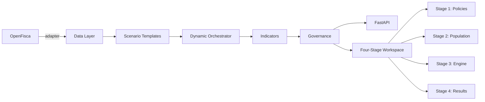

# ReformLab

[](LICENSE)
[](https://github.com/reformlab/ReformLab/actions/workflows/ci.yml)
[](https://www.python.org/downloads/)

OpenFisca-first environmental policy analysis platform.

## What it does

ReformLab simulates the distributional impact of environmental tax-and-transfer policies on household populations. It wraps [OpenFisca](https://openfisca.org) as a computation backend and adds data preparation, scenario templates, dynamic multi-year orchestration with vintage tracking, indicators, and governance layers. For example: simulate a €100/tCO₂ carbon tax with lump-sum redistribution across French households over 10 years and compare distributional outcomes.

## Quick start

```bash
git clone https://github.com/reformlab/ReformLab.git
cd ReformLab
uv sync --all-extras
uv run pytest
```

For the frontend:

```bash
cd frontend
npm install
npm run dev
```

First launch loads a demo scenario automatically — a carbon tax with dividend policy on a French synthetic population — so you can explore the workspace immediately.

## Features

### Four-Stage Workspace

The ReformLab GUI organizes policy analysis into four stages:

- **Stage 1: Policies & Portfolio** — Build policy bundles from templates, compose multiple policies, and manage conflict resolution
- **Stage 2: Population** — Select built-in populations, explore data profiles, or generate synthetic populations via data fusion
- **Stage 3: Engine** — Configure time horizon, set simulation parameters, and validate before execution
- **Stage 4: Run / Results / Compare** — Execute simulations, view distributional charts, and compare outcomes across scenarios

### Python API & Notebooks

Programmatic access via Python API for batch simulations and custom analysis workflows.

## Evidence Model

ReformLab uses a trust-governed evidence model that classifies all data sources by origin, access mode, trust status, and data class. This ensures transparency about what data can be used for decision support and what limitations apply.

### Classification Axes

- **Origin**: Where the data comes from
  - `open-official`: Openly usable official or institutional data (INSEE, Eurostat, ADEME)
  - `synthetic-public`: Public synthetic datasets from trusted producers
  - `synthetic-internal`: Internally generated synthetic assets (future phase)
  - `restricted`: Access-controlled data (future phase)

- **Access Mode**: How ReformLab obtains the data
  - `bundled`: Distributed with the product or repository
  - `fetched`: Obtained automatically from public sources
  - `deferred-user-connector`: User-provided data connector (future phase)

- **Trust Status**: What can be claimed about the data
  - `production-safe`: Validated for decision-support use
  - `exploratory`: Suitable for exploration and prototyping, not decision support
  - `demo-only`: Example data, not for analysis
  - `validation-pending`: Requires validation dossier before production use
  - `not-for-public-inference`: Internal use only

- **Data Class**: The role of the data in the evidence taxonomy
  - `structural`: Define who or what is modeled (households, firms, places)
  - `exogenous`: Observed/projected context inputs (prices, rates, costs)
  - `calibration`: Fit the model to observed reality
  - `validation`: Test the model against independent observations

### Current-Phase Scope

The current phase supports **open official data** and **public synthetic data**. Restricted data access and internal synthetic generation are reserved for future phases. All datasets are documented in the [evidence source matrix](_bmad-output/planning-artifacts/evidence-source-matrix-v1-2026-03-27.md).

### Evidence Governance

- Calibration targets and validation benchmarks are stored separately (calibration data is excluded from validation tests)
- Scenario manifests include evidence provenance for reproducibility
- Trust status warnings appear when exploratory data is used for decision support
- All evidence descriptors include license and redistribution information

## Architecture

**Backend:** Data Layer → Scenario Templates → Dynamic Orchestrator → Indicators → Governance → FastAPI

**Frontend:** Four-stage workspace (Policies, Population, Engine, Results) with OpenFisca as external computation backend



## Live services

| Service | URL | Description |
| --- | --- | --- |
| Website | <https://reform-lab.eu> | Public website |
| App | <https://app.reform-lab.eu> | Simulation frontend |
| API | <https://api.reform-lab.eu> | FastAPI backend |
| Logs | <https://logs.reform-lab.eu> | Container log viewer (Dozzle) |
| Monitor | <https://monitor.reform-lab.eu> | System metrics dashboard (Glances) |

## License

AGPL-3.0-or-later. See [LICENSE](LICENSE).

## Citation

If you use ReformLab in academic work, please cite it using the metadata in [CITATION.cff](CITATION.cff).
