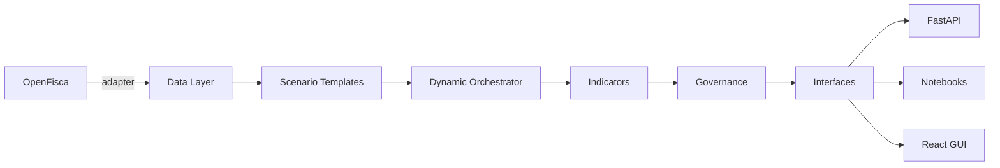

# ReformLab

[](LICENSE)
[](https://github.com/reformlab/ReformLab/actions/workflows/ci.yml)
[](https://www.python.org/downloads/)

OpenFisca-first environmental policy analysis platform.

## What it does

ReformLab simulates the distributional impact of environmental tax-and-transfer policies on household populations. It wraps [OpenFisca](https://openfisca.org) as a computation backend and adds data preparation, scenario templates, dynamic multi-year orchestration with vintage tracking, indicators, and governance layers. For example: simulate a €100/tCO₂ carbon tax with lump-sum redistribution across French households over 10 years and compare distributional outcomes.

## Quick start

```bash
git clone https://github.com/reformlab/ReformLab.git
cd ReformLab
uv sync --all-extras
uv run pytest
```

For the frontend:

```bash
cd frontend
npm install
npm run dev
```

## Architecture

Data Layer → Scenario Templates → Dynamic Orchestrator → Indicators → Governance → Interfaces (API, Notebooks, GUI), with OpenFisca as an external computation backend accessed via an adapter interface.



## Live services

| Service | URL | Description |
| --- | --- | --- |
| Website | <https://reform-lab.eu> | Public website |
| App | <https://app.reform-lab.eu> | Simulation frontend |
| API | <https://api.reform-lab.eu> | FastAPI backend |
| Logs | <https://logs.reform-lab.eu> | Container log viewer (Dozzle) |
| Monitor | <https://monitor.reform-lab.eu> | System metrics dashboard (Glances) |

## License

AGPL-3.0-or-later. See [LICENSE](LICENSE).

## Citation

If you use ReformLab in academic work, please cite it using the metadata in [CITATION.cff](CITATION.cff).
