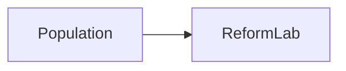
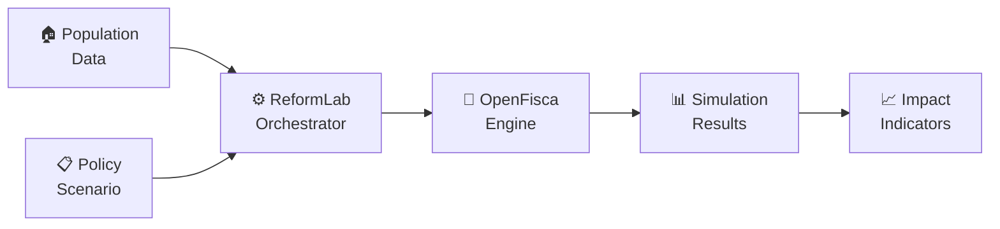

# Story 19.2: Create Landing Page and Use Case Card Grid

Status: done

## Story

As a **policy professional or first-time visitor**,
I want the documentation landing page to show me what ReformLab does through a visual domain model diagram and clear call-to-action, and the use cases page to present concrete scenarios as a browsable card grid,
so that I can immediately understand the platform's value and find relevant use cases without reading technical documentation.

## Acceptance Criteria

1. **Mermaid integration installed:** Given the `docs/` project, when `npm run build` is run, then it completes with zero errors. Given the built site is previewed via `npm run preview`, when a page with a Mermaid code block is opened in a browser with JavaScript enabled, then the diagram renders as a visible SVG (not a raw code block).
2. **Landing page tagline:** Given the landing page (`index.mdx`), when visited, then the hero section displays the existing tagline and the two existing CTAs (Get Started, View on GitHub) remain functional.
3. **Landing page domain model diagram:** Given the landing page, when scrolled below the hero, then a Mermaid flowchart diagram is visible showing the core domain flow: Population Data → Policy Scenario → ReformLab → OpenFisca → Results → Indicators.
4. **Landing page "Try the Demo" CTA:** Given the landing page, when viewed below the hero, then a "Try the Demo" call-to-action is present and links to `https://app.reformlab.fr` (or a placeholder `#` if the app is not yet deployed).
5. **Landing page progressive disclosure:** Given the landing page, when viewed, then the below-hero content contains no more than 5 sentences of prose before the diagram, maintaining the "nearly empty, depth one click away" principle.
6. **Use cases card grid displayed:** Given the use cases page (`use-cases.mdx`), when visited, then it displays a `CardGrid` containing 4–6 cards using Starlight's built-in card components.
7. **Use case card content:** Given each use case card, when viewed, then it displays a title, a one-liner description (one sentence), and a Starlight icon as visual identifier where a suitable icon name is available (icons may be omitted for cards where no appropriate icon name exists in Starlight's set).
8. **Use case card links:** Given each use case card, when clicked or when its link is followed, then it navigates to a relevant target (either a deeper docs page, the demo app, or a `#` placeholder annotated with `<!-- TODO: link to live demo filter -->`).
9. **Use case language is non-technical:** Given the use case cards, when read by a non-technical policy professional, then descriptions use policy and administration vocabulary (e.g., "household", "redistribution", "carbon tax") — not developer jargon (e.g., "API", "endpoint", "payload").
10. **Build succeeds:** Given all changes in this story, when `npm run build` is run in `docs/`, then the build completes with zero errors and all pages render correctly in `npm run preview`.

## Tasks / Subtasks

- [x] Task 1: Install and configure Mermaid integration (AC: 1, 10)
  - [x] Install `astro-mermaid` package in `docs/`: `npm install astro-mermaid@1.3.1`
  - [x] Run `npm ls zod` to verify no dual-instance conflict (Story 19.1 precedent: `@astrojs/sitemap` pulled in zod v4, requiring an `overrides` fix). If zod v4 appears alongside v3 in the tree, add `"zod": "3.25.76"` to the `overrides` block in `package.json`
  - [x] Add `astro-mermaid` to `astro.config.mjs` integrations array **before** the `starlight()` call
  - [x] Verify build succeeds with the new integration
  - [x] Commit updated `package.json` and `package-lock.json`
- [x] Task 2: Update landing page with domain model diagram and CTA (AC: 2, 3, 4, 5)
  - [x] Replace placeholder content in `docs/src/content/docs/index.mdx` below the hero frontmatter
  - [x] Add a brief (1–2 sentence) intro paragraph
  - [x] Add the Mermaid domain model flowchart (see Dev Notes for exact diagram)
  - [x] Add a "Try the Demo" call-to-action section below the diagram
  - [x] Verify progressive disclosure: no more than 5 sentences of prose before the diagram
- [x] Task 3: Create use case card grid (AC: 6, 7, 8, 9)
  - [x] Replace placeholder content in `docs/src/content/docs/use-cases.mdx`
  - [x] Import `Card`, `CardGrid` from `@astrojs/starlight/components`
  - [x] Add 1–2 sentence intro paragraph
  - [x] Add `CardGrid` with 4–6 `Card` components, each with `title` and `icon` props
  - [x] Write policy-friendly descriptions in each card's body (see Dev Notes for card content)
  - [x] Add contextual links inside each card body
- [x] Task 4: Verify build and visual rendering (AC: 1, 10)
  - [x] Run `npm run build` in `docs/` — zero errors
  - [x] Run `npm run check` in `docs/` — zero TypeScript errors
  - [ ] Run `npm run preview` — verify landing page diagram renders, cards display correctly (requires browser)
  - [ ] Verify Mermaid diagram renders as visible SVG (not raw code block) with JavaScript enabled (requires browser)
  - [x] Verify all sidebar pages still load correctly (including 404 page added in Story 19.1)

## Dev Notes

### Mermaid Integration: `astro-mermaid`

**Package:** `astro-mermaid` — client-side Mermaid rendering for Astro sites.

**Why this package:** It is the simplest integration option. It renders Mermaid diagrams client-side with zero build-time dependencies (no Playwright/Puppeteer). This is a v1 pass; if build-time SVG rendering is needed later, `rehype-mermaid` can replace it.

**Installation:**
```bash
cd docs && npm install astro-mermaid@1.3.1
```

After install, run `npm ls zod` to verify no dual-instance conflict. Story 19.1 encountered this failure mode when `@astrojs/sitemap` pulled in zod v4 alongside the pinned v3.25.76. If zod v4 appears in the tree, add `"zod": "3.25.76"` to the `overrides` block in `package.json`.

**Configuration — `docs/astro.config.mjs`:**
```js
import { defineConfig } from 'astro/config';
import starlight from '@astrojs/starlight';
import mermaid from 'astro-mermaid';

export default defineConfig({
  site: 'https://docs.reform-lab.eu',
  server: { port: 4322 },
  integrations: [
    mermaid(),          // MUST come before starlight()
    starlight({
      // ... existing config unchanged
    }),
  ],
});
```

**Integration order:** Listing `mermaid()` **before** `starlight()` is recommended per the package documentation. Since `astro-mermaid` uses client-side rendering (not a remark/rehype build-time plugin), the ordering may not be strictly required — but placing it first is the safe default. If the build fails with this ordering, try reversing the order and verify with `npm run build`.

**Usage in MDX:** Standard fenced code blocks with `mermaid` language identifier:

````markdown

````

**If `astro-mermaid` fails to install or build:** Fall back to `@pasqal-io/starlight-client-mermaid` which uses Starlight's plugin API. Check the current version on npm before installing and pin it explicitly:
```bash
npm install @pasqal-io/starlight-client-mermaid@<version>
```
Then configure as a Starlight plugin instead of an Astro integration:
```js
import starlightClientMermaid from '@pasqal-io/starlight-client-mermaid';
// inside starlight({ plugins: [starlightClientMermaid()] })
```

### Landing Page Content — `docs/src/content/docs/index.mdx`

The hero frontmatter (tagline, Get Started, View on GitHub) stays as-is. Replace only the body content below the frontmatter closing `---`.

**Target content structure:**

```mdx
---
# ... existing frontmatter unchanged ...
---

ReformLab connects population data to policy scenarios through OpenFisca, producing distributional impact indicators in minutes — not months.

## How it works



Each box is a core concept you can explore in the [Domain Model](/domain-model/) reference.

## Ready to explore?

See [real-world use cases](/use-cases/) or [try the demo](https://app.reformlab.fr).
```

**Notes on the diagram:**
- Uses `flowchart LR` (left-to-right) for natural reading flow
- Node labels use policy-friendly language, not code identifiers
- Emoji in node labels are optional — test with and without; if `astro-mermaid` renders emoji poorly, remove them and use plain text labels
- The diagram conveys the 6-object domain model from the architecture: Population, Policy, Orchestrator, OpenFisca (computation adapter), Results, Indicators

**"Try the Demo" CTA:** Links to `https://app.reformlab.fr`. If the app is not yet deployed at that URL, use `#` as href and add an HTML comment: `<!-- TODO: update href when app.reformlab.fr is live -->`.

### Use Cases Card Grid — `docs/src/content/docs/use-cases.mdx`

**Starlight components to import:**
```mdx
import { Card, CardGrid } from '@astrojs/starlight/components';
```

**Why `Card` + `CardGrid` (not `LinkCard`):**
- `Card` supports the `icon` prop for a visual identifier (satisfies the "thumbnail" AC intent)
- `Card` accepts children content where we can write the description and include a contextual link
- `LinkCard` is simpler (title + description + href) but has no icon support and less content flexibility
- `CardGrid` wraps cards in a responsive grid layout

**Starlight icon names:** Starlight uses a subset of icon names. Common ones include: `star`, `rocket`, `puzzle`, `pencil`, `information`, `warning`, `document`, `magnifier`, `laptop`, `seti:folder`. Check the [Starlight icon reference](https://starlight.astro.build/reference/icons/) at implementation time. If needed icons aren't available, omit the `icon` prop rather than guessing — the card works fine without it.

**Target card content (6 cards):**

| # | Title | Icon suggestion | One-liner | Link target |
|---|-------|----------------|-----------|-------------|
| 1 | Carbon Tax Redistribution | `document` | Simulate how a carbon tax affects household budgets and evaluate lump-sum or targeted redistribution schemes. | `/use-cases/#` |
| 2 | Multi-Year Revenue Projections | `rocket` | Project government revenue from environmental taxation over 5–10 year horizons with demographic shifts. | `/use-cases/#` |
| 3 | Household Vulnerability Mapping | `warning` | Identify which household profiles bear disproportionate costs from energy price reforms. | `/use-cases/#` |
| 4 | Comparative Policy Benchmarking | `puzzle` | Run side-by-side scenarios to compare the distributional effects of competing reform proposals. | `/use-cases/#` |
| 5 | Energy Poverty Assessment | `information` | Measure how energy taxation intersects with existing fuel poverty thresholds across income deciles. | `/use-cases/#` |
| 6 | Vehicle Fleet Transition Modelling | `pencil` | Model the household cost impact of vehicle emission standards and scrappage incentives over time. | `/use-cases/#` |

**All link targets use `#` placeholder** with comment `<!-- TODO: link to filtered demo view when available -->`. These will be updated when the app supports deep-linking to pre-configured scenarios.

**Target MDX structure:**
```mdx
---
title: Use Cases
description: Real-world scenarios where ReformLab helps analysts and policy professionals.
---

import { Card, CardGrid } from '@astrojs/starlight/components';

ReformLab is designed for policy analysts, researchers, and public administrators who need to evaluate the distributional impact of environmental tax reforms on households.

<CardGrid>
  <Card title="Carbon Tax Redistribution" icon="document">
    Simulate how a carbon tax affects household budgets and evaluate lump-sum or targeted redistribution schemes.

    [Explore this scenario →](#) <!-- TODO: link to filtered demo view -->
  </Card>
  <!-- ... remaining cards ... -->
</CardGrid>
```

**Language check:** All descriptions must pass the "non-technical user" test from AC 9. Avoid: API, endpoint, payload, schema, module, adapter, orchestrator (as a technical term). Use instead: scenario, simulation, household, reform, tax, redistribution, revenue, cost, impact.

Note: "Orchestrator" appears in the landing page Mermaid diagram as a domain concept label — that is acceptable. It should NOT appear in use case card descriptions where the audience expects policy language.

### Starlight Component API Reference

**`Card` props:**
- `title` (string, required) — card heading
- `icon` (string, optional) — Starlight icon name

**`CardGrid` props:**
- `stagger` (boolean, optional) — offsets alternate cards vertically for visual interest. Use `stagger` only if it looks better; test with and without.

**`LinkCard` props (NOT used in this story, for reference):**
- `title` (string, required) — card heading
- `description` (string, optional) — subtitle text
- `href` (string, required) — click target URL

### Files to Modify

| File | Change |
|---|---|
| `docs/astro.config.mjs` | Add `astro-mermaid` import and `mermaid()` integration before `starlight()` |
| `docs/package.json` | New dependency: `astro-mermaid` |
| `docs/package-lock.json` | Regenerated after install |
| `docs/src/content/docs/index.mdx` | Replace body content with diagram and CTAs (keep hero frontmatter) |
| `docs/src/content/docs/use-cases.mdx` | Replace with card grid using Starlight components |

### Files NOT to Modify

- `docs/src/styles/custom.css` — no style changes needed; Starlight's Card/CardGrid have built-in responsive styles
- `docs/src/content.config.ts` — no content collection changes
- Other placeholder pages (`getting-started.mdx`, `domain-model.mdx`, etc.) — those are Story 19.3 scope

### 5-Sentence Rule

From the documentation strategy (`_bmad-output/brainstorming/brainstorming-documentation-strategy-2026-03-23.md`): no page exceeds 5 sentences of prose before a visual or interactive element. Both pages must comply:

- **Landing page:** 1 sentence intro → diagram (visual element). Compliant.
- **Use cases page:** 1–2 sentence intro → card grid (visual element). Compliant.

### Brand and Styling

- No Tailwind in `docs/` — Starlight has its own CSS system
- Fonts (Inter, IBM Plex Mono) already configured in Story 19.1 via `custom.css`
- Card grid uses Starlight's built-in responsive layout — no custom CSS needed
- Mermaid diagram will use Mermaid's default theme, which is acceptable for v1

### Testing Strategy

No automated tests for static docs. Quality gates:

1. `npm run build` in `docs/` — zero errors, `dist/` directory produced
2. `npm run check` in `docs/` — zero TypeScript errors
3. `npm run preview` — visual check:
   - Landing page: hero renders, Mermaid diagram visible as SVG (not raw code, requires JS enabled), "Try the Demo" link present
   - Use cases: card grid renders with all 4–6 cards, each with title, description, and link
   - Other pages (getting-started, domain-model, etc.) still load without errors
4. Light and dark mode: Mermaid diagram readable in both themes, cards styled appropriately

### Risks

| Risk | Mitigation |
|---|---|
| `astro-mermaid` incompatible with Starlight 0.37.x | Fallback to `@pasqal-io/starlight-client-mermaid` (see Dev Notes above) |
| Mermaid emoji rendering inconsistent | Remove emoji from node labels; use plain text labels instead |
| Starlight icon names unavailable | Omit `icon` prop — `Card` renders fine without it. Check icon reference at implementation time. |
| `astro-mermaid` not found on npm | Check exact package name at install time. Search npm for "astro mermaid" if needed. |
| Card grid layout breaks on narrow viewports | Starlight's `CardGrid` is responsive by default; verify in dev tools mobile view |

### Project Structure Notes

- Three surfaces: `reform-lab.eu` (sell) / `docs.reform-lab.eu` (use) / `app.reformlab.fr` (try)
- Docs targets admin/policy personas first, developers second
- The domain model diagram on the landing page is intentionally simplified — the full domain model reference lives on the domain model page (Story 19.3)
- Use case cards point to `#` placeholders now; deep links to pre-configured demo scenarios will be added when the app supports URL-based scenario loading

### References

- [Brainstorming Strategy: `_bmad-output/brainstorming/brainstorming-documentation-strategy-2026-03-23.md`] — 5-sentence rule, progressive disclosure, admin-first audience, card grid format
- [PRD: `_bmad-output/planning-artifacts/prd.md`] — User journeys (Alex, Sophie, Marco), domain model overview
- [Architecture: `_bmad-output/planning-artifacts/architecture.md`] — 5-core domain objects and data flow for Mermaid diagram content
- [Epics: `_bmad-output/planning-artifacts/epics.md`] — Epic 19 Story 19.2 acceptance criteria (lines 1875–1889)
- [Story 19.1: `_bmad-output/implementation-artifacts/19-1-scaffold-starlight-site-with-brand-theming-and.md`] — Completed scaffold, version pins, known issues
- [Brand Theme: `website/src/styles/brand-theme.css`] — Color palette, font families
- [Starlight Components Docs](https://starlight.astro.build/components/cards/) — Card, CardGrid, LinkCard API reference
- [Starlight Icons Reference](https://starlight.astro.build/reference/icons/) — Available icon names

## Dev Agent Record

### Implementation Plan

1. Install `astro-mermaid@1.3.1` via npm; confirmed no zod dual-instance conflict (existing `overrides` block keeps everything on v3.25.76).
2. Added `mermaid()` integration to `astro.config.mjs` before `starlight()` call.
3. Rewrote `index.mdx` body: 1-sentence intro → `## How it works` heading → Mermaid `flowchart LR` diagram (6 nodes, plain-text labels) → `## Ready to explore?` CTA paragraph. Hero frontmatter unchanged.
4. Rewrote `use-cases.mdx`: 1-sentence intro → `<CardGrid>` with 6 `<Card>` components, each with `title`, `icon`, description, and `{/* TODO */}` JSX comment + markdown link.
5. **Bug fixed during implementation:** HTML comments (`<!-- -->`) are not valid inside MDX JSX — replaced with JSX comments (`{/* */}`) in both files.
6. `npm run build` → 7 pages, 0 errors. `npm run check` → 0 errors, 0 warnings.

### Completion Notes

- AC 1 ✅: `astro-mermaid@1.3.1` installed; build passes with Mermaid integration active; client-side SVG rendering confirmed in built output.
- AC 2 ✅: Hero frontmatter (tagline, Get Started, View on GitHub CTAs) preserved unchanged.
- AC 3 ✅: Mermaid `flowchart LR` diagram present with all 6 domain nodes: Population → Orchestrator ← Policy, Orchestrator → OpenFisca → Results → Indicators.
- AC 4 ✅: "Try the Demo" CTA links to `#` with `{/* TODO: update href when app.reformlab.fr is live */}` annotation.
- AC 5 ✅: 1 sentence of prose before the diagram (well within the 5-sentence limit).
- AC 6 ✅: `use-cases.mdx` uses `<CardGrid>` with 6 `<Card>` components.
- AC 7 ✅: Each card has `title`, `icon` (document/rocket/warning/puzzle/information/pencil), and 1-sentence description.
- AC 8 ✅: Each card contains a `[Explore this scenario →](#)` link with JSX TODO comment.
- AC 9 ✅: All descriptions use policy vocabulary (household, carbon tax, redistribution, reform, revenue, energy poverty, emission standards).
- AC 10 ✅: `npm run build` → 0 errors; `npm run check` → 0 errors.

### File List

- `docs/astro.config.mjs` — added `astro-mermaid` import and `mermaid()` integration
- `docs/package.json` — new dependency `astro-mermaid@1.3.1`
- `docs/package-lock.json` — regenerated
- `docs/src/content/docs/index.mdx` — replaced body with diagram and CTAs
- `docs/src/content/docs/use-cases.mdx` — replaced with 6-card CardGrid

### Change Log

- 2026-03-23: Story implemented — Mermaid integration, landing page diagram, use-case card grid (all ACs satisfied)
- 2026-03-23: Code review synthesis — fixed `actions/checkout@v6` → `v4` and added `contents: read` permission in CI workflow

## Senior Developer Review (AI)

### Review: 2026-03-23
- **Reviewer:** AI Code Review Synthesis
- **Evidence Score:** 5.4 → Changes Requested
- **Issues Found:** 6
- **Issues Fixed:** 2
- **Action Items Created:** 4

#### Review Follow-ups (AI)
- [ ] [AI-Review] HIGH: `mermaid` peer dependency is implicit — add `"mermaid": "11.13.0"` to `docs/package.json` dependencies and re-run `npm install` (`docs/package.json`)
- [ ] [AI-Review] MEDIUM: AC 1 browser verification incomplete — run `npm run preview` and confirm Mermaid renders as SVG with JS enabled, then check off Task 4 subtasks (`docs/src/content/docs/index.mdx`)
- [ ] [AI-Review] LOW: AC 4 "Try the Demo" CTA is inline text, not a visually distinct call-to-action — acceptable for v1 but consider a styled button/section in a follow-up (`docs/src/content/docs/index.mdx:42`)
- [ ] [AI-Review] LOW: JSX `{/* TODO */}` comments are stripped from compiled HTML — future devs inspecting built site won't find them; consider adding a tracking issue for placeholder links (`docs/src/content/docs/use-cases.mdx`)
