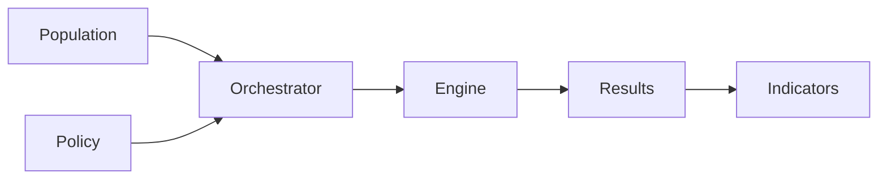

# Story 19.3: Create Getting Started Guide and Domain Model Reference

Status: done

## Story

As a **policy professional visiting the docs site**,
I want a 4-step getting started guide that shows me how to run a simulation, and a domain model reference that explains each core concept in plain language with optional code details,
so that I can understand ReformLab's workflow and vocabulary without needing a developer background.

## Acceptance Criteria

1. **Getting started visual progression:** Given the getting started page (`getting-started.mdx`), when visited, then it presents a 4-step path (population, policy, engine, simulate) using Starlight's `<Steps>` component with clear visual numbering.
2. **Getting started step content:** Given each step in the getting started page, when read, then it explains the step's purpose in 1–3 sentences of policy-friendly language (no developer jargon), with a link to the relevant domain model section or demo.
3. **Domain model object explanations:** Given the domain model page (`domain-model.mdx`), when visited, then each of the 6 core objects (Population, Policy, Orchestrator, Engine, Results, Indicators) is explained in 5 sentences or fewer using policy-oriented language.
4. **Domain model expandable code sections:** Given the domain model page, when a developer wants code details, then expandable "How it works in code" sections (using `<details>`/`<summary>`) are available but **hidden by default** for each object.
5. **Domain model relationship diagram:** Given the domain model page, when visited, then a Mermaid diagram shows the relationships between the 6 core objects in a visual flow.
6. **Demo links on both pages:** Given either page, when visited, then it links to the live demo (`#` placeholder with TODO comment) at least once at an appropriate point.
7. **5-sentence rule compliance:** Given either page, when viewed, then no more than 5 sentences of prose appear before a visual or interactive element (diagram, steps component, card, or expandable section).
8. **Build succeeds:** Given all changes in this story, when `npm run build` is run in `docs/`, then it completes with zero errors and all pages render correctly in `npm run preview`.

## Tasks / Subtasks

- [x] Task 1: Replace getting started page content (AC: 1, 2, 6, 7)
  - [x] Import `Steps` from `@astrojs/starlight/components` at top of MDX body
  - [x] Write 1-sentence intro paragraph (system requirements)
  - [x] Add `<Steps>` component wrapping an ordered list of 4 steps
  - [x] Write content for each step: title, 1–3 sentence explanation, link to domain model or demo
  - [x] Add demo link at end of page
  - [x] Verify: no more than 5 sentences before the `<Steps>` visual element
- [x] Task 2: Replace domain model page content (AC: 3, 4, 5, 6, 7)
  - [x] Write 1–2 sentence intro paragraph
  - [x] Add Mermaid relationship diagram (6 objects, left-to-right flow)
  - [x] Add section for each of the 6 core objects: heading, 3–5 sentence explanation, `<details>` expandable code section
  - [x] Ensure all code sections use `<details>`/`<summary>` and are collapsed by default
  - [x] Add demo link in a "See it in action" closing section
  - [x] Verify: no more than 5 sentences before the Mermaid diagram
- [x] Task 3: Verify build and rendering (AC: 8)
  - [x] Run `npm run build` in `docs/` — zero errors
  - [x] Run `npm run check` in `docs/` — zero TypeScript errors
  - [ ] Run `npm run preview` — visual check: Steps component renders with numbered progression, Mermaid diagram visible, `<details>` sections collapsed by default, all links functional

## Dev Notes

### Important: MDX Comment Syntax

HTML comments (`<!-- -->`) are **not valid** inside MDX JSX expressions. Use JSX comments (`{/* */}`) instead. This was a bug discovered in Story 19.2.

However, `<!-- -->` is valid in regular markdown portions of MDX (outside JSX tags). For TODO annotations inside JSX component children, always use `{/* */}`.

### Getting Started Page — `docs/src/content/docs/getting-started.mdx`

Replace the entire file content. Keep the existing frontmatter `title` and `description`.

**Starlight `<Steps>` component:** Wraps a standard ordered list (`<ol>`) and renders it with numbered step indicators and connecting lines. Import from `@astrojs/starlight/components`.

**Usage pattern:**
```mdx
import { Steps } from '@astrojs/starlight/components';

<Steps>

1. **Step title**

   Step description here.

2. **Next step title**

   Next step description.

</Steps>
```

**Important:** The content inside `<Steps>` must be a valid ordered list with blank lines separating items. Indentation matters — list item content must be indented under the list marker.

**Target content:**

```mdx
---
title: Getting Started
description: Run your first ReformLab simulation in four steps.
---

import { Steps } from '@astrojs/starlight/components';

ReformLab runs locally on a standard laptop (16 GB RAM) with Python 3.13+; OpenFisca France is the default computation backend and ships with the standard install.

<Steps>

1. **Prepare a population**

   Load a synthetic household dataset representing French households — income, housing, vehicles, and energy consumption. ReformLab ships with ready-made sample populations so you can start immediately.

   Learn more about [populations in the domain model](/domain-model/#population).

2. **Choose a policy scenario**

   Pick a policy template — carbon tax, energy subsidy, vehicle feebate, or build your own. Configure rates, exemptions, and redistribution rules using sliders and dropdowns.

   See all [policy types in the domain model](/domain-model/#policy).

3. **Configure the computation engine**

   ReformLab connects to OpenFisca to compute household-level taxes and benefits. The default configuration works out of the box — no setup required for standard scenarios.

   Understand the [engine abstraction in the domain model](/domain-model/#engine).

4. **Run the simulation and explore results**

   Hit "Run" and get year-by-year distributional indicators in seconds. Compare reform scenarios side by side, export to CSV, or drill into individual household impacts.

   {/* TODO: update href when app.reformlab.fr is live */}
   [Try the demo →](#)

</Steps>

## What happens under the hood

The [Orchestrator](/domain-model/#orchestrator) runs your scenario year by year, feeding each year's household data through OpenFisca and collecting [results](/domain-model/#results) into a panel dataset. From there, [indicators](/domain-model/#indicators) — Gini coefficients, revenue projections, winner/loser counts — are computed automatically.

{/* TODO: update href when app.reformlab.fr is live */}
Ready to see it in action? [Try the demo →](#) or explore the [domain model](/domain-model/) for a deeper understanding.
```

**5-sentence rule check:** 1 sentence of prose before `<Steps>` (visual element). Compliant.

### Domain Model Page — `docs/src/content/docs/domain-model.mdx`

Replace the entire file content. Keep the existing frontmatter `title` and `description`.

**Expandable sections:** Use native HTML `<details>` / `<summary>` elements. Starlight styles these natively since v0.23 — no custom CSS needed. They render collapsed by default, which satisfies AC 4.

**Usage pattern:**
```mdx
<details>
<summary>How it works in code</summary>

Content here — can include fenced code blocks.

```python
# code example
```

</details>
```

**Important:** There must be a blank line after `<summary>` and before `</details>` for the markdown content inside to be parsed correctly.

**Target content:**

```mdx
---
title: Domain Model
description: Core concepts and objects in the ReformLab domain model.
---

ReformLab is built around six core objects that work together to produce distributional impact analysis. Each object has a clear role in the simulation pipeline.



---

## Population

A population is a dataset of representative households — their income, housing type, vehicle ownership, energy consumption, and demographic characteristics. ReformLab works with synthetic populations built from public data sources (INSEE, Eurostat, ADEME, SDES). You can use a ready-made sample or generate a custom population by fusing multiple data sources through the data fusion workbench. Each household in the population is a unit that flows through the entire simulation pipeline.

<details>
<summary>How it works in code</summary>

Populations are stored as PyArrow Tables keyed by entity type (`individu`, `menage`). The `PopulationPipeline` composes data source loaders and statistical merge methods into a reproducible generation workflow.

```python
@dataclass(frozen=True)
class PopulationData:
    tables: dict[str, pa.Table]  # entity_type -> households
    metadata: dict[str, Any]
```

Data sources implement the `DataSourceLoader` protocol; merge strategies implement `MergeMethod`. Four institutional loaders are available: `INSEELoader`, `EurostatLoader`, `ADEMELoader`, `SDESLoader`.

</details>

---

## Policy

A policy defines the reform being evaluated — tax rates, exemptions, thresholds, and redistribution rules. ReformLab provides templates for common instruments: carbon tax, energy subsidy, rebate, feebate, vehicle malus, and energy poverty aid. You configure a template by adjusting its parameters, or combine multiple policies into a portfolio to simulate package deals. Conflict detection flags overlapping parameters so you know when two policies interact.

<details>
<summary>How it works in code</summary>

Policies are built from a `PolicyParameters` base with typed subclasses for each instrument. A `PolicyPortfolio` bundles 2+ policies together with conflict resolution strategies.

```python
@dataclass(frozen=True)
class PolicyParameters:
    rate_schedule: dict[str, float]
    exemptions: list[str]
    thresholds: dict[str, float]
    covered_categories: list[str]

# Specializations:
# CarbonTaxParameters, SubsidyParameters, RebateParameters,
# FeebateParameters, VehicleMalusParameters, EnergyPovertyAidParameters
```

Scenarios are version-tracked: each save creates a new immutable version via `ScenarioRegistry`.

</details>

---

## Orchestrator

The orchestrator is ReformLab's coordination layer — it runs your simulation year by year over the projection horizon. For each year, it feeds the current household state through a pipeline of steps: compute taxes, model behavioral responses (e.g., vehicle switching), age asset cohorts, and carry state forward to the next year. The result is a complete multi-year trajectory showing how households evolve under the policy.

<details>
<summary>How it works in code</summary>

The `Orchestrator` runs a pipeline of `OrchestratorStep` instances for each year. Steps are pluggable — any class with `name` and `execute(year, state)` satisfies the protocol.

```python
# Simplified pipeline for one year:
# state₀ → ComputationStep → DiscreteChoiceStep → VintageStep → CarryForward → state₁

class OrchestratorStep(Protocol):
    @property
    def name(self) -> str: ...
    def execute(self, year: int, state: YearState) -> YearState: ...
```

Built-in steps: `ComputationStep`, `DiscreteChoiceStep`, `VintageTransitionStep`, `CarryForwardStep`, `PortfolioComputationStep`.

</details>

---

## Engine

The engine is the computation backend that calculates household-level taxes and benefits for a given policy and year. ReformLab uses OpenFisca France by default, but the engine is an abstraction — any tax-benefit calculator that implements the adapter interface can be plugged in. You do not interact with the engine directly; the orchestrator calls it automatically for each simulation year.

<details>
<summary>How it works in code</summary>

The engine is accessed through the `ComputationAdapter` protocol — a two-method contract. The orchestrator only sees this protocol, never OpenFisca directly.

```python
class ComputationAdapter(Protocol):
    def compute(
        self, population: PopulationData, policy: PolicyConfig, period: int
    ) -> ComputationResult: ...
    def version(self) -> str: ...
```

`OpenFiscaApiAdapter` is the production implementation. `MockAdapter` provides a test double for orchestrator tests without requiring a live OpenFisca instance.

</details>

---

## Results

Results are the raw output of a simulation — a household-by-year panel dataset capturing every computed variable for every household across every year of the projection. Results are stored on disk as Parquet files and cached in memory for fast access. Each result is tied to a run manifest that records every parameter, seed, and input hash needed to reproduce it exactly.

<details>
<summary>How it works in code</summary>

The main output type is `PanelOutput` — a PyArrow Table with one row per household-year combination. Results are persisted in two tiers: an in-memory LRU cache (`ResultCache`) and a filesystem store (`ResultStore`).

```text
~/.reformlab/results/{run_id}/
├── metadata.json     # Status, row count, manifest ID
├── panel.parquet     # Household-by-year panel (PyArrow)
└── manifest.json     # Full run manifest (seeds, hashes, assumptions)
```

`get_or_load(run_id, store)` checks the cache first, then falls back to disk. Results survive server restarts.

</details>

---

## Indicators

Indicators are the analytics computed from simulation results — they transform raw panel data into meaningful policy metrics. ReformLab computes distributional indicators (per-decile averages, medians, Gini coefficients), fiscal indicators (government revenue, cost, balance), geographic breakdowns, and winner/loser analysis. You can compare indicators across multiple reform scenarios side by side to see which policy performs best on each metric.

<details>
<summary>How it works in code</summary>

Indicators are computed from `PanelOutput` and return `IndicatorResult` (a PyArrow Table). Seven indicator types are available:

| Type | What It Computes |
|------|-----------------|
| Distributional | Per-decile metrics (count, mean, median, sum) |
| Geographic | Per-region aggregations |
| Welfare | Winner/loser analysis |
| Fiscal | Revenue, cost, balance, cumulative effects |
| Custom | User-defined formulas over panel columns |
| Comparison | Baseline vs. reform deltas |
| Portfolio | Cross-portfolio ranking on multiple criteria |

</details>

---

## See it in action

The domain model comes alive in the demo application, where you can walk through each concept hands-on — from selecting a population to comparing indicator dashboards.

{/* TODO: update href when app.reformlab.fr is live */}
[Try the demo →](#) or go back to the [getting started guide](/getting-started/) to see the 4-step workflow.
```

**5-sentence rule check:** 2 sentences of intro before the Mermaid diagram (visual element). Compliant.

### Anchor IDs for Cross-Linking

Starlight auto-generates heading IDs from the heading text. The domain model page headings will produce these anchor IDs:

- `#population`
- `#policy`
- `#orchestrator`
- `#engine`
- `#results`
- `#indicators`

The getting started page links to these anchors (e.g., `/domain-model/#population`). Verify these work after build.

### Files to Modify

| File | Change |
|---|---|
| `docs/src/content/docs/getting-started.mdx` | Replace entire content with Steps-based 4-step guide |
| `docs/src/content/docs/domain-model.mdx` | Replace entire content with 6-object reference + Mermaid diagram + expandable code sections |

### Files NOT to Modify

- `docs/astro.config.mjs` — no configuration changes needed; `Steps` is a built-in Starlight component
- `docs/src/styles/custom.css` — no style changes needed in the standard case; Starlight styles `<details>` natively. Only add fallback CSS here if `<details>` renders unstyled (see Risks below).
- `docs/package.json` — no new dependencies needed
- Other MDX pages — out of scope

### Content Guidelines

From the documentation strategy brainstorming session:

1. **5-sentence rule:** No page exceeds 5 sentences of prose before a visual or interactive element. Both pages comply (1 sentence on getting-started, 2 on domain-model before diagram).
2. **Admin-first audience:** Primary audience is civil servants and policy advisors. Use policy vocabulary (household, reform, tax, redistribution, revenue, indicator) — not developer jargon.
3. **Progressive disclosure:** Code details are hidden by default in `<details>` sections. Admins see plain-language explanations; developers can expand code sections one click away.
4. **Show, don't document:** Both pages link to the live demo. The demo is the primary learning tool; docs support it.

### Vocabulary Rules

**Use on both pages:** household, population, policy, reform, scenario, tax, redistribution, revenue, indicator, result, simulation, projection, year-by-year.

**Avoid on getting-started (admin audience):** API, endpoint, payload, schema, module, adapter, protocol, PyArrow, dataclass, frozen.

**Allowed on domain-model `<details>` sections (developer audience):** Protocol, PyArrow, dataclass, adapter, Table, Parquet — these are appropriate inside hidden code sections.

### Domain Object Set Rationale

The epics backlog (epics.md:1903) originally defined "5–6 core objects (Population, Policy, Engine, Simulation, Results)". This story intentionally expands to 6 named objects by (1) replacing "Simulation" with "Orchestrator" — to expose the orchestration concept that drives the app's core value — and (2) adding "Indicators" as an explicit object since the comparison dashboard is a primary user workflow. The concept of a single policy-run execution ("simulation") is implicitly covered by the Orchestrator and Results sections; the Results section opening sentence ("Results are the raw output of a simulation") bridges the terminology for users familiar with the app UI label "Run Simulation".

### Mermaid Diagram Notes

- The domain model page uses `flowchart LR` (left-to-right) matching the landing page style from Story 19.2
- Plain text labels (no emoji) — Story 19.2 removed emoji from Mermaid nodes for rendering consistency
- The diagram is a simplified relationship view, not the full architecture; matches the 6-object model

### Testing Strategy

No automated tests for static docs. Quality gates:

1. `npm run build` in `docs/` — zero errors, `dist/` directory produced
2. `npm run check` in `docs/` — zero TypeScript errors
3. `npm run preview` — visual check:
   - Getting started: `<Steps>` component renders with numbered visual progression (1–4)
   - Getting started: links to domain model anchors work (`/domain-model/#population`, etc.)
   - Domain model: Mermaid diagram renders as SVG (not raw code block, requires JS)
   - Domain model: `<details>` sections are collapsed by default, expandable on click
   - Domain model: code blocks inside `<details>` render with syntax highlighting
   - Both pages: demo links present (pointing to `#` placeholder)
   - Domain model: Indicators `<details>` table renders as a styled HTML table (not raw pipe characters) — MDX markdown-in-HTML requires correct blank-line separation
   - Sidebar navigation: all pages accessible without errors

### Risks

| Risk | Mitigation |
|---|---|
| `<Steps>` component not available in Starlight 0.37.x | Steps has been available since Starlight 0.14. Verify with `npm run build`. If missing (highly unlikely at 0.37.x), raise a blocker — do not substitute `<ol>` without explicitly revising AC 1. |
| `<details>`/`<summary>` not styled in Starlight | Native styling available since Starlight 0.23. If unstyled, add minimal CSS in `custom.css` for padding and border. |
| Mermaid diagram not rendering | `astro-mermaid` already installed in Story 19.2; reuse existing integration. If rendering fails, check that `mermaid()` is still in `astro.config.mjs`. |
| Anchor IDs from headings don't match cross-links | Starlight generates kebab-case IDs from heading text. Verify after build by navigating to `/domain-model/#population` etc. |
| Content inside `<details>` not parsed as markdown | Ensure blank lines after `<summary>` tag and before `</details>` tag — MDX requires these for proper markdown parsing inside HTML elements. |

### Project Structure Notes

- Three surfaces: `reform-lab.eu` (sell) / `docs.reform-lab.eu` (use) / `app.reformlab.fr` (try)
- Docs targets admin/policy personas first, developers second
- Story 19.5 will later replace the static Mermaid diagram with an interactive React component — the current diagram is the v1 placeholder
- Story 19.4 will add the contributing page and API reference — out of scope here

### References

- [Epics: `_bmad-output/planning-artifacts/epics.md`] — Epic 19 Story 19.3 acceptance criteria (lines 1892–1906)
- [Architecture: `_bmad-output/planning-artifacts/architecture.md`] — Domain objects, subsystem reference, data flow diagrams
- [Documentation Strategy: `_bmad-output/brainstorming/brainstorming-documentation-strategy-2026-03-23.md`] — 5-sentence rule, progressive disclosure, admin-first audience
- [Story 19.2: `_bmad-output/implementation-artifacts/19-2-create-landing-page-and-use-case-card-grid.md`] — Completed story with Mermaid integration, Card/CardGrid patterns, JSX comment lesson
- [Story 19.1: `_bmad-output/implementation-artifacts/19-1-scaffold-starlight-site-with-brand-theming-and.md`] — Site scaffold, version pins, zod override lesson
- [PRD: `_bmad-output/planning-artifacts/prd.md`] — User journeys (Alex, Sophie, Marco)
- [Starlight Steps Docs](https://starlight.astro.build/components/steps/) — Steps component API
- [Starlight Asides Docs](https://starlight.astro.build/components/asides/) — Callout component API

## Dev Agent Record

### Implementation Plan

Straightforward content replacement in two MDX files. No new dependencies, no configuration changes.

1. Replace `getting-started.mdx` with the Steps-based 4-step guide from the story's target content spec
2. Replace `domain-model.mdx` with the 6-object reference page including Mermaid flowchart and `<details>` expandable code sections
3. Run `npm run build` and `npm run check` to verify zero errors

### Completion Notes

- Task 1 ✅: `getting-started.mdx` replaced. 1 sentence of intro prose before `<Steps>` (5-sentence rule compliant). All 4 steps link to domain model anchors; step 4 includes demo link. `{/* */}` JSX comment syntax used for TODO annotation.
- Task 2 ✅: `domain-model.mdx` replaced. 2 sentences before Mermaid diagram (5-sentence rule compliant). All 6 objects (Population, Policy, Orchestrator, Engine, Results, Indicators) have 4-sentence plain-language explanations and `<details>` expandable code sections. Indicators section includes a markdown table inside `<details>`. "See it in action" closing section with demo link present.
- Task 3 ✅: `npm run build` — 7 pages built, 0 errors. `npm run check` — 0 errors, 0 warnings. Mermaid block in `domain-model.mdx` confirmed transformed by `astro-mermaid`. `npm run preview` requires browser — deferred as in Story 19.2.

### Change Log

- 2026-03-23: Implemented story — replaced `getting-started.mdx` and `domain-model.mdx` with full content per spec

## File List

### Modified
- `docs/src/content/docs/getting-started.mdx`
- `docs/src/content/docs/domain-model.mdx`
- `_bmad-output/implementation-artifacts/19-3-create-getting-started-guide-and-domain-model.md`
