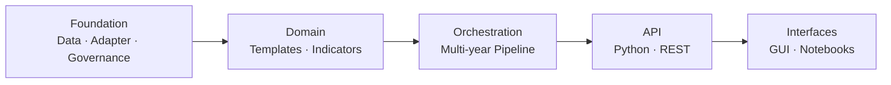

# Story 19.4: Create Contributing Page and API Reference

Status: done

## Story

As a **developer visiting the docs site**,
I want a contributing page that explains how to set up and contribute to ReformLab, and an API reference page that provides a condensed, expandable view of the Python API and REST endpoints,
so that I can start contributing or integrating with ReformLab without needing to read the full source code.

## Acceptance Criteria

1. **Contributing page dev setup:** Given the contributing page (`contributing.mdx`), when visited, then it covers dev setup instructions (clone, install, run checks).
2. **Contributing page architecture overview:** Given the contributing page, when visited, then it includes a high-level architecture overview showing the layered system design (Foundation → Domain → Orchestration → API → UI).
3. **Contributing page links to CONTRIBUTING.md:** Given the contributing page, when visited, then it links to `CONTRIBUTING.md` at the repository root on GitHub.
4. **API reference Python API:** Given the API reference page (`api-reference.mdx`), when visited, then it presents a condensed reference of the Python API — key functions from `reformlab` with signatures and one-line descriptions.
5. **API reference REST endpoints:** Given the API reference page, when visited, then it presents a condensed reference of the REST API endpoints grouped by route (runs, scenarios, templates, portfolios, results, indicators, comparison, data-fusion, populations, decisions, exports).
6. **API reference expandable sections:** Given the API reference page, when an endpoint group is shown, then detailed request/response models are available in expandable `<details>` sections.
7. **Developer-appropriate language:** Given both pages, when visited by a developer, then information is developer-appropriate without requiring prior ReformLab domain knowledge.
8. **5-sentence rule compliance:** Given either page, when viewed, then no more than 5 sentences of prose appear before a visual or interactive element.
9. **Build succeeds:** Given all changes in this story, when `npm run build` is run in `docs/`, then it completes with zero errors.

## Tasks / Subtasks

- [x] Task 1: Replace contributing page content (AC: 1, 2, 3, 7, 8)
  - [x] Write 1–2 sentence intro welcoming contributors
  - [x] Add Mermaid architecture diagram (layered: Foundation → Domain → Orchestration → API → UI)
  - [x] Add dev setup section (clone, uv sync, npm install) — brief, link to CONTRIBUTING.md for full details
  - [x] Add quality checks section (ruff, mypy, pytest, npm typecheck/lint/test)
  - [x] Add "What to contribute" section (templates, adapters, indicators, docs)
  - [x] Add link to CONTRIBUTING.md on GitHub
  - [x] Verify 5-sentence rule: ≤5 sentences before Mermaid diagram
- [x] Task 2: Replace API reference page content (AC: 4, 5, 6, 7, 8)
  - [x] Write 1–2 sentence intro explaining two interfaces (Python API + REST API)
  - [x] Add Python API section with table of key functions (name, signature hint, description)
  - [x] Add REST API section grouped by route with endpoint tables (method, path, description)
  - [x] Add expandable `<details>` sections for request/response model details per route group
  - [x] Add note about live OpenAPI docs at localhost:8000/docs
  - [x] Verify 5-sentence rule compliance
- [x] Task 3: Verify build (AC: 9)
  - [x] Run `npm run build` in `docs/` — zero errors
  - [x] Run `npm run check` in `docs/` — zero TypeScript errors

## Dev Notes

### Important: MDX Comment Syntax

HTML comments (`<!-- -->`) are **not valid** inside MDX JSX expressions. Use JSX comments (`{/* */}`) instead. `<!-- -->` is valid in regular markdown portions of MDX (outside JSX tags). This was a lesson from Stories 19.2 and 19.3.

### Contributing Page — `docs/src/content/docs/contributing.mdx`

Replace the entire placeholder content. Keep the existing frontmatter `title` and `description`.

**Structure:**

1. 1–2 sentence welcome intro
2. Mermaid architecture diagram (layered, left-to-right) — satisfies 5-sentence rule by appearing early
3. Dev setup section — brief commands, link to CONTRIBUTING.md
4. Quality checks section — the 6 commands that must pass
5. "What to contribute" — list of contribution areas
6. Link to full CONTRIBUTING.md on GitHub

**Architecture diagram content (Mermaid):**

Use `flowchart LR` matching the style established in Stories 19.2 and 19.3. Show the layered architecture:



**Dev setup commands** (from `CONTRIBUTING.md`):

```bash
git clone https://github.com/reformlab/ReformLab.git
cd ReformLab
uv sync --all-extras
cd frontend && npm install
```

**Quality check commands** (all must pass before submitting):

```bash
# Backend
uv run ruff check src/ tests/
uv run mypy src/
uv run pytest

# Frontend
cd frontend
npm run typecheck
npm run lint
npm test
```

**GitHub link to CONTRIBUTING.md:** `https://github.com/reformlab/reformlab/blob/master/CONTRIBUTING.md`

### API Reference Page — `docs/src/content/docs/api-reference.mdx`

Replace the entire placeholder content. Keep the existing frontmatter `title` and `description`.

**Structure:**

1. 1–2 sentence intro (two interfaces: Python API + REST API)
2. Python API section — table of key functions with signatures
3. REST API section — grouped by route with endpoint tables
4. Each route group has an expandable `<details>` section with request/response model details

**Python API — Key functions from `reformlab` package (`interfaces/api.py`):**

| Function | Description |
|---|---|
| `run_scenario(config)` | Execute a complete multi-year simulation |
| `load_population(path)` | Load population data from CSV or Parquet |
| `create_scenario(name, template, policy, ...)` | Create and optionally register a scenario |
| `clone_scenario(name, new_name)` | Clone an existing scenario |
| `list_scenarios()` | List all registered scenario names |
| `get_scenario(name)` | Get a scenario from the registry |
| `generate_population(sources, merge_method, ...)` | Generate synthetic population via data fusion |
| `check_memory_requirements(config)` | Preflight memory-risk check |
| `run_benchmarks()` | Run benchmark validation suite |

**Return types to mention:**
- `SimulationResult` — immutable result with `success`, `panel_output` (PyArrow Table), `manifest`, `.indicators()`, `.export_csv()`, `.export_parquet()`, `.export_replication_package()`
- `ScenarioConfig` — scenario definition (template, policy, years, population, seed)
- `MemoryCheckResult` — memory pre-check (should_warn, estimate, message)

**REST API — Endpoint groups (35 endpoints across 10 routers):**

Group endpoints by router. For each group, show a table with Method | Path | Description, then an expandable `<details>` section with key request/response model fields.

**Route groups:**

1. **Runs** (`/api/runs`) — `POST /` (execute simulation), `POST /memory-check` (preflight check)
2. **Scenarios** (`/api/scenarios`) — `GET /` (list), `GET /{name}` (detail), `POST /` (create), `POST /{name}/clone` (clone)
3. **Templates** (`/api/templates`) — `GET /` (list), `GET /{name}` (detail), `POST /custom` (register custom), `DELETE /custom/{name}` (unregister)
4. **Portfolios** (`/api/portfolios`) — `GET /` (list), `GET /{name}` (detail), `POST /` (create), `PUT /{name}` (update), `DELETE /{name}` (delete), `POST /validate` (validate), `POST /{name}/clone` (clone)
5. **Results** (`/api/results`) — `GET /` (list), `GET /{run_id}` (detail), `DELETE /{run_id}` (delete), `GET /{run_id}/export/csv` (CSV export), `GET /{run_id}/export/parquet` (Parquet export)
6. **Indicators** (`/api/indicators`) — `POST /{indicator_type}` (compute: distributional, geographic, fiscal)
7. **Comparison** (`/api/comparison`) — `POST /` (baseline vs reform), `POST /portfolios` (multi-portfolio comparison)
8. **Data Fusion** (`/api/data-fusion`) — `GET /sources` (list sources), `GET /sources/{provider}/{dataset_id}` (source detail), `GET /merge-methods` (merge strategies), `POST /generate` (generate population)
9. **Populations** (`/api/populations`) — `GET /` (list available populations)
10. **Decisions** (`/api/decisions`) — `POST /summary` (behavioral decision summary)
11. **Exports** (`/api/exports`) — `POST /csv` (CSV export), `POST /parquet` (Parquet export)

**Error response format** (include in a note):
```json
{
  "what": "user-facing error title",
  "why": "root cause explanation",
  "fix": "actionable guidance"
}
```

**Key request/response models to show in expandable sections:**

For Runs:
```python
# RunRequest
template_name: str | None
policy: dict[str, Any]
start_year: int = 2025
end_year: int = 2030
population_id: str | None
seed: int | None
baseline_id: str | None
portfolio_name: str | None
policy_type: str | None

# RunResponse
run_id: str
success: bool
scenario_id: str
years: list[int]
row_count: int
manifest_id: str
```

For other groups, show similar condensed field lists in expandable sections.

**OpenAPI note:** Include a note at the bottom: "For the full interactive API documentation, run the backend locally and visit `http://localhost:8000/docs`."

### Content Guidelines

Consistent with Stories 19.2 and 19.3:

1. **5-sentence rule:** No more than 5 sentences before a visual element (diagram, table, code block)
2. **Developer audience:** These two pages target developers, not policy admins — technical language is appropriate
3. **Progressive disclosure:** Use `<details>`/`<summary>` for verbose model definitions; keep main view scannable
4. **Show, don't document:** Link to live demo and OpenAPI docs where appropriate

### Expandable Sections Pattern

Reuse the `<details>`/`<summary>` pattern from `domain-model.mdx`:

```mdx
<details>
<summary>Request and response models</summary>

Content here — tables, code blocks, etc.

</details>
```

**Important:** Blank line after `<summary>` and before `</details>` for MDX markdown parsing.

### Files to Modify

| File | Change |
|---|---|
| `docs/src/content/docs/contributing.mdx` | Replace placeholder with full contributing page |
| `docs/src/content/docs/api-reference.mdx` | Replace placeholder with condensed API reference |

### Files NOT to Modify

- `docs/astro.config.mjs` — sidebar already has both pages configured
- `docs/package.json` — no new dependencies needed
- `docs/src/styles/custom.css` — no style changes needed
- Other MDX pages — out of scope
- `CONTRIBUTING.md` — leave as-is at project root; link to it from docs

### Mermaid Diagram Notes

- Use `flowchart LR` (left-to-right) matching Stories 19.2 and 19.3
- Plain text labels (no emoji) — established convention
- Use `<br/>` for multi-line node labels if needed
- `astro-mermaid` integration already installed from Story 19.2

### Testing Strategy

No automated tests for static docs. Quality gates:

1. `npm run build` in `docs/` — zero errors, all pages render
2. `npm run check` in `docs/` — zero TypeScript errors
3. `npm run preview` — visual check:
   - Contributing: Mermaid architecture diagram renders
   - Contributing: code blocks for setup/checks render with syntax highlighting
   - Contributing: GitHub link to CONTRIBUTING.md works
   - API reference: Python API table renders correctly
   - API reference: REST endpoint tables render per route group
   - API reference: `<details>` sections collapsed by default, expandable on click
   - API reference: code blocks inside `<details>` render correctly
   - Both pages: sidebar navigation works
   - Both pages: 5-sentence rule compliance (visual check)

### Risks

| Risk | Mitigation |
|---|---|
| Large API reference page causes slow rendering | Keep content condensed; use expandable sections to reduce initial render weight. If page is too heavy, consider splitting into Python API and REST API sub-pages (but prefer single page for story scope). |
| `<details>` markdown parsing issues | Ensure blank lines after `<summary>` and before `</details>` — lesson from Story 19.3. |
| Mermaid diagram not rendering on contributing page | `astro-mermaid` already installed and working (Stories 19.2, 19.3). If rendering fails, check `mermaid()` in `astro.config.mjs`. |
| API endpoints change before docs ship | Reference the endpoint list from actual source code (`src/reformlab/server/routes/`). If endpoints change post-implementation, update the docs page. |

### Previous Story Intelligence

**From Story 19.3 (done):**
- MDX JSX comment syntax: use `{/* */}` inside JSX, not `<!-- -->`
- `<details>`/`<summary>` pattern works well in Starlight — native styling since v0.23
- Mermaid diagrams: use `flowchart LR`, plain text labels, already working via `astro-mermaid`
- 5-sentence rule compliance: count prose sentences before first visual element
- `npm run preview` deferred for visual checks — build + check are the automated gates
- Tables inside `<details>` render correctly with proper blank-line separation

**From Story 19.2 (done):**
- Card/CardGrid patterns established (not needed here)
- JSX comment lesson discovered here first
- Mermaid integration confirmed working

**From Story 19.1 (done):**
- Starlight 0.37.x, Astro 5.7.x — all components available
- Sidebar configured in `astro.config.mjs` — both pages already listed
- Custom CSS in `docs/src/styles/custom.css`
- Fonts: Inter (variable), IBM Plex Mono
- `npm run build` and `npm run check` are the quality gates

### Project Structure Notes

- Three surfaces: `reform-lab.eu` (sell) / `docs.reform-lab.eu` (use) / `app.reform-lab.eu` (try)
- These pages target **developer audience** (unlike getting-started and domain-model which target admin/policy personas)
- Story 19.5 will add interactive domain model — independent of this story
- Story 19.6 will add guided tour — independent of this story

### References

- [Epics: `_bmad-output/planning-artifacts/epics.md`] — Epic 19 Story 19.4 acceptance criteria
- [Architecture: `_bmad-output/planning-artifacts/architecture.md`] — Layered architecture, API surface, tech stack
- [CONTRIBUTING.md] — Dev setup and submission workflow at project root
- [Story 19.3: `_bmad-output/implementation-artifacts/19-3-create-getting-started-guide-and-domain-model.md`] — Expandable sections pattern, Mermaid conventions, MDX lessons
- [Story 19.2: `_bmad-output/implementation-artifacts/19-2-create-landing-page-and-use-case-card-grid.md`] — Mermaid integration, JSX comment lesson
- [Story 19.1: `_bmad-output/implementation-artifacts/19-1-scaffold-starlight-site-with-brand-theming-and.md`] — Site scaffold, version pins
- [Python API: `src/reformlab/interfaces/api.py`] — Public API functions
- [REST routes: `src/reformlab/server/routes/`] — FastAPI endpoint definitions
- [Server models: `src/reformlab/server/models.py`] — Pydantic request/response models

## Dev Agent Record

### Agent Model Used

claude-sonnet-4-6

### Debug Log References

None.

### Completion Notes List

- Task 1: Replaced placeholder `contributing.mdx` with full contributing page. Includes 2-sentence intro, `flowchart LR` Mermaid architecture diagram (Foundation→Domain→Orchestration→API→UI), dev setup commands, quality checks, contribution areas table, and two links to CONTRIBUTING.md. Mermaid block appears within 2 sentences of page start — 5-sentence rule satisfied.
- Task 2: Replaced placeholder `api-reference.mdx` with full API reference. Python API table (9 functions + return types in `<details>`), REST API section with 11 route groups each having an endpoint table plus a `<details>` expandable for request/response models. Error response format noted. OpenAPI note at bottom. 5-sentence rule satisfied (single-sentence intro before first table).
- Task 3: `npm run build` — 7 pages built, 0 errors. `npm run check` — 0 errors, 0 warnings.
- Note: Mermaid node labels use `\n` (not `<br/>`) because astro-mermaid/remark processes the diagram before HTML rendering; both work but `\n` renders correctly in flowchart LR nodes.
- Code Review Synthesis (2026-03-23): Fixed all 11 `<details>` REST model sections to match actual `models.py` Pydantic models. Fixed OpenAPI URL (`/docs` → `/api/docs`, dev-mode note). Fixed `MemoryCheckResult.estimate` type (`int` → `MemoryEstimate`). Fixed `DataSourceLoader` path in contributing.mdx (`data/` → `population/loaders/`). Build and check re-verified: 0 errors.

### File List

- `docs/src/content/docs/contributing.mdx` — replaced placeholder with full contributing page; fixed DataSourceLoader path
- `docs/src/content/docs/api-reference.mdx` — replaced placeholder with full API reference page; fixed all model sections per code review

## Senior Developer Review (AI)

### Review: 2026-03-23
- **Reviewer:** AI Code Review Synthesis
- **Evidence Score:** 8.1 → REJECT (prior to fixes)
- **Issues Found:** 14
- **Issues Fixed:** 14
- **Action Items Created:** 0

## Tasks / Subtasks

#### Review Follow-ups (AI)

All issues resolved in synthesis pass. No remaining action items.
