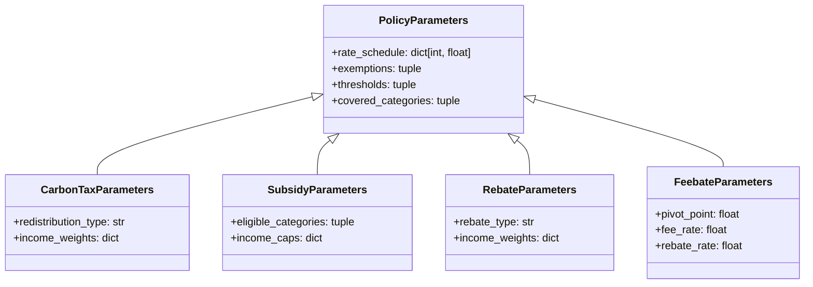

# Story 6.7: Rework Notebook UX — Policy-First Design

Status: ready-for-dev

<!-- Note: Validation is optional. Run validate-create-story for quality check before dev-story. -->

## Story

As a **first-time user or policy researcher**,
I want the quickstart and advanced notebooks to **lead with policy objects** (`CarbonTaxParameters`, `BaselineScenario`) instead of adapter configuration and raw parameter dicts,
so that I **understand the policy abstraction** well enough to define my own policy types — not just run pre-built demos.

## Acceptance Criteria

1. **AC-1: Policy-first quickstart flow** — Given the quickstart notebook, when a user reads cells in order, then the first code interaction is instantiating a `CarbonTaxParameters` object (not configuring an adapter), and the user sees every field on the policy object before any simulation runs.

2. **AC-2: Policy hierarchy is visible** — Given the quickstart notebook, when the user reaches the policy definition section, then a brief explanation (text + diagram) shows `PolicyParameters` → `CarbonTaxParameters` inheritance, making it clear the user could subclass `PolicyParameters` for their own policy type.

3. **AC-3: Adapter is a footnote, not a protagonist** — Given both notebooks, when the adapter is introduced, then it is explained in a single markdown cell + one code cell as "the computation engine — in production this is OpenFisca, here it's a demo adapter with a transparent formula." The formula `carbon_tax = emissions × (rate / 44.0)` is shown explicitly, not hidden in a closure.

4. **AC-4: Typed objects replace raw dicts** — Given both notebooks, when `ScenarioConfig` is constructed, then `template_name` maps clearly to the scenario's `name` field and `parameters` comes from the typed policy object (e.g., `dict(rate_schedule=dict(policy.rate_schedule))`), making the bridge between typed policy and execution config explicit and educational.

5. **AC-5: Advanced notebook teaches custom policy creation** — Given the advanced notebook, when the user reaches Section 4, then they see a complete example of subclassing `PolicyParameters` to create a custom policy type (e.g., a simplified feebate), wrapping it in a scenario, running it, and comparing results with the carbon tax scenario.

6. **AC-6: Quickstart narrative is "define → load → run → explore → modify → compare"** — Given the quickstart notebook, when executed end-to-end, then the section flow is: (1) Define a policy, (2) Load population data, (3) Run the simulation, (4) Distributional analysis, (5) Modify the policy and compare, (6) Reproducibility, (7) Next steps.

7. **AC-7: Advanced narrative is "multi-year → vintage → compare → custom policy → lineage"** — Given the advanced notebook, when executed end-to-end, then the section flow is: (1) Multi-year escalating policy, (2) Vintage tracking, (3) Baseline vs. reform comparison, (4) Build your own policy type, (5) Lineage and reproducibility, (6) Exports and next steps.

8. **AC-8: No API changes** — Given both notebooks, when reworked, then no changes are made to `run_scenario()`, `ScenarioConfig`, `RunConfig`, or any module under `src/reformlab/`. Only notebook `.ipynb` content changes.

9. **AC-9: CI passes** — Given both notebooks after rework, when `pytest --nbmake notebooks/` runs in CI, then all cells execute without errors and produce expected outputs.

10. **AC-10: Export section preserved** — Given the quickstart notebook, when the user reaches the export section, then CSV/Parquet export and manifest export functionality is demonstrated as before.

## Tasks / Subtasks

### Quickstart Notebook Rework (`notebooks/quickstart.ipynb`)

- [ ] Task 1: Rewrite Section 1 — "Define a Policy" (AC: #1, #2, #4)
  - [ ] 1.1: Replace adapter-first intro with markdown cell explaining policy objects and the `PolicyParameters` → `CarbonTaxParameters` hierarchy (include Mermaid class diagram)
  - [ ] 1.2: Add code cell instantiating `CarbonTaxParameters(rate_schedule={2025: 44.0}, ...)` with print showing all fields
  - [ ] 1.3: Add markdown + code cell wrapping policy in `BaselineScenario(name=..., parameters=policy, year_schedule=...)`
  - [ ] 1.4: Add code cell showing the explicit bridge from typed policy → `ScenarioConfig` → `RunConfig` with inline comments explaining each mapping (use the canonical bridge pattern from Dev Notes below — reuse this exact pattern in all bridge cells across both notebooks)

- [ ] Task 2: Rewrite Section 2 — "Load Population Data" (AC: #6)
  - [ ] 2.1: Keep existing CSV load + `show()` logic, update markdown framing to reference the policy defined above

- [ ] Task 3: Rewrite Section 3 — "Run the Simulation" (AC: #3, #6)
  - [ ] 3.1: Single markdown cell explaining the adapter pattern in one paragraph: "In production → OpenFisca, here → demo adapter, formula: `carbon_tax = emissions × (rate / 44.0)`"
  - [ ] 3.2: Single code cell creating demo adapter (using `create_quickstart_adapter()` — but with a comment showing the formula it applies, not baking the rate into it as a policy concept)
  - [ ] 3.3: Code cell calling `run_scenario(config, adapter=adapter)` and showing result. Note: `run_scenario()` full signature is `run_scenario(config: RunConfig, adapter: ComputationAdapter, *, steps: list[OrchestratorStep] | None = None, initial_state: dict | None = None) -> SimulationResult`. The quickstart uses only `config` + `adapter`; the advanced notebook's vintage section also uses `steps=` for `VintageTransitionStep`.
  - [ ] 3.4: Code cell inspecting `result.panel_output.table`

- [ ] Task 4: Rewrite Section 4 — "Distributional Analysis" (AC: #6)
  - [ ] 4.1: Keep existing indicator computation and decile plot, update narrative to reference the policy object

- [ ] Task 5: Rewrite Section 5 — "Modify and Compare" (AC: #1, #4, #6)
  - [ ] 5.1: Define a new `CarbonTaxParameters(rate_schedule={2025: 100.0})` — user sees modifying a typed object, not a raw dict
  - [ ] 5.2: Wrap in new scenario, bridge to `ScenarioConfig`, run, plot comparison
  - [ ] 5.3: Side-by-side chart using existing `SimulationResult.plot_comparison()` method (defined at `src/reformlab/interfaces/api.py` lines 332-379 — do NOT reimplement)

- [ ] Task 6: Rewrite Section 6 — "Reproducibility" (AC: #6)
  - [ ] 6.1: Keep manifest inspection and JSON export, trim verbosity

- [ ] Task 7: Rewrite Section 7 — "Export and Next Steps" (AC: #10, #6)
  - [ ] 7.1: Keep CSV/Parquet export cells and manifest export
  - [ ] 7.2: Update "Next Steps" markdown to mention the 4 policy types (`CarbonTaxParameters`, `SubsidyParameters`, `RebateParameters`, `FeebateParameters`) and tease "subclass `PolicyParameters` in the advanced notebook"

### Advanced Notebook Rework (`notebooks/advanced.ipynb`)

- [ ] Task 8: Rewrite Section 1 — "Multi-Year Escalating Policy" (AC: #4, #7)
  - [ ] 8.1: Define `CarbonTaxParameters(rate_schedule={2025: 50.0, 2026: 60.0, ..., 2034: 100.0})` as typed object
  - [ ] 8.2: Wrap in `BaselineScenario` with 2025-2034 year schedule
  - [ ] 8.3: Bridge to `ScenarioConfig` → `RunConfig`, run, show panel, plot yearly progression

- [ ] Task 9: Rewrite Section 2 — "Vintage Tracking" (AC: #7)
  - [ ] 9.1: Keep `VintageConfig`, `VintageTransitionStep`, initial fleet setup
  - [ ] 9.2: Update narrative to reference the policy object from Section 1, not adapter config
  - [ ] 9.3: Keep fleet evolution table and stacked area chart

- [ ] Task 10: Rewrite Section 3 — "Baseline vs. Reform Comparison" (AC: #7)
  - [ ] 10.1: Define baseline as `CarbonTaxParameters(rate_schedule={y: 44.0 for y in range(2025, 2035)})` — typed object
  - [ ] 10.2: Run both scenarios, compute distributional + fiscal indicators, plot comparison
  - [ ] 10.3: Keep fiscal comparison and per-year delta sections

- [ ] Task 11: **CREATE** new Section 4 — "Build Your Own Policy Type" (AC: #5, #7). This section does NOT exist in the current advanced notebook — it must be inserted as a new section between the current comparison section and the lineage section. All cells below are net-new.
  - [ ] 11.1: Markdown cell explaining that all built-in policies subclass `PolicyParameters`, and users can do the same
  - [ ] 11.2: Code cell defining a custom `SimpleFeebateParameters(PolicyParameters)` with `pivot_point`, `fee_rate`, `rebate_rate` fields
  - [ ] 11.3: Wrap in `BaselineScenario`, bridge to `ScenarioConfig`, create a demo adapter that handles the feebate formula
  - [ ] 11.4: Run and compare with carbon tax scenario from Section 1
  - [ ] 11.5: Markdown cell summarizing the pattern: "subclass → instantiate → wrap in scenario → run"

- [ ] Task 12: Rewrite Section 5 — "Lineage and Reproducibility" (AC: #7)
  - [ ] 12.1: Keep manifest inspection, cross-scenario lineage, deterministic rerun verification
  - [ ] 12.2: Update narrative to reference typed policy objects

- [ ] Task 13: Rewrite Section 6 — "Exports and Next Steps" (AC: #7, #10)
  - [ ] 13.1: Keep Parquet/CSV export cells, comparison table export, round-trip verification
  - [ ] 13.2: Update "Next Steps" to reference custom policy types as a demonstrated capability

### Cross-Cutting

- [ ] Task 14: Verify CI (AC: #9)
  - [ ] 14.1: Verify `pyproject.toml` pytest config — `testpaths` is currently `["tests"]` only. Notebook tests must be run explicitly via `pytest --nbmake notebooks/quickstart.ipynb notebooks/advanced.ipynb` (not bare `pytest`). Confirm this command is documented or add a `[tool.pytest.ini_options]` marker/alias if desired.
  - [ ] 14.2: Run `pytest --nbmake notebooks/quickstart.ipynb notebooks/advanced.ipynb` and fix any failures
  - [ ] 14.3: Ensure all cells execute without errors in clean kernel restart

- [ ] Task 15: Verify no API changes (AC: #8)
  - [ ] 15.1: Run full test suite `pytest tests/` to confirm no regressions
  - [ ] 15.2: Verify no files changed under `src/reformlab/`

## Dev Notes

### Core Principle

These notebooks are **teaching tools**, not just demos. The goal is that by the end of the advanced notebook, the user understands the policy abstraction well enough to create their own policy type. Every cell should serve that learning journey.

### Current State (What You're Changing From)

- **Quickstart notebook** currently leads with adapter configuration (cell 6 creates adapter before any policy object). Uses raw parameter dicts (`{"rate_schedule": {2025: 44.0}}`) throughout. No typed policy objects imported or used. Narrative flow is adapter-first → data → run → analyze.
- **Advanced notebook** has 3 existing sections (multi-year, vintage, comparison) but no Section 4 ("Build Your Own Policy Type"). Uses same raw dict pattern. Vintage section uses `run_scenario()` with `steps=[VintageTransitionStep(...)]`.
- **Neither notebook** imports from `reformlab.templates.schema` — they only use the top-level `reformlab` API imports.

### What Changes (Content Only)

- **Cell order and narrative structure** of both notebooks
- **Markdown explanations** — rewritten to lead with policy concepts
- **Code cells** — reordered so policy objects come first, adapter comes later
- **New section in advanced notebook** — "Build Your Own Policy Type" (Section 4)
- **No changes to any Python module** under `src/reformlab/`

### What Stays the Same

- All existing API calls (`run_scenario()`, `SimulationResult`, `indicators()`, `compare_scenarios()`)
- The `create_quickstart_adapter()` function — still used, just introduced later and explained better
- Matplotlib plotting patterns
- Export functionality (CSV, Parquet, manifest JSON)
- Vintage tracking demonstration
- Deterministic rerun verification
- Error UX format from story 6.6: `[What failed] — [Why] — [How to fix]`. If notebooks intentionally demonstrate error handling or show what happens with bad parameters, ensure error messages follow this format (already implemented in the API layer).

### Key Imports to Add in Notebooks

```python
# Quickstart — new imports for typed policy objects
from reformlab.templates.schema import (
    CarbonTaxParameters,
    BaselineScenario,
    PolicyParameters,
    YearSchedule,
)

# Advanced — additional imports for custom policy
from reformlab.templates.schema import (
    CarbonTaxParameters,
    FeebateParameters,
    BaselineScenario,
    PolicyParameters,
    YearSchedule,
)
```

### The Bridge Pattern (typed policy → ScenarioConfig)

Since we're not changing the API, notebooks must bridge from typed objects to `ScenarioConfig`. This bridge should be **explicit and educational**:

```python
# 1. Define the typed policy
policy = CarbonTaxParameters(
    rate_schedule={2025: 44.0},
    redistribution_type="",
)

# 2. Wrap in a scenario
scenario = BaselineScenario(
    name="france-carbon-tax-2025",
    policy_type="carbon_tax",
    year_schedule=YearSchedule(start_year=2025, end_year=2025),
    parameters=policy,
    description="France's carbon tax at current rate",
)

# 3. Bridge to execution config (this is what run_scenario() needs today)
config = RunConfig(
    scenario=ScenarioConfig(
        template_name=scenario.name,
        parameters={"rate_schedule": dict(policy.rate_schedule)},
        start_year=scenario.year_schedule.start_year,
        end_year=scenario.year_schedule.end_year,
    ),
    seed=42,
)
```

Add a comment in the notebook: "In a future API version, `run_scenario()` will accept `BaselineScenario` directly. For now, this bridge makes the mapping explicit."

### Mermaid Diagram for Policy Hierarchy (Quickstart Section 1)



### Adapter Explanation (Single Paragraph)

Use this wording in the quickstart (Section 3, markdown cell):

> ReformLab uses an **adapter pattern** to separate policy definition from computation. The adapter is the engine that applies tax formulas to population data. In production, this is an OpenFisca adapter running the full French tax-benefit microsimulation. For this quickstart, we use a demo adapter that applies a transparent formula: `carbon_tax = carbon_emissions × (rate / 44.0)`, `disposable_income = income - carbon_tax`. The important thing: **you define the policy, the adapter computes it**.

### Custom Policy Example (Advanced Section 4)

```python
from dataclasses import dataclass, field
from reformlab.templates.schema import PolicyParameters

@dataclass(frozen=True)
class SimpleFeebateParameters(PolicyParameters):
    """A feebate taxes high emitters and rebates low emitters."""
    pivot_point: float = 5.0       # tCO2/year threshold
    fee_rate: float = 50.0         # €/tCO2 above pivot
    rebate_rate: float = 30.0      # €/tCO2 below pivot
```

### Provenance Note

This story was added post-retrospective via a Party Mode UX analysis session (2026-03-02). It does not have a corresponding entry in the canonical epics file (`epics.md` lists Epic 6 stories up to BKL-606 / story 6.6). The epic-6-retrospective is already marked `done` in sprint-status while epic-6 remains `in-progress` to accommodate this late addition.

### Project Structure Notes

- Only two files modified: `notebooks/quickstart.ipynb` and `notebooks/advanced.ipynb`
- No new files created under `src/`
- No changes to test files under `tests/`
- Alignment with existing project structure is maintained

### References

- [Source: _bmad-output/planning-artifacts/architecture.md — Interfaces Layer, Adapter Pattern]
- [Source: _bmad-output/implementation-artifacts/6-2-build-quickstart-notebook.md — Original quickstart story]
- [Source: _bmad-output/implementation-artifacts/6-3-build-advanced-notebook.md — Original advanced story]
- [Source: src/reformlab/templates/schema.py — PolicyParameters hierarchy]
- [Source: src/reformlab/interfaces/api.py — ScenarioConfig, RunConfig, run_scenario(), create_quickstart_adapter()]
- [Source: src/reformlab/computation/adapter.py — ComputationAdapter protocol]
- [Source: Party Mode session 2026-03-02 — UX analysis identifying adapter-first confusion, hidden formula, raw dict issues]

## Dev Agent Record

### Agent Model Used

### Debug Log References

### Completion Notes List

### File List
