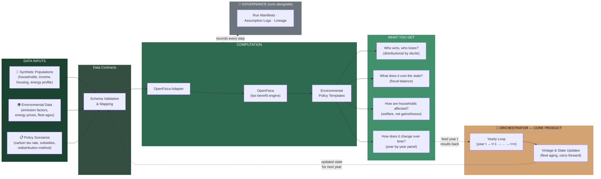
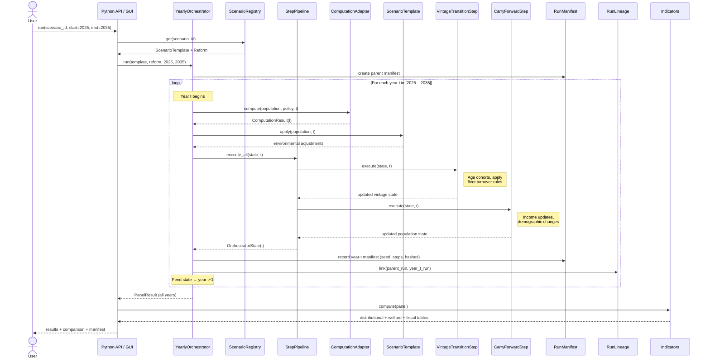

# ReformLab Architecture Diagrams

Three views of the same system at different zoom levels:

1. **Data Flow Architecture** — how data and policy flow through the system to produce results, and how the orchestrator loops it over time
2. **Class / Interface Diagram** — key types, protocols, and relationships within each package
3. **Orchestrator Sequence Diagram** — runtime flow of the core product logic

---

## 1. Data Flow Architecture

Three input streams converge into OpenFisca computation, producing distributional results. The orchestrator wraps the entire process in a multi-year loop, feeding each year's outputs back as the next year's inputs with vintage and state updates.

---

## 2. Class / Interface Diagram

```mermaid
classDiagram
    direction TB

    namespace computation {
        class ComputationAdapter {
            <<Protocol>>
            +compute(population, policy, period) ComputationResult
            +version() str
        }
        class OpenFiscaAdapter {
            -version_pin : str
            -mapping_config : MappingConfig
            +compute(population, policy, period) ComputationResult
            +version() str
        }
        class PopulationData {
            +households : DataFrame
            +metadata : dict
        }
        class PolicyConfig {
            +policy_type : str
            +parameters : dict
            +year_schedule : dict
        }
        class ComputationResult {
            +outputs : DataFrame
            +period : int
            +adapter_version : str
        }
    }

    namespace data {
        class DataPipeline {
            +load_population(source) PopulationData
            +load_emission_factors(source) DataFrame
            +validate(contract) ValidationResult
        }
        class DataContract {
            +required_fields : list
            +field_types : dict
            +validate(data) ValidationResult
        }
        class DataSource {
            +path : str
            +format : str
            +hash : str
        }
    }

    namespace templates {
        class ScenarioTemplate {
            +policy_type : str
            +baseline_params : dict
            +year_schedule : dict
            +apply(population, year) DataFrame
        }
        class Reform {
            +base_scenario_id : str
            +overrides : dict
        }
        class ScenarioRegistry {
            +register(template) str
            +get(version_id) ScenarioTemplate
            +clone(version_id) ScenarioTemplate
            +list_versions() list
        }
    }

    namespace orchestrator {
        class OrchestratorStep {
            <<Protocol>>
            +execute(state, year) OrchestratorState
            +name() str
        }
        class YearlyOrchestrator {
            -adapter : ComputationAdapter
            -pipeline : StepPipeline
            -governance : ManifestWriter
            +run(scenario, start, end) PanelResult
        }
        class StepPipeline {
            -steps : list~OrchestratorStep~
            +register(step)
            +execute_all(state, year) OrchestratorState
        }
        class OrchestratorState {
            +population : PopulationData
            +vintage_state : dict
            +year : int
            +seed : int
        }
        class PanelResult {
            +yearly_results : dict
            +manifest_id : str
            +export_csv(path)
            +export_parquet(path)
        }
    }

    namespace vintage {
        class VintageTransitionStep {
            -asset_class : str
            -transition_rules : list~TransitionRule~
            +execute(state, year) OrchestratorState
            +name() str
        }
        class CarryForwardStep {
            -rules : dict
            +execute(state, year) OrchestratorState
            +name() str
        }
        class AssetCohort {
            +asset_class : str
            +vintage_year : int
            +count : int
            +attributes : dict
        }
        class TransitionRule {
            +asset_class : str
            +aging_fn : Callable
            +replacement_fn : Callable
        }
    }

    namespace indicators {
        class Indicator {
            <<Protocol>>
            +compute(panel) DataFrame
            +name() str
        }
        class DistributionalIndicator {
            +grouping : str
            +compute(panel) DataFrame
        }
        class WelfareIndicator {
            +compute(panel) DataFrame
        }
        class FiscalIndicator {
            +cumulative : bool
            +compute(panel) DataFrame
        }
        class ScenarioComparison {
            +baseline : PanelResult
            +reform : PanelResult
            +compare() DataFrame
        }
    }

    namespace governance {
        class RunManifest {
            +run_id : str
            +adapter_version : str
            +scenario_version : str
            +data_hashes : dict
            +seeds : dict
            +parameters : dict
            +timestamp : str
            +verify_integrity() bool
        }
        class AssumptionLog {
            +entries : list
            +add(source, method, value)
        }
        class RunLineage {
            +parent_id : str
            +child_ids : list
            +link(parent, child)
            +get_children(run_id) list
        }
    }

    OpenFiscaAdapter ..|> ComputationAdapter
    VintageTransitionStep ..|> OrchestratorStep
    CarryForwardStep ..|> OrchestratorStep
    DistributionalIndicator ..|> Indicator
    WelfareIndicator ..|> Indicator
    FiscalIndicator ..|> Indicator

    YearlyOrchestrator --> ComputationAdapter : uses
    YearlyOrchestrator --> StepPipeline : executes
    YearlyOrchestrator --> RunManifest : writes
    StepPipeline --> OrchestratorStep : contains
    YearlyOrchestrator --> ScenarioTemplate : reads
    ScenarioRegistry --> ScenarioTemplate : stores
    Reform --> ScenarioTemplate : overrides
    VintageTransitionStep --> AssetCohort : updates
    VintageTransitionStep --> TransitionRule : applies
    ScenarioComparison --> PanelResult : compares
    DataPipeline --> DataContract : validates against
    DataPipeline --> PopulationData : produces
    RunLineage --> RunManifest : links
```

Key types, protocols (`<<Protocol>>`), and relationships across all 8 packages.

---

## 3. Orchestrator Sequence Diagram

Runtime flow of a multi-year scenario run — the core product logic. Shows how the yearly loop coordinates the adapter, templates, pluggable steps, governance, and indicators.

---

## Reading Guide

| Diagram | Question it answers | Audience |
|---|---|---|
| Data Flow Architecture | "What goes in, what happens, what comes out — and how does the loop work?" | Everyone — analysts, stakeholders, new contributors |
| Class / Interface | "What are the key types? Where are the extension points?" | Developers implementing or extending the system |
| Orchestrator Sequence | "What happens at runtime when I run a scenario?" | Developers, testers, and analysts understanding the core loop |
