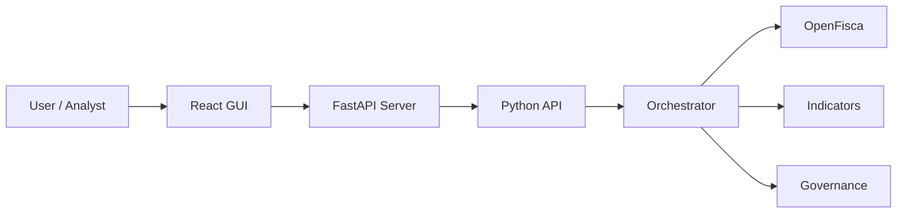
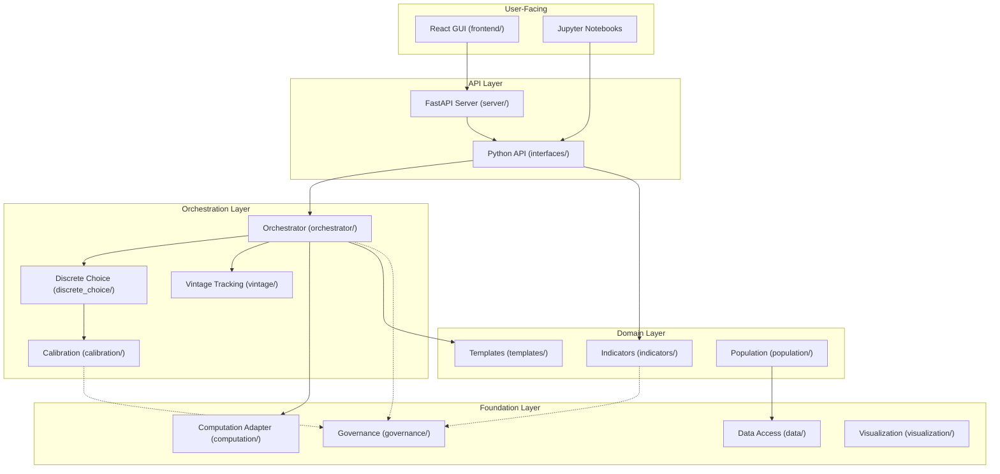
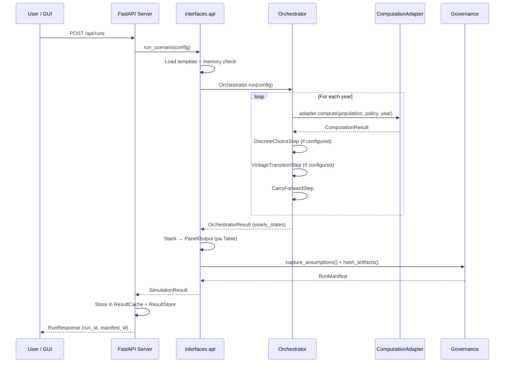
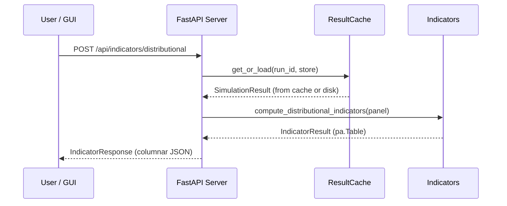
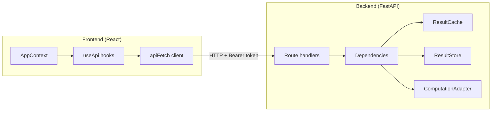

# Architecture — ReformLab

**Generated:** 2026-03-08
**Status:** Phase 2 Complete (Epics 1–17)

## How to Read This Document

This architecture document is organized to answer questions in order of increasing depth:

1. **What does this system do?** (System Overview)
2. **How is it structured?** (Layered Architecture)
3. **What are the key design decisions?** (Architecture Patterns)
4. **How do the pieces connect?** (Data Flow and Integration)
5. **How does each subsystem work?** (Subsystem Reference)

If you are new to the project, read sections 1–4 first. Section 5 is a reference you can consult when working on a specific subsystem.

---

## 1. System Overview

ReformLab is an environmental policy analysis platform. You give it a population (households), a policy (carbon tax, subsidies, etc.), and a time horizon — it simulates the multi-year effects and produces indicators (who wins, who loses, fiscal impact, distributional effects).

**The core insight:** ReformLab is **not** a computation engine. It is an **orchestration platform** that wraps OpenFisca (or any tax-benefit engine) and adds everything above: scenario management, multi-year simulation, behavioral modeling, portfolio comparison, reproducibility, and a GUI.



---

## 2. Layered Architecture

The system is organized in layers. Each layer depends only on the layers below it. This makes each layer independently testable and replaceable.



**Reading the diagram:** Solid arrows = direct dependency. Dotted arrows = cross-cutting concern (governance is used by many layers but does not own any business logic).

### Layer Responsibilities

| Layer | Purpose | Key Question It Answers |
| ----- | ------- | ----------------------- |
| User-Facing | Present results, accept input | "What does the user see?" |
| API | Expose stable interfaces | "How do I call the system?" |
| Orchestration | Run multi-year simulations | "What happens year by year?" |
| Domain | Define policies, compute indicators | "What policies exist? What do the results mean?" |
| Foundation | Access data, compute taxes, ensure reproducibility | "Where does the data come from? Can I trust the results?" |

---

## 3. Architecture Patterns

These are the key design decisions that shape the entire codebase. Understanding them helps you predict how any new feature should be built.

### 3.1 Adapter Pattern — Backend Swapping

**Problem:** We do not want to be locked into OpenFisca. Other engines (PolicyEngine, custom models) should be pluggable.

**Solution:** The `ComputationAdapter` protocol defines a two-method contract. Any class that implements `compute()` and `version()` works — no inheritance needed.

```python
# This is the entire contract. Nothing else required.
class ComputationAdapter(Protocol):
    def compute(self, population: PopulationData, policy: PolicyConfig, period: int) -> ComputationResult: ...
    def version(self) -> str: ...
```

**Consequence:** No module outside `computation/` imports OpenFisca directly. The orchestrator only sees the protocol.

### 3.2 Protocol-Driven Design — Structural Typing

**Problem:** Traditional inheritance creates tight coupling. Subclasses must know about base classes.

**Solution:** Use Python `Protocol` (PEP 544) for all extension points. Any class with the right methods satisfies the contract — no registration, no base class.

**Four core protocols:**

| Protocol | Methods | Used By |
| -------- | ------- | ------- |
| `ComputationAdapter` | `compute()`, `version()` | Orchestrator → tax-benefit engine |
| `OrchestratorStep` | `name`, `execute(year, state)` | Orchestrator → pluggable pipeline steps |
| `DataSourceLoader` | `download()`, `status()`, `descriptor()` | Population → institutional data sources |
| `MergeMethod` | `merge()` | Population → statistical fusion methods |

### 3.3 Frozen Dataclasses — Immutability by Default

**Problem:** Mutable state causes bugs that are hard to trace, especially in multi-year simulations where the same data passes through many steps.

**Solution:** All input and configuration types use `@dataclass(frozen=True)`. Once created, an object cannot be modified. You create new objects instead. Result types (e.g. `OrchestratorResult`) are mutable since they are built incrementally.

```python
@dataclass(frozen=True)
class YearState:
    year: int
    data: dict[str, Any]
    seed: int | None = None
    metadata: dict[str, Any]
```

**Consequence:** All domain types are hashable (can be used as dict keys), safe for caching, and safe to share across threads.

### 3.4 PyArrow-First Data Model

**Problem:** Pandas DataFrames are convenient but memory-hungry, slow to serialize, and loosely typed.

**Solution:** All tabular data uses PyArrow Tables. This gives columnar storage (memory-efficient), zero-copy serialization, type safety, and native Parquet support.

**Where PyArrow is used:**

- `PopulationData.tables` — input households
- `ComputationResult.output_fields` — tax-benefit computation output
- `PanelOutput.table` — household-by-year panel (main simulation output)
- `CostMatrix.table` — discrete choice cost matrix
- `IndicatorResult.indicators` — typed indicator sequences (`DecileIndicators`, `RegionIndicators`, etc.)

### 3.5 Manifest-First Governance

**Problem:** In policy analysis, you need to prove that a result is reproducible. "Run it again and see" is not good enough.

**Solution:** Every simulation run produces a `RunManifest` — an immutable record that captures everything needed to reproduce the result:

- **Seeds:** All random seeds (master + per-year)
- **Policy:** Complete parameter snapshot
- **Hashes:** SHA-256 of all inputs and outputs
- **Assumptions:** Every assumption with its source (default vs. user-specified)
- **Lineage:** Parent/child relationships between runs
- **Integrity hash:** SHA-256 of the manifest itself (tamper detection)

**Consequence:** You can export a "replication package" and anyone can reproduce the exact same result.

### 3.6 Error Responses — What / Why / Fix

**Problem:** Generic error messages like "Internal Server Error" or "Invalid input" don't help users fix the problem.

**Solution:** Every error response follows a three-field pattern:

```python
{
    "what": "Run 'abc123' not found",           # What happened
    "why": "No metadata record for this run_id", # Why it happened
    "fix": "Check the run_id; ensure the simulation was executed"  # How to fix it
}
```

This pattern is used consistently in both the HTTP API (`HTTPException`) and domain exceptions.

---

## 4. Data Flow

### 4.1 Simulation Run — End to End

This is the most important data flow. It shows what happens when a user clicks "Run Simulation" in the GUI.



### 4.2 Indicator Computation

After a run completes, the user requests indicators. These are computed from the stored panel data.



### 4.3 Frontend-Backend Integration

The frontend communicates with the backend through a typed API client layer.



**API proxy:** In development, Vite proxies `/api/*` to `http://localhost:8000`. In production, Traefik routes `api.reformlab.fr` to the backend container.

### 4.4 Result Persistence

Results are persisted in two tiers: a fast in-memory LRU cache and a durable filesystem store.

```text
ResultCache (in-memory, LRU, max 10 entries)
    ↓ cache miss
ResultStore (filesystem)
    ~/.reformlab/results/{run_id}/
    ├── metadata.json     # Immutable metadata (status, row_count, manifest_id)
    ├── panel.parquet      # Household-by-year panel (PyArrow)
    └── manifest.json      # Full run manifest (assumptions, hashes, lineage)
```

`get_or_load(run_id, store)` checks the cache first, then falls back to disk. This means results survive server restarts.

---

## 5. Subsystem Reference

This section describes each subsystem in detail. Consult it when you need to understand or modify a specific part of the system.

### 5.1 Computation (`computation/`)

**Purpose:** Abstract interface to tax-benefit backends.

**Key types:**

| Type | Role |
| ---- | ---- |
| `ComputationAdapter` | Protocol — the swap point for backends |
| `PopulationData` | Input: PyArrow tables keyed by entity (individu, menage) |
| `PolicyConfig` | Input: policy parameters for a single period |
| `ComputationResult` | Output: computed fields + per-entity tables |
| `OpenFiscaApiAdapter` | Concrete implementation for OpenFisca |
| `MockAdapter` | Test double for orchestrator tests |

**Data contracts:** `DataSchema` validates CSV/Parquet at ingestion boundaries. `FieldMapping` maps between OpenFisca variable names and project schema.

### 5.2 Templates (`templates/`)

**Purpose:** Define what policies look like and how they are configured.

**Policy type hierarchy:**

```text
PolicyParameters (base: rate_schedule, exemptions, thresholds, covered_categories)
├── CarbonTaxParameters (+redistribution_type, +income_weights)
├── SubsidyParameters (+eligible_categories, +income_caps)
├── RebateParameters (+rebate_type, +income_weights)
├── FeebateParameters (+pivot_point, +fee_rate, +rebate_rate)
├── VehicleMalusParameters (custom template)
└── EnergyPovertyAidParameters (custom template)
```

**Portfolio composition:** A `PolicyPortfolio` bundles 2+ policies together. Conflict detection identifies overlapping parameters, and resolution strategies (error, sum, first_wins, last_wins, max) handle them.

**Scenario versioning:** `ScenarioRegistry` provides immutable version tracking. Each save creates a new version — no overwrites.

### 5.3 Orchestrator (`orchestrator/`)

**Purpose:** Execute multi-year projections as a pluggable step pipeline.

**How it works:** The `Orchestrator` takes a `YearState` and runs it through a pipeline of steps for each year. Each step transforms the state and passes it to the next.

```text
Year 2025: state₀ → [ComputationStep] → [DiscreteChoiceStep] → [VintageStep] → [CarryForward] → state₁
Year 2026: state₁ → [ComputationStep] → [DiscreteChoiceStep] → [VintageStep] → [CarryForward] → state₂
...
```

**Built-in steps:**

| Step | Purpose |
| ---- | ------- |
| `ComputationStep` | Invokes the adapter to compute taxes/benefits |
| `DiscreteChoiceStep` | Expands population, computes choice probabilities |
| `VintageTransitionStep` | Ages asset cohorts, applies transition rules |
| `CarryForwardStep` | Deterministic state carry-over between years |
| `PortfolioComputationStep` | Runs multiple policies in sequence |

**Extensibility:** Any class with a `name` property and an `execute(year, state)` method satisfies the `OrchestratorStep` protocol. You can also use bare functions via `adapt_callable()`.

### 5.4 Discrete Choice (`discrete_choice/`)

**Purpose:** Model household behavioral responses to policy changes (e.g., vehicle investment, heating system choice).

**The pipeline:**

1. **Expansion** — N households × M alternatives = N×M rows
2. **Cost matrix** — Compute cost of each alternative for each household
3. **Logit model** — Conditional logit with seed-controlled random draws
4. **State update** — Apply chosen alternative to household state

**Decision domains:** `VehicleInvestmentDomain` and `HeatingInvestmentDomain` are the concrete implementations. Each defines its alternatives, cost function, and state update logic.

**Eligibility filtering:** `EligibilityFilter` pre-screens households to skip those with no viable alternatives, improving performance on large populations.

### 5.5 Calibration (`calibration/`)

**Purpose:** Tune discrete choice taste parameters so simulated transition rates match observed real-world rates.

**Workflow:**

1. Load `CalibrationTargetSet` — observed transition rates (e.g., "5% of households switched to EV in 2024")
2. `CalibrationEngine` optimizes `TasteParameters` via scipy to minimize divergence
3. `validate_holdout()` tests calibrated parameters against held-out data
4. `capture_calibration_provenance()` records everything in the run manifest

### 5.6 Population (`population/`)

**Purpose:** Generate realistic household populations by fusing institutional data sources.

**Data sources (5 loaders):**

| Loader | Source | Data |
| ------ | ------ | ---- |
| `INSEELoader` | French national statistics | Demographics, income |
| `EurostatLoader` | EU statistics | Cross-country data |
| `ADEMELoader` | Energy/environment agency | Energy consumption, emissions |
| `SDESLoader` | Transport statistics | Vehicle ownership, mobility |
| `EuSilcLoader` | EU-SILC survey | Harmonized income and living conditions |

**Merge methods (3 strategies):**

| Method | How It Works |
| ------ | ------------ |
| `UniformMergeMethod` | Random matching with replacement |
| `IPFMergeMethod` | Iterative Proportional Fitting to known marginals |
| `ConditionalSamplingMethod` | Stratum-based conditional sampling |

**Pipeline:** `PopulationPipeline` composes loaders and methods into a reproducible generation workflow with assumption chain recording.

### 5.7 Indicators (`indicators/`)

**Purpose:** Compute analytics from simulation panel output.

**Indicator types:**

| Type | What It Computes |
| ---- | ---------------- |
| Distributional | Per-decile metrics (count, mean, median, sum, min, max) |
| Geographic | Per-region aggregations |
| Welfare | Winner/loser analysis (who gains, who loses) |
| Fiscal | Revenue, cost, balance, cumulative effects |
| Custom | User-defined formulas over panel columns |
| Comparison | Baseline vs. reform deltas |
| Portfolio comparison | Cross-portfolio ranking on multiple criteria |

### 5.8 Governance (`governance/`)

**Purpose:** Ensure every result is reproducible, auditable, and tamper-evident.

**Capabilities:**

- **Manifests** — Immutable run records with all parameters and seeds
- **Hashing** — SHA-256 integrity for inputs, outputs, and the manifest itself
- **Lineage** — Parent/child graph between runs
- **Reproducibility** — Re-run and verify identical output
- **Benchmarking** — Validate outputs against reference data
- **Memory estimation** — Preflight checks before large runs
- **Replication packages** — Export/import complete run bundles

### 5.9 Server (`server/`)

**Purpose:** HTTP facade over the Python API. Thin layer — no business logic in routes.

**API surface (14 route modules):**

| Route prefix | Key endpoints |
| ------------ | ------------- |
| `/api/auth` | Authentication |
| `/api/runs` | `POST /` execute, `POST /memory-check` preflight |
| `/api/indicators/{type}` | `POST /` compute indicators |
| `/api/comparison` | `POST /` baseline vs reform, `POST /portfolios` multi-run |
| `/api/scenarios` | `GET /`, `GET /{name}`, `POST /`, `POST /{name}/clone` |
| `/api/templates` | `GET /`, `GET /{name}`, `GET /categories` |
| `/api/portfolios` | `GET /`, `POST /`, `PUT /{name}`, `POST /validate` |
| `/api/populations` | `GET /`, `GET /{id}/preview`, `GET /{id}/profile`, `GET /{id}/crosstab`, `POST /upload` |
| `/api/data-fusion` | `GET /sources/{provider}`, `POST /generate` |
| `/api/exogenous` | Exogenous time series data |
| `/api/results` | `GET /` list saved results |
| `/api/exports` | `POST /` CSV export |
| `/api/decisions` | `GET /` decision audit trail |
| `/api/validation` | Preflight validation checks |

**Canonical analysis objects:** `Portfolio` stores reusable policy bundles. `Scenario` stores the versioned combination of portfolio, selected population(s), simulation configuration, mappings, and metadata. `Run` executes one scenario version, potentially as a scenario-by-population matrix when multiple populations are selected.

**Mode ownership is explicit:** `Scenario` owns `simulation_mode` (`annual` or `horizon_step`) plus horizon settings and inherited population references. `Run` and its manifest own `runtime_mode` (`live` or explicit `replay`). These fields are intentionally separate: simulation behavior is not the same thing as live-vs-replay execution path.

**Population ownership is split by stage, not by object:** Stage 2 writes the primary population selection into the durable scenario object. The later Scenario stage consumes and displays that inherited context, and may add optional sensitivity populations without forcing primary-population reselection.

**Dependency injection:** Three global singletons — `ResultCache` (LRU), `ResultStore` (disk), `ComputationAdapter` (backend) — initialized lazily and overridable in tests.

### 5.10 Frontend (`frontend/`)

**Purpose:** No-code GUI for analysts who prefer a visual interface over notebooks or API calls.

**Architecture:** React 19 SPA with centralized state (`AppContext`), typed API client, and Shadcn/Radix component library.

**Interaction model:** The GUI is a four-stage shell (with sub-views) over the same scenario registry and run model exposed by the API. Stage keys are defined in `frontend/src/types/workspace.ts`.

| Stage (key) | Label | Purpose | Sub-views | Primary frontend surfaces |
| ----------- | ----- | ------- | --------- | ------------------------- |
| `policies` | Policies & Portfolio | Build or edit reusable policy bundles and surface truthful catalog availability | — | `PoliciesStageScreen`, template browser, inline policy-set composition |
| `population` | Population | Select, generate, upload, and inspect populations | `data-fusion`, `population-explorer` | `PopulationLibraryScreen`, `DataFusionWorkbench`, population explorer/profiler |
| `engine` | Scenario | Configure simulation mode, horizon settings, investment decisions, inherited population context, optional sensitivity population, and validation | `decisions` | `EngineStageScreen`, `InvestmentDecisionsWizard`, `ValidationGate`, run summary |
| `results` | Run / Results / Compare | Execute runs, inspect results, compare completed runs, export outputs | `runner`, `comparison` | `SimulationRunnerScreen`, `ResultsOverviewScreen`, `ComparisonDashboardScreen` |

Note: The stage key `engine` refers to the simulation/execution configuration scope. The user-facing label is "Scenario" because this stage configures the full execution context (engine settings, horizon, investment decisions, validation). The broader concept of a "scenario" (policy + population + engine + parameters) spans all stages and is represented by the `WorkspaceScenario` type.

**Scenario semantics in the GUI:** Users may enter through a pre-seeded demo scenario or an existing saved scenario. Stages 1-3 edit the scenario definition; Stage 4 executes and compares runs produced from that scenario. Browser routes map to stage/sub-view state rather than to the older sequence of full-screen setup pages.

**Runtime semantics in the GUI:** Standard web execution defaults to live OpenFisca. Replay remains available only through explicit demo or manual flows and is reflected in run metadata and manifest surfaces. The first slice does not add a user-facing runtime or engine selector to the standard Scenario flow.

**State management:** Single `AppContext` manages data fetching, stage navigation, selected scenario, population/profile inspection state, and run execution. Typed hooks in `useApi.ts` handle individual data domains with loading/error/mock-fallback patterns.

**Design system:** 18 Shadcn/Radix UI primitives styled with Tailwind v4. Chart colors defined as CSS custom properties (`--chart-baseline`, `--chart-reform-a` through `-d`).

---

## 6. Technology Stack

### Backend

| Category | Technology | Version | Role |
| -------- | ---------- | ------- | ---- |
| Language | Python | 3.13+ | Core runtime |
| Package manager | uv | latest | Fast dependency resolution |
| Build | hatchling | latest | Package build backend |
| Web framework | FastAPI | 0.133+ | HTTP API |
| ASGI server | uvicorn | 0.41+ | Production server |
| Data | PyArrow | 18.0+ | Columnar data and Parquet I/O |
| Computation | OpenFisca | optional | Tax-benefit engine (adapter pattern) |
| Optimization | scipy | 1.14+ | Calibration engine |
| Validation | jsonschema | 4.23+ | Schema validation |
| Serialization | PyYAML | 6.0+ | YAML scenario files |
| Plotting | matplotlib | 3.8+ | Notebook visualizations |
| Linting | ruff | 0.15+ | Fast Python linter |
| Type checking | mypy | 1.19+ | Strict mode enabled |
| Testing | pytest | 8.3+ | 11,000+ tests, 80%+ coverage |
| Notebooks | nbmake | 1.4+ | Notebook execution tests |

### Frontend

| Category | Technology | Version | Role |
| -------- | ---------- | ------- | ---- |
| Framework | React | 19.1 | UI rendering |
| Language | TypeScript | 5.9 | Type safety |
| Build | Vite | 7.1 | Dev server + bundler |
| Styling | Tailwind CSS | v4 | Utility-first CSS |
| Charts | Recharts | 3.1 | Data visualization |
| UI primitives | Radix UI | various | Headless accessible components |
| Icons | Lucide React | 0.542 | Icon library |
| Toasts | Sonner | 2.0 | Toast notifications |
| Layout | react-resizable-panels | 3.0 | Resizable 3-panel workspace |
| Testing | Vitest | 3.2 | Test runner |
| Testing | Testing Library | 16.3 | Component testing |
| Linting | ESLint | 9.34 | Code quality |

### Infrastructure

| Category | Technology | Role |
| -------- | ---------- | ---- |
| CI | GitHub Actions | Lint, type-check, test, notebook validation |
| CD | Kamal 2 | Docker-based deployment |
| Containerization | Docker | Backend (python:3.13-slim) + Frontend (nginx:alpine) |
| Hosting | Hetzner VPS | Single-machine deployment |
| Proxy | Traefik | HTTPS routing, Let's Encrypt SSL |
| Domains | api.reformlab.fr / app.reformlab.fr | Production URLs |

---

## 7. Quality Checks

Run these before marking any work as done:

```bash
# Backend
uv run ruff check src/ tests/     # Lint (0 errors required)
uv run mypy src/                   # Type check (strict mode)
uv run pytest tests/               # 11,000+ tests

# Frontend
npm run typecheck                  # TypeScript check
npm run lint                       # ESLint
npm test                           # Vitest
```

All checks run automatically in CI on every push.
