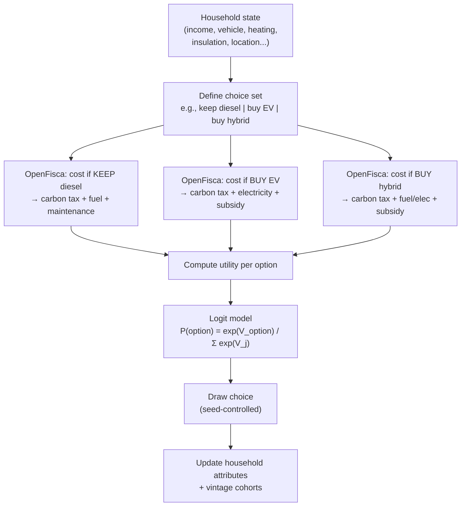
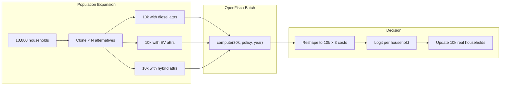
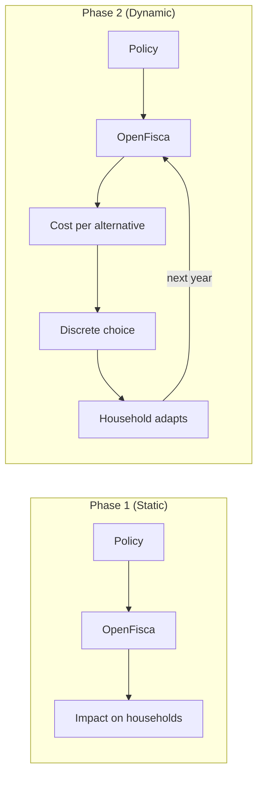

# Phase 2 Design Note: Discrete Choice Model for Household Investment Decisions

## Purpose

This document captures the design direction for Phase 2 behavioral responses in ReformLab. Household investment decisions — energy renovation, vehicle replacement, heating system changes — are modeled as **discrete choice problems using logit functions**, grounded in microeconomic foundations.

## Core Concept

Households face a finite set of investment alternatives. Each alternative has a calculable cost (including taxes, subsidies, energy expenses). Households choose probabilistically based on relative costs, following a discrete choice (logit) model.

This is the standard McFadden-style approach used in transport economics and energy transition modeling.

## How It Works

### Decision Flow Per Household Per Year



### Why OpenFisca Must Evaluate Each Alternative

The cost of each option depends on household-specific policy interactions:

- **Carbon tax** amounts differ by vehicle type and usage — calculated by OpenFisca
- **Subsidies are means-tested** — MaPrimeRénov' and bonus écologique depend on household income, which OpenFisca evaluates
- **Tax credits** interact with income tax brackets
- **Energy costs** depend on consumption patterns affected by policy parameters

You cannot decompose these costs outside OpenFisca because the policy rules live inside it. Each alternative requires a separate OpenFisca evaluation for that household.

## Integration With the Current Architecture

### What Already Exists (Phase 1)

| Component | Status | Role in discrete choice |
|---|---|---|
| Step-pluggable orchestrator | Built | Decision step registers as a new `OrchestratorStep` |
| `ComputationAdapter.compute()` | Built | Called multiple times per year (once per alternative set) |
| Vintage tracking | Built | Records cohort changes when households switch assets |
| Carry-forward rules | Built | Propagates decision outcomes to subsequent years |
| Seed control | Built | Makes probabilistic logit draws reproducible |
| Panel output | Built | Tracks which households made which decisions each year |
| Run manifests | Built | Records behavioral model parameters for auditability |

### What Phase 2 Adds

A new orchestrator step — `DiscreteChoiceStep` — that runs after the baseline OpenFisca computation and before state carry-forward.

### Population Expansion Pattern

The adapter interface does not need to change. The decision step **expands the population** to evaluate alternatives:

```text
Original population:     10,000 households
Expand by alternatives:  10,000 × 3 options = 30,000 "virtual" households
Run OpenFisca:           compute(expanded_population, policy, year)
Reshape results:         10,000 × 3 cost matrix
Apply logit:             10,000 choices
Update real population:  10,000 households with new attributes
```

OpenFisca is vectorized — it processes populations as arrays. Evaluating 30,000 rows instead of 10,000 is a 3x computational cost, not a different kind of operation.



### Orchestrator Year Loop With Discrete Choice

```text
For each year t in [start_year .. end_year]:
  1. Run ComputationAdapter — baseline OpenFisca (current household state)
  2. Apply environmental policy templates (carbon tax, subsidies)
  3. Execute transition steps:
     a. Vintage transitions (age assets, retire old)
     b. ★ Discrete choice step:
        i.   Define choice sets per decision domain (vehicle, heating, renovation)
        ii.  Expand population × alternatives
        iii. Run OpenFisca for each alternative set
        iv.  Compute utilities from cost results
        v.   Apply logit, draw choices (seed-controlled)
        vi.  Update household attributes + create new vintage entries
     c. State carry-forward (income, demographics)
  4. Record year-t results (including decisions made) in panel output
  5. Record behavioral parameters in manifest
  6. Feed updated state into year t+1
```

## Decision Domains

Each domain defines its own choice set and utility function:

### Vehicle Investment

- **Choice set:** keep current vehicle, buy new petrol, buy diesel, buy hybrid, buy EV, buy no vehicle
- **Utility inputs:** purchase cost (net of subsidy), annual fuel/electricity cost, annual carbon tax, maintenance, residual value
- **Vintage integration:** chosen vehicle creates a new vintage cohort entry (age=0)

### Energy Renovation

- **Choice set:** no renovation, insulation upgrade (by level), window replacement, heating system change
- **Utility inputs:** renovation cost (net of MaPrimeRénov'/tax credit), annual energy savings, carbon tax reduction, comfort value
- **Attribute update:** `insulation_class`, `heating_type`, `energy_consumption_kwh`

### Heating System

- **Choice set:** keep current, gas boiler, heat pump, electric, wood/pellet
- **Utility inputs:** equipment cost (net of subsidy), annual energy cost by fuel type, carbon tax by fuel type, maintenance
- **Vintage integration:** new heating system enters vintage tracking

## Logit Model Specification

### Conditional Logit (Baseline)

The probability that household *i* chooses alternative *j* from choice set *C*:

```text
P(j | C_i) = exp(V_ij) / Σ_k∈C exp(V_ik)
```

Where `V_ij` is the deterministic utility of alternative *j* for household *i*:

```text
V_ij = β_cost × cost_ij + β_subsidy × subsidy_ij + β_carbon × carbon_tax_ij + ...
```

The β coefficients (taste parameters) come from econometric estimation or calibration against observed transition rates.

### Nested Logit (Extension)

For correlated alternatives (e.g., "buy hybrid" and "buy EV" are more similar to each other than to "keep diesel"), a nested logit structure groups alternatives into nests:

```text
Nest 1: Keep current
Nest 2: Buy combustion (petrol, diesel)
Nest 3: Buy electrified (hybrid, EV)
```

This is a natural extension — the same population expansion pattern applies, with an additional nesting parameter in the utility aggregation.

## Performance Considerations

| Factor | Impact | Mitigation |
|---|---|---|
| N alternatives per domain | Linear cost multiplier (3-6x per domain) | Batch all alternatives in one OpenFisca call |
| Multiple decision domains | Multiplicative if simultaneous, additive if sequential | Run domains sequentially within each year |
| 10-year horizon | 10x the single-year cost | Acceptable — decisions happen once per year |
| Population size (100k households) | 100k × 5 alternatives = 500k rows per domain per year | OpenFisca handles vectorized populations efficiently |

**Computational scaling for a 10-year run with 100k households and 2 decision domains (5 alternatives each):**

- Phase 1 (no decisions): 10 × 100k = 1M OpenFisca evaluations
- Phase 2 (with decisions): 10 × (100k baseline + 2 × 500k alternatives) = 11M evaluations
- ~11x scaling factor — manageable on a laptop for populations up to 100k

If performance becomes a constraint, the decision step can filter households by eligibility (e.g., only households whose vehicle is older than 10 years face the vehicle choice) to reduce the expanded population size.

## Data Requirements

### Inputs

- **Choice set definitions:** which alternatives exist per domain, with attribute overrides
- **Taste parameters (β coefficients):** from econometric literature or calibration
- **Eligibility rules:** which households face which choices (e.g., only homeowners face renovation decisions)
- **Alternative attributes:** purchase costs, energy consumption profiles, subsidy schedules

### Outputs (Added to Panel Data)

- `decision_domain`: which decision was evaluated (vehicle, renovation, heating)
- `chosen_alternative`: which option the household selected
- `choice_probabilities`: logit probabilities for each alternative (for analysis)
- `utility_values`: computed utility per alternative (for debugging/calibration)

## Reproducibility

- Logit draws use the orchestrator's **seed-controlled randomness** — same seed produces same household decisions across runs
- Taste parameters (β coefficients) are recorded in the **run manifest**
- Choice set definitions are versioned alongside scenario configurations
- Panel output records every decision for every household every year

## Assumptions and Limitations

1. **Independence of Irrelevant Alternatives (IIA):** The conditional logit assumes IIA — adding or removing an alternative does not change the relative odds between other alternatives. Nested logit relaxes this within nests.
2. **Myopic decisions:** Households decide based on current-year costs, not discounted future streams. Forward-looking behavior extensions increase complexity significantly.
3. **No peer effects:** A household's decision does not influence neighboring households. This is a simplification — in reality, EV adoption has neighborhood spillovers.
4. **Exogenous choice sets:** The available alternatives are defined by the analyst, not endogenously determined by market dynamics.
5. **Annual decision frequency:** Households face each decision domain at most once per year.

## Relationship to Phase 1

Phase 1 delivers **static distributional analysis** — what happens to each household under a policy, assuming no behavioral change. Phase 2 adds **dynamic behavioral response** — how households adapt their energy consumption and investment patterns in response to policy signals.

The discrete choice model is the bridge: it translates policy costs (computed by OpenFisca) into household actions (asset switches), which then feed back into next year's OpenFisca computation. This feedback loop is the core of the dynamic orchestrator's Phase 2 value.


