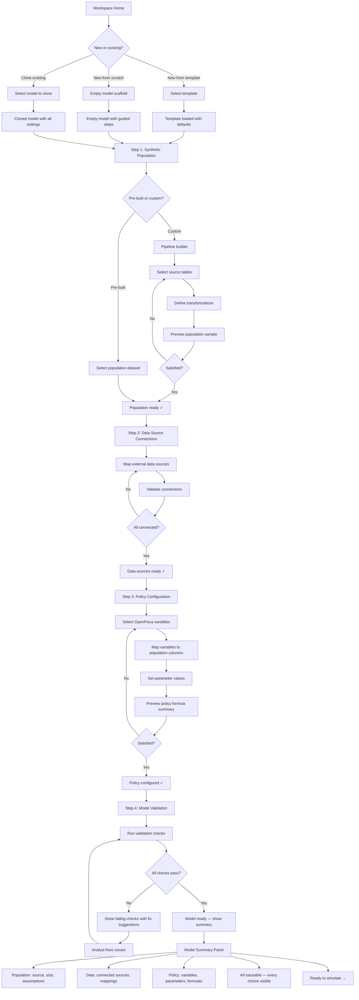
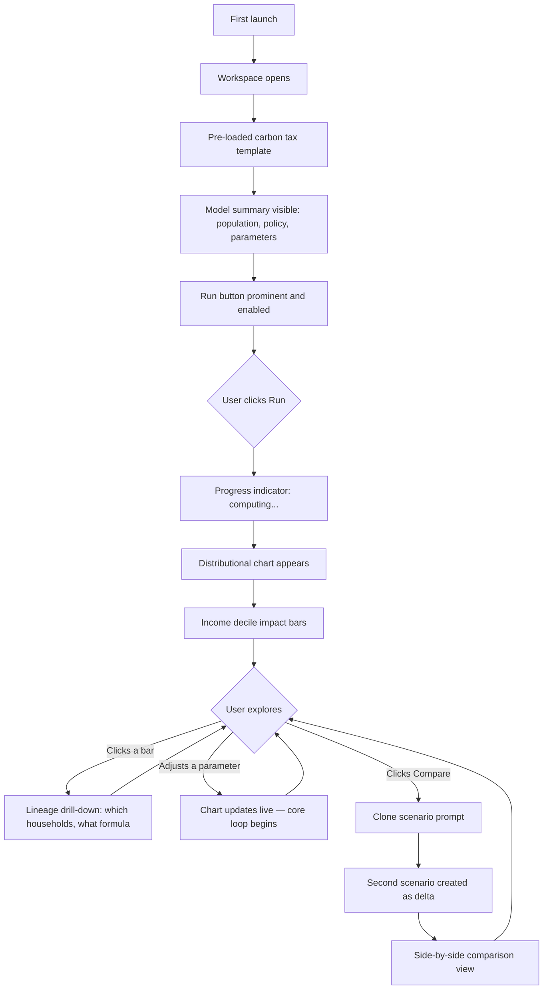
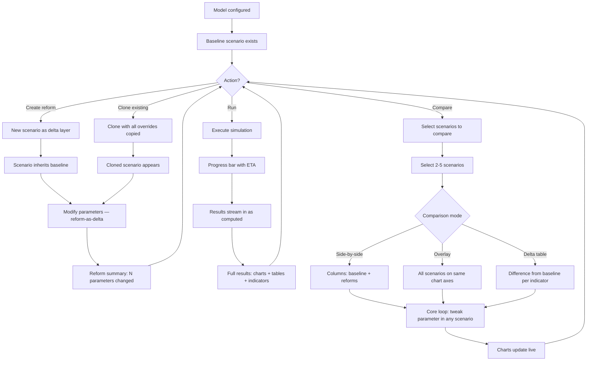
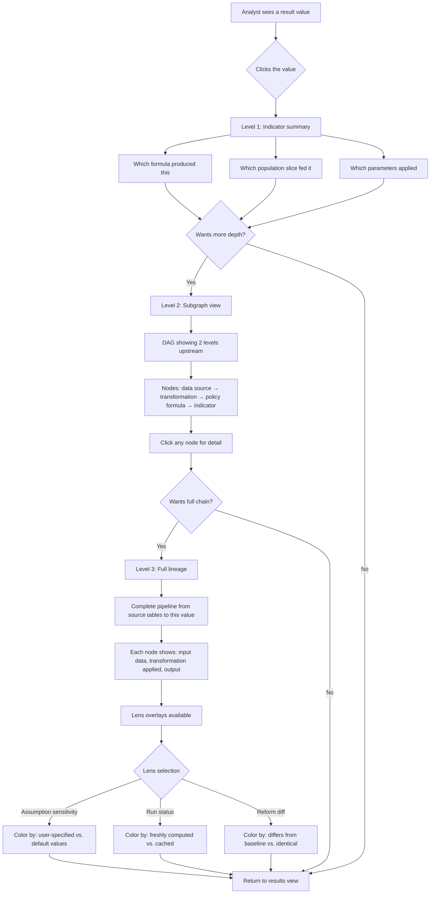
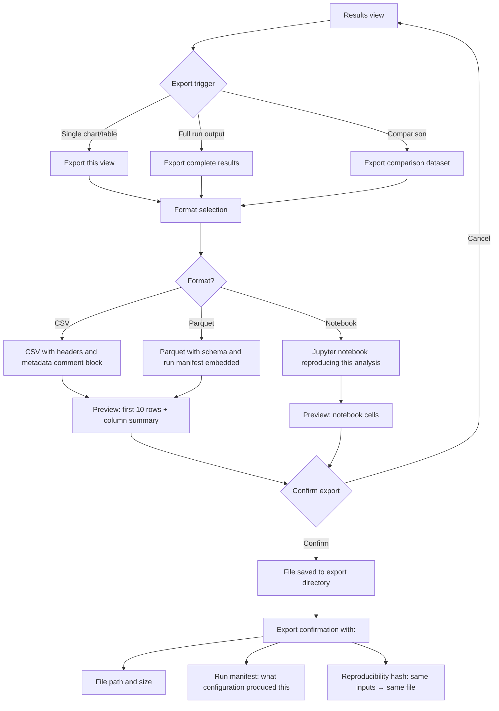

# UX Design Specification ReformLab

**Author:** Lucas
**Date:** 2026-02-24

---

<!-- UX design content will be appended sequentially through collaborative workflow steps -->

## Strategic Direction Update (2026-02-24)

UX scope now assumes:

- OpenFisca provides baseline policy calculations.
- ReformLab UX focuses on no-code scenario operations, dynamic (10+ year) projections, and transparent run governance.
- MVP prioritizes analyst workflow UX before public citizen-facing UX.

## Executive Summary

### Project Vision

ReformLab is an OpenFisca-first analyst product for environmental policy assessment. The MVP centers on carbon-tax and subsidy scenarios for French households, featuring OpenFisca baseline integration, template-driven scenario setup, dynamic year-by-year projections with vintage effects, and reproducible indicator outputs. The product offers two core interfaces: no-code workflow for analysts and notebook/API workflow for researchers. Public-facing UX remains post-MVP.

### Target Users

**Sophie (Applied Policy Analyst)** — Works at France's Ministry of Ecological Transition. Comfortable with Python but frustrated by rebuilding infrastructure for every policy assessment. Needs fast distributional charts and automatic methodology documentation. Primary interface: no-code scenario workspace with optional advanced config editing.

**Marco (Academic Researcher)** — University economist publishing on carbon tax incidence and behavioral responses. Wants to plug in his own elasticities and export complete replication packages for journal appendices. Primary interface: Python API + Jupyter notebooks.

**Claire (Engaged Citizen)** — Non-technical user who wants to compare candidates' environmental policy proposals on her household. Primary interface: future web application (Phase 3, not MVP).

### Key Design Challenges

1. **Multi-persona coherence** — Sophie uses no-code scenario flows while Marco uses Python notebooks; both must share the same scenario and run-governance concepts.

2. **Making governance usable** — Assumption transparency only matters if users can inspect mappings, scenario versions, and year-to-year state updates quickly.

3. **Configuration complexity vs. no-code usability** — Analysts need fast controls for policy parameters and projection horizon without editing fragile config files.

4. **Dynamic workflow explainability** — Users must understand what changed year to year (especially vintage effects), not just final-year charts.

### Design Opportunities

1. **Scenario workspace as primary UX surface** — A no-code scenario board (baseline, reforms, run status, comparison) can become the analyst "daily cockpit."

2. **Template-driven onboarding** — Carbon-tax and subsidy templates can teach by doing, with guardrailed parameter edits and instant reruns.

3. **Run lineage as trust artifact** — If every output links back to data/version/assumption lineage, trust becomes a visible product feature.

## Core User Experience

### Defining Experience

ReformLab's user experience is built around a **continuous analyst workspace** with two interconnected activity modes:

**Mode 1 — Model Configuration (complex but guided):**
The analyst selects or builds a synthetic population, connects data sources, and defines the policy model. This involves real analytical decisions: which source tables to use, how to construct the synthetic population, what policy parameters to set, and how to map OpenFisca variables. The UX must make this process navigable and transparent — every data manipulation step is tracked and visible so the user can always inspect how the dataset was built and what assumptions were made.

Pre-built synthetic population pipelines and policy templates provide fast-start paths. Customization extends these paths naturally rather than requiring a separate workflow.

**Measurable target:** A returning analyst (Sophie) can configure a new policy model from an existing template in under 15 minutes.

**Mode 2 — Simulation Execution (effortless):**
Once the model is configured, running simulations is a single action. The analyst launches a run, compares scenarios side-by-side, sweeps parameters for sensitivity analysis, and sees distributional charts, welfare tables, and fiscal indicators immediately. No configuration questions, no intermediate steps — push a button, see results.

**These modes are not sequential stages.** The workspace supports fluid movement between them. An analyst runs a simulation, sees unexpected results, inspects the data construction choices, adjusts a parameter or data assumption, and re-runs — all within the same workspace without context switching.

### Platform Strategy

- **GUI-first design:** The GUI is the primary interface for both model configuration and simulation execution. An analyst can complete the full workflow — from synthetic population selection through policy configuration to scenario comparison — without writing code.
- **Code-alongside (MVP scope):** The GUI operates through the same Python API objects used in notebooks. Users can export their current configuration and workflow as a notebook at any point. A live side-by-side code panel is a Phase 2 GUI expansion.
- **Desktop web application:** Browser-based (localhost or hosted), mouse/keyboard primary.
- **Fully offline:** No network calls required for core workflows (NFR13). All data and computation are local.
- **Single-machine target:** 16GB laptop for MVP populations (up to 500k households).

### Effortless Interactions

- **Simulation execution:** Configured model → run → visual results in one click.
- **Scenario comparison:** Select two or more completed runs → side-by-side indicator tables and charts appear automatically.
- **Parameter sweeps:** Select a parameter, define a range, launch sensitivity analysis — results stream in as they complete.
- **Export:** Any table or chart → CSV/Parquet with one action from the GUI or API.

### Critical Success Moments

1. **First distributional chart from zero configuration** — Alex opens the GUI for the first time. A pre-loaded carbon tax template and synthetic population are ready. He clicks Run, sees income-decile impact bars in under 15 minutes. No setup required. This is the "I'm never going back" moment.
2. **Reverse-traceability from results to assumptions** — Sophie clicks on a surprising number in a chart and traces it backward: which policy formula produced it → which population slice fed it → which synthetic data assumptions built that slice → which source tables were used. Trust is earned through this drill-down, not through documentation.
3. **Instant scenario comparison** — Sophie modifies one parameter in a reform scenario, re-runs, and sees the baseline vs. reform comparison update. The speed makes iterative policy analysis feel like a conversation.
4. **Model configuration completion with confidence** — The analyst finishes configuring a custom synthetic population and policy model. The system shows a summary: data sources, assumptions, parameter choices, all traceable. The analyst knows exactly what will be computed before pressing "Run."
5. **Deterministic trust signal** — An analyst re-runs the same configuration and sees identical results. The GUI surfaces this: "Same inputs → same outputs." Reproducibility is visible, not assumed.

### Experience Principles

1. **Zero-configuration first run** — The default state of the GUI when first opened is: pre-loaded carbon tax template, pre-loaded synthetic population, Run button visible. A new user produces their first distributional chart without configuring anything.
2. **Configuration is complex but navigable** — Model setup involves real analytical decisions. The UX guides without hiding complexity. Every step is visible, traceable, and reversible. Target: new model from template in under 15 minutes.
3. **Execution is instant and unquestioned** — Once configured, running simulations, comparisons, and sensitivity sweeps feels like a single action with immediate visual results.
4. **Lineage is the trust moat** — From synthetic population construction through policy configuration to simulation output, the user can trace any number back to its source assumptions. No other tool in this space makes assumptions this visible. Progressive disclosure keeps the default view clean (summary), with full pipeline drill-down on demand. This is the product's competitive differentiator.
5. **Determinism is a UX feature** — "Same inputs → same outputs" is surfaced in the interface, not just a backend guarantee. Reproducibility builds analyst confidence and institutional trust.
6. **GUI-first, code-alongside** — The GUI is the primary design surface for all users. Configuration is exportable as notebooks. Code is always accessible but never required.
7. **Continuous workspace, not staged wizard** — The analyst moves fluidly between configuration and execution. Inspect results, adjust assumptions, re-run — all without leaving the workspace.

## Desired Emotional Response

### Primary Emotional Goals

**Confidence is the core emotion.** Every UX decision in ReformLab should build confidence across four layers:

1. **Confidence in the data** — "I know where this population came from and what assumptions shaped it." The analyst can inspect every step of the synthetic population construction pipeline and every data source connection.
2. **Confidence in the model** — "I understand what policy logic is being applied and can verify it." Policy templates, parameter choices, and OpenFisca mappings are visible and inspectable, not hidden behind abstractions.
3. **Confidence in the results** — "These numbers are correct, reproducible, and defensible to my director." Deterministic execution, run manifests, and benchmark validation make results trustworthy by construction.
4. **Confidence in myself** — "I can do this analysis without calling in a specialist." The GUI guides complex decisions without requiring deep technical expertise, and pre-built templates demonstrate correct patterns.

### Emotional Journey Mapping

| Stage | Current feeling (without tool) | Target feeling (with ReformLab) |
|-------|-------------------------------|--------------------------------------|
| **First discovery** | Skepticism — "another framework that won't work for my use case" | Curiosity — "this looks like it understands my actual workflow" |
| **First run** | Anxiety — "will I spend two hours configuring before seeing anything?" | Surprise — "I clicked Run and got distributional charts from the default template in minutes" |
| **Model configuration** | Overwhelm — "so many scripts to chain, so many assumptions to track manually" | Clarity — "I can see every step, every data source, every assumption — and change any of them" |
| **Seeing results** | Doubt — "is this number right? I can't trace where it came from" | Trust — "I can click any number and trace it back to source assumptions" |
| **When something goes wrong** | Fragility — "I changed one thing and something broke but I don't know what" | Understanding — "the system tells me exactly what failed, why, and what to check" |
| **Returning next time** | Dread — "I have to rebuild everything from scratch again" | Ease — "my previous configurations are here, I can clone and modify in minutes" |

### Micro-Emotions

**Critical confidence signals the UX must reinforce:**

- **Confidence over confusion** — At every decision point in model configuration, the analyst knows what's being asked, what the options mean, and what will happen next. No unexplained jargon, no hidden defaults.
- **Trust over skepticism** — Results are backed by visible lineage. The analyst never has to "just believe" a number — she can always verify it.
- **Accomplishment over frustration** — Completing a configuration or producing a comparison feels like a milestone. The system acknowledges progress and shows what was achieved.
- **Control over anxiety** — Every action is reversible. The analyst can undo parameter changes, revert to a previous scenario version, or re-run from a known good state. Nothing is permanent until explicitly saved.

**Emotions to actively prevent:**

- **Fragility** — The feeling that changing one parameter might break everything. The system must validate configurations before execution and contain errors to the specific failing component.
- **Opacity** — The feeling that something is happening behind the scenes that can't be understood. Every computation, transformation, and assumption is inspectable.
- **Abandonment** — The feeling of being stuck without guidance. Error messages are actionable, configuration guidance is contextual, and the path forward is always visible.

### Design Implications

| Emotional goal | UX design approach |
|---|---|
| Confidence in data | Data pipeline summary panel showing source → transformation → population with drill-down at each stage |
| Confidence in model | Policy configuration shows live preview of what will be computed, with parameter validation before run |
| Confidence in results | Every chart/table cell is clickable for lineage drill-down; deterministic rerun indicator visible |
| Confidence in self | Progressive complexity — start with template defaults, reveal advanced options as the analyst gains familiarity |
| Control over anxiety | Undo/revert available at every step; scenario versioning means nothing is lost; validation runs before execution |
| Trust over skepticism | Run manifests accessible from any result view; benchmark validation status visible for templates |
| Understanding over fragility | Error messages name the exact field/parameter/step that failed, suggest specific fixes, and never show raw tracebacks |

### Emotional Design Principles

1. **Every number is defensible** — If an analyst can't explain a result to their director by tracing it through the interface, the UX has failed. Lineage drill-down is not a power-user feature — it's the core trust mechanism.
2. **Errors build confidence, not destroy it** — When something goes wrong, the system response should increase the analyst's understanding. Clear error identification, specific fix suggestions, and preserved state make errors learning moments rather than setbacks.
3. **Progress is visible and persistent** — The analyst should always know where they are in the workflow, what's been completed, and what's saved. No lost work, no ambiguous state.
4. **Complexity is earned, not imposed** — New users see clean defaults and simple actions. Advanced configuration reveals itself as the analyst explores. The interface never overwhelms on first contact.
5. **Speed reinforces confidence** — Fast execution (seconds, not minutes) is not just a performance feature — it's an emotional signal that the system is working correctly and the analyst is in control.

## UX Pattern Analysis & Inspiration

### Inspiring Products Analysis

**PolicyEngine** (policyengine.org) — Open-source tax-benefit reform simulator

What it does well:
- **Three-column layout** (parameter tree / charts / context sidebar) is proven for expert analytical tools.
- **Reform-as-delta** — reforms are sparse overrides on a baseline, never full copies. The baseline is protected.
- **"Reproduce in Python" tab** — auto-generates executable code from the current GUI state. Strong trust signal for researchers.
- **Waterfall contribution charts** — shows which policy component drives how much of the total outcome. Rare and analytically powerful.
- **URL-encoded state** — every configuration is shareable via link, essential for research collaboration.
- **Household income sweep chart** — shows net income across an earnings range for baseline vs. reform. Uniquely effective at surfacing benefit cliffs and phase-out slopes.
- **Audience-calibrated AI summaries** — ELI5/Normal/Wonk selector with inspectable prompt.

What it gets wrong:
- **No multi-scenario comparison** — compares exactly one reform against one baseline. Comparing two reforms requires two browser tabs. Critical gap for our use case.
- **No reform summary panel** — the user cannot see "your reform changes 4 parameters" at a glance. Must read generated Python code to audit.
- **Data provenance is invisible** — the underlying population dataset (what year, what reweighting method, what assumptions) is not explained in context.
- **No parameter dependency visualization** — changing one tax bracket shows no indication of interactions with related parameters.
- **Opaque computation wait** — shows queue position but no estimated time. Heavy reforms take 20-60 seconds with no progress signal.
- **No scenario family organization** — no way to group related reform variants.

**Scenario Planning Platforms** (Synario, Runway, Pigment)

What they do well:
- **Layer/branch model for scenario isolation** — scenarios are overlays on a protected baseline, never full copies. Prevents drift and corruption that plagues Excel-based workflows.
- **Real-time recalculation** — parameter changes produce instant visual feedback. Eliminates "run and wait" friction.
- **Toggle-based parameter control** (Synario) — on/off switches for binary policy decisions faster than numeric editing.
- **Audit trail** (Runway) — contextual log of who changed what assumption and when, with comments per change.
- **Pivot-by-scenario** (Synario, Anaplan) — any report or chart can be pivoted so the scenario dimension becomes the column axis.

What they get wrong:
- **No year-by-year temporal decomposition** — none show how a scenario diverges from baseline year-by-year with explanation of which assumption drove each year's delta. This is exactly our vintage tracking use case.
- **Governance is an afterthought** — audit trails are buried in settings/log tabs rather than surfaced alongside results.
- **Scenario proliferation** — no taxonomic organization beyond flat named lists. Breaks down above ~10 scenarios.
- **Missing assumption provenance** — tracks who changed a value, not what external data source or methodology version informed it.

**dbt** (data build tool) — Data lineage visualization

What it does well:
- **Click-to-highlight upstream chain** — clicking any output node immediately highlights its full dependency chain in purple, graying out everything irrelevant. Answers "where did this come from?" in one click.
- **Lens overlay system** — recolors the same DAG by different dimensions (test status, materialization type, data freshness) without changing the graph structure. Like switching map layers.
- **Depth-bounded tracing** — `2+my_model` shows exactly 2 levels upstream. The analyst controls investigation scope before expanding.
- **Passthrough vs. transform labeling** — column-level lineage explicitly labels whether data was passed through unchanged or actively transformed. Eliminates need to inspect code.
- **Four-level progressive disclosure ladder:**
  1. Overview (zoomed out, colors only — "are there failures?")
  2. Subgraph (focused context — "what feeds this model?")
  3. Node detail panel (key metadata — "what is this thing?")
  4. Full resource detail with column-level lineage (deep investigation)
- **Lineage diff** — comparing two states color-codes changed (orange), added (green), removed (red) nodes with automatic downstream impact rendering.

### Transferable UX Patterns

**Navigation & Layout:**
- **Three-column shell** (PolicyEngine) — parameter tree / main content / context sidebar. Proven for expert tools. Adapt for: configuration tree / workspace / run context.
- **Continuous workspace** (Figma model) — no page transitions between configure and execute. The workspace is always the same surface with contextual panels.

**Scenario Configuration:**
- **Layer/branch model** (Synario, Runway) — reforms are always delta layers on a protected baseline. Never edit the baseline directly. Never create full copies.
- **Reform summary panel** (gap in PolicyEngine — we fix this) — persistent panel showing "this scenario changes N parameters" with a human-readable list of overrides.
- **Toggle + slider controls** (Synario) — binary policy provisions use on/off switches; continuous parameters use sliders with numeric input.

**Results & Comparison:**
- **Waterfall contribution charts** (PolicyEngine) — show which policy component drives how much of the total outcome. Adopt directly for distributional indicator decomposition.
- **Multi-scenario overlay charts** (Runway, Pigment) — each scenario gets a color; all render on the same axes. Limit to 4-5 scenarios before the view degrades.
- **Side-by-side table columns** (Synario, Simul8) — baseline leftmost, one column per scenario, delta columns optional.

**Lineage & Traceability:**
- **Click-to-highlight upstream chain** (dbt) — clicking any indicator or chart value highlights the full pipeline: indicator formula → simulation step → policy parameter → population segment → data source.
- **Lens overlays for the pipeline DAG** (dbt) — microsimulation-specific lenses: assumption-sensitivity lens (user-specified vs. defaults), run-status lens (executed vs. cached), reform-diff lens (what changed between baseline and reform).
- **Depth-bounded tracing** (dbt) — "show 1 step back" / "show 2 steps back" / "show full chain." Prevents overwhelm.
- **Lineage diff for scenario comparison** (dbt Recce) — color-code pipeline nodes: orange = parameters differ, green = reform-only steps, gray = identical.

**Onboarding:**
- **Template-first start** (all platforms) — pre-built scenario templates onboard by doing. The template teaches the data model implicitly.
- **Zero-configuration first run** (our principle) — combine with PolicyEngine's instant feedback pattern.

### Anti-Patterns to Avoid

1. **Full-copy scenario model** — never let users create scenarios by duplicating the baseline. Creates untracked drift, the dominant failure mode in Excel-based research workflows.
2. **Export-only comparison** — scenario comparison must be live and interactive, not a "generate comparison report" button producing static output.
3. **Governance buried in a log tab** — run provenance must be surfaced contextually alongside results, not hidden in administrative screens.
4. **Opaque computation wait** — show progress indicators with estimated time, not just a spinner or queue position.
5. **Double-duty navigation** (PolicyEngine weakness) — don't use the same panel for both configuration tree and results navigation without a clear mode indicator.
6. **Flat scenario lists** — provide scenario family organization (e.g., "carbon tax at various rates — sensitivity variants") to keep libraries navigable.
7. **Hidden data provenance** — never show a result without making the underlying population dataset version, construction method, and source tables accessible in context.

### Design Inspiration Strategy

**Adopt directly:**
- PolicyEngine's reform-as-delta model and waterfall contribution charts
- dbt's click-to-highlight lineage and four-level progressive disclosure
- Layer/branch scenario isolation from financial planning platforms
- Template-first onboarding from all platforms
- "Reproduce in Python" code bridge from PolicyEngine

**Adapt for our context:**
- dbt's lens overlay system → microsimulation-specific lenses (assumption sensitivity, run status, reform diff)
- dbt's depth-bounded tracing → "show N steps back" for pipeline investigation
- dbt's lineage diff → scenario comparison diff (what changed between baseline and reform)
- Financial platform real-time recalculation → instant for parameter tweaks, async with progress bar for full multi-year runs
- Scenario family grouping → organize by policy type, reform variant, sensitivity test

**Differentiate by addressing known gaps:**
- **Year-by-year temporal decomposition with vintage explanation** — no reviewed platform shows how a scenario diverges from baseline year-by-year with explanation of which vintage effect or parameter change drove each year's delta. This is our core differentiator.
- **Structured assumption provenance as a first-class UI element** — not just "who changed this value" but "what dataset version and methodology informed it."
- **Native multi-scenario comparison** — PolicyEngine's biggest gap. We ship with side-by-side and overlaid comparison for 2-5 scenarios from day one.
- **Reform summary panel** — persistent, human-readable summary of all parameter overrides in the current scenario.

## Design System Foundation

### Design System Choice

**React + Shadcn/ui (Tailwind CSS)** — a copy-paste component library built on Radix UI primitives with Tailwind CSS for styling. This approach provides maximum control over every component while leveraging proven, accessible primitives underneath.

Key characteristics:

- **Own your components**: Shadcn/ui copies component source into your project — no black-box dependency, full customization freedom
- **Tailwind CSS utility-first styling**: Rapid iteration, consistent design tokens, AI-friendly code generation
- **Radix UI accessibility primitives**: WCAG 2.1 AA compliance built into every interaction
- **TypeScript-first**: Strong typing for complex simulation domain objects

### Rationale for Selection

1. **AI-coded workflow alignment** — Tailwind's utility classes and Shadcn/ui's explicit component patterns are highly predictable for AI code generation. The user will rely on AI prompts for implementation, and this stack produces the most consistent AI-generated output across all major coding assistants.

2. **Maximum freedom without vendor lock-in** — Components live in the project, not in node_modules. Every button, dialog, and data table can be modified without forking a library or fighting upstream opinions. This matches the "totally free" principle expressed in the inspiration strategy.

3. **Progressive complexity support** — Simple components (buttons, inputs) work out of the box. Complex simulation-specific components (DAG viewers, parameter editors, run comparison panels) can be built from Radix primitives without fighting a design system's assumptions about what UI should look like.

4. **Confidence-building visual consistency** — Tailwind's design token system (colors, spacing, typography scales) enforces visual consistency automatically, supporting the core emotional goal of confidence through predictable, professional interfaces.

5. **Community and ecosystem** — Largest component ecosystem in React; extensive Tailwind plugin library; strong integration with visualization libraries (React Flow for DAG lineage, Recharts/Nivo for simulation outputs).

### Implementation Approach

**Core Stack:**

- **React 18+** with TypeScript — component framework
- **Shadcn/ui** — base component library (copied into `src/components/ui/`)
- **Tailwind CSS v4** — utility-first styling with design tokens
- **Radix UI** — accessible primitive layer (used by Shadcn/ui internally)

**Specialized Libraries:**

- **React Flow** — DAG visualization for data lineage and pipeline tracking (key differentiator)
- **Recharts or Nivo** — simulation output charts, comparison visualizations
- **TanStack Table** — high-performance data tables for assumption inspection and parameter grids
- **React Hook Form + Zod** — form handling for model configuration with schema validation

**Project Structure:**

```
src/
  components/
    ui/          # Shadcn/ui base components (Button, Dialog, Card, etc.)
    simulation/  # Domain-specific components (ScenarioCard, RunComparison, etc.)
    lineage/     # DAG and lineage visualization components
    layout/      # Shell, navigation, workspace layout
  lib/
    design-tokens.ts  # Extended Tailwind theme configuration
```

**Design-in-code workflow (no Figma required):**

- Sketch rough layouts on paper or whiteboard
- Describe components to AI coding assistant, get working code directly
- Iterate in the browser with hot reload
- Shadcn/ui + Tailwind tokens serve as the design system — no separate design tool needed

### Customization Strategy

**Design Token Layer:**

- Extend Tailwind's default theme with ReformLab-specific tokens: confidence-palette colors (greens for validated, ambers for warnings, blues for information), simulation-state colors, data-quality indicators
- Typography scale optimized for data-dense interfaces: monospace for numbers/IDs, proportional for labels/descriptions
- Spacing scale tuned for dashboard density — tighter than default Shadcn/ui for information-rich panels

**Component Customization Phases:**

- **Phase 1 (MVP)**: Use Shadcn/ui defaults with custom color tokens — minimal visual customization, maximum development speed
- **Phase 2**: Refine component variants for simulation-specific patterns (run-status badges, confidence indicators, lineage node styles)
- **Phase 3**: Full visual identity refinement based on user testing feedback

**AI-Coding Guidelines:**

- All components follow Shadcn/ui's variant pattern (`cva` class variance authority) for consistent AI generation
- Tailwind-only styling — no CSS modules, no styled-components, no inline styles — single pattern for AI to learn
- Component props use TypeScript discriminated unions for simulation domain types, giving AI assistants strong type hints

## Defining Interaction

### The Core Loop

**"Tweak a parameter, see the distributional impact instantly."**

This is ReformLab's defining interaction — the single loop that, if executed perfectly, makes analysts adopt the tool and never go back to spreadsheets. The analyst adjusts a policy parameter (carbon tax rate, subsidy threshold, phase-out slope) and immediately sees who wins, who loses, and by how much across the population.

### User Mental Model

Analysts already think in terms of "change input, see output." Their current tools (Excel, ad-hoc Python scripts, Stata) support this mental model but with high friction: re-run scripts, wait for computation, manually rebuild charts, lose track of which version produced which result.

ReformLab preserves the familiar mental model while removing the friction. The parameter-to-chart loop feels like a conversation with the policy model rather than a batch processing job.

**Key mental model elements:**

- **Parameters are levers** — the analyst thinks of tax rates, thresholds, and phase-out slopes as things they "pull" to see effects. Sliders and numeric inputs match this metaphor directly.
- **Charts are the answer** — distributional bar charts, waterfall decompositions, and comparison tables are how analysts think about policy impact. Results should appear in these familiar forms, not raw data tables.
- **Scenarios are "what if" questions** — each scenario is a question the analyst is asking. The tool should make asking questions fast and comparing answers effortless.

### Success Criteria

| Criterion | Target |
|-----------|--------|
| Parameter change to chart update | < 2 seconds for cached populations, < 10 seconds for full recomputation |
| Analyst understands what changed | Waterfall chart highlights the parameter's contribution to the distributional shift |
| Surprising result is investigable | One click from any chart value to its lineage chain |
| Comparison is immediate | Adjusting a parameter in a reform scenario auto-updates the baseline vs. reform comparison view |
| Loop is repeatable without friction | No "save and re-run" step — the loop is continuous: tweak → see → tweak → see |

### Novel vs. Established Patterns

**Established patterns we adopt:**

- Slider + numeric input for continuous parameters (every data tool does this)
- Bar charts and line charts for distributional output (analyst expectation)
- Side-by-side comparison layout (common in financial planning tools)

**Novel combination that defines us:**

- **Parameter change + instant distributional update + lineage traceability in one continuous surface.** No existing microsimulation tool combines all three. PolicyEngine has parameter-to-chart but no lineage. dbt has lineage but no parameter interaction. Financial planning tools have instant update but no distributional analysis. ReformLab fuses all three into one loop.

**Teaching strategy:** No education needed for the core loop — "move slider, see chart update" is universally understood. Lineage drill-down is discoverable: clickable chart values with a subtle "trace" affordance that reveals depth on demand.

### Experience Mechanics

**1. Initiation:**

- The analyst sees the current scenario's parameter panel (left column in the three-column layout)
- Parameters are grouped by policy domain (tax rates, thresholds, subsidies) with the most commonly adjusted parameters visible by default
- Each parameter shows its current value and the baseline value for reference

**2. Interaction:**

- **Slider drag** for continuous parameters (tax rate: 0-100%) — chart updates live during drag
- **Numeric input** for precise values — chart updates on Enter or blur
- **Toggle switch** for binary provisions (enabled/disabled) — chart updates instantly
- **The reform-as-delta indicator** shows which parameters differ from baseline, always visible

**3. Feedback:**

- **Distributional bar chart** redraws within 2 seconds, highlighting the changed deciles with animation
- **Waterfall contribution panel** shows how much of the distributional shift is attributable to the parameter just changed vs. other reform parameters
- **Delta indicators** on key summary statistics (Gini coefficient, fiscal cost, affected population %) update alongside the chart
- **Confidence signal**: if the result is deterministic (same inputs as a previous run), a subtle "verified" indicator appears

**4. Completion:**

- There is no explicit completion — the loop is continuous. The analyst tweaks, observes, tweaks again.
- When satisfied, the analyst can: name/save the scenario, export results, or clone the scenario to explore a variant
- The workspace preserves the current state automatically — closing and reopening returns to exactly this configuration

### Visual Identity

> For the complete color system, typography, chart palette, and visual style rules,
> see the canonical source: `_bmad-output/branding/visual-identity-guide.md`
>
> This UX spec covers component behavior and interaction patterns only.
> All visual styling decisions are maintained in the visual identity guide.

## User Journey Flows

### Journey 1: Model Configuration

**Goal:** Analyst builds a complete, validated model ready for simulation — synthetic population + data sources + policy configuration.

**Entry point:** Workspace opens with "New Model" or "Clone Existing Model" options. Pre-built templates (carbon tax, subsidy) are prominently displayed as fast-start paths.



**Key UX decisions:**

- **Progressive steps, not a wizard:** Steps 1-4 are visible as a progress indicator but the analyst can jump between them freely. Completing one step doesn't lock it — they can always go back.
- **Template fast-path:** Templates pre-fill Steps 1-3 with sensible defaults. The analyst can review and modify any default, or accept and go straight to validation.
- **Pipeline visibility:** Every data transformation in the synthetic population builder shows input → transformation → output. The analyst never wonders "what happened to my data."
- **Validation before execution:** The model summary panel at the end is the "confidence checkpoint" — the analyst sees everything that will be computed before pressing Run.

### Journey 2: First-Run Onboarding

**Goal:** Alex (new user) produces a distributional chart in under 15 minutes with zero configuration.

**Entry point:** First launch of the application. No login, no setup wizard.



**Key UX decisions:**

- **No empty state, ever.** The workspace opens with a fully configured model. The Run button works immediately.
- **The template IS the tutorial.** By exploring the pre-loaded model, the analyst learns: what a synthetic population looks like, how parameters are structured, how results appear. No separate tutorial, no tooltip tour.
- **First chart is the hook.** Everything before the first chart is automatic. Everything after is the analyst's curiosity driving exploration.
- **Gentle discovery:** The lineage drill-down and scenario comparison are discoverable (clickable chart elements, visible "Compare" action) but not pushed. The analyst finds them when they're ready.

### Journey 3: Scenario Workspace

**Goal:** Analyst creates, clones, runs, and compares scenarios within the continuous workspace.

**Entry point:** From a configured model (Journey 1 complete) or from the pre-loaded template.



**Key UX decisions:**

- **Baseline is protected.** The baseline scenario cannot be directly edited. All reforms are delta layers. This prevents the #1 failure mode from Excel-based workflows.
- **Reform summary always visible.** A persistent indicator shows "this scenario changes N parameters" with a human-readable list. The analyst always knows what makes this scenario different.
- **Comparison is a view, not a report.** Selecting scenarios to compare switches the main content area to comparison mode. It's not a "generate comparison" action that produces a separate artifact.
- **The core loop lives here.** The parameter-to-chart loop (tweak → see) operates within the scenario workspace. Adjusting a parameter in a reform scenario updates the comparison view in real time.
- **Scenario families:** Scenarios can be grouped (e.g., "carbon tax rate variants — 20, 40, 60, 80 EUR/ton"). Groups are collapsible in the scenario selector. Prevents flat-list proliferation above ~10 scenarios.

### Journey 4: Assumption Inspection (Lineage Drill-Down)

**Goal:** Analyst traces any result back to its source assumptions to verify correctness and build trust.

**Entry point:** Any clickable value in the results view — chart bar, table cell, summary indicator.



**Key UX decisions:**

- **Four-level progressive disclosure** (adapted from dbt):
  1. **Result value** — the number in the chart or table (default view)
  2. **Indicator summary** — one-click popup showing formula, population slice, parameters (Level 1)
  3. **Subgraph** — DAG showing 2 levels upstream with clickable nodes (Level 2)
  4. **Full lineage** — complete pipeline with lens overlays (Level 3)
- **Depth-bounded by default.** The analyst sees 2 levels upstream initially, not the full chain. They expand on demand. This prevents overwhelm.
- **Lens overlays recolor the same DAG** by different dimensions without changing the graph structure. The analyst switches lenses to ask different questions about the same pipeline.
- **Every node is inspectable.** Clicking a DAG node shows: what data came in, what transformation was applied, what data came out. No black boxes.
- **Return is always one click.** From any depth of lineage, the analyst can return to the results view immediately. Exploration is always safe and reversible.

### Journey 5: Export Flow

**Goal:** Analyst exports results as CSV or Parquet for external use (reports, further analysis, sharing).

**Entry point:** Any results view — chart, table, comparison, or full run output.



**Key UX decisions:**

- **One-action export.** From any view, the export action is at most 2 clicks: trigger → confirm. Format defaults to the last-used format.
- **Run manifest always included.** Every export includes metadata about what configuration, parameters, and population produced the result. The analyst never has an orphaned data file without provenance.
- **Notebook export is a first-class option.** "Reproduce in Python" (inspired by PolicyEngine) generates a Jupyter notebook that recreates the exact analysis. This bridges Sophie's GUI workflow with Marco's notebook workflow.
- **Preview before write.** The analyst sees what will be exported (first rows, column summary) before committing. No surprises.
- **Reproducibility hash.** The export includes a hash that proves: re-running the same configuration produces the identical file. Trust by construction.

### Journey Patterns

**Patterns recurring across all five journeys:**

| Pattern | Description | Used in |
|---------|-------------|---------|
| **Progressive disclosure** | Start with summary, reveal depth on demand | Model config (steps), Lineage (4 levels), Scenario comparison (modes) |
| **Validation before action** | Show what will happen, confirm, then execute | Model validation, Export preview, Run summary |
| **Always reversible** | Every action can be undone or returned from | Model config (edit any step), Lineage (return to results), Scenario (clone before editing) |
| **Reform-as-delta** | Changes are sparse overrides, never full copies | Scenario creation, Parameter editing, Model cloning |
| **Provenance attached** | Every output carries metadata about its origin | Export manifest, Run summary, Lineage nodes |
| **Template fast-path** | Pre-built defaults for common operations | Onboarding template, Policy templates, Population datasets |

### Flow Optimization Principles

1. **Minimize clicks to value.** Onboarding: 1 click (Run) to first chart. Export: 2 clicks (trigger + confirm). Scenario creation: 1 click (clone) + parameter tweaks.

2. **Never block the core loop.** Model configuration is the only journey that requires sequential completion. All other journeys can be entered from any workspace state.

3. **Errors are navigation aids, not dead ends.** Every validation failure names the exact issue, suggests a fix, and provides a link to the relevant configuration step. The analyst is never stuck.

4. **State is always preserved.** Closing the browser and reopening returns to exactly the same workspace state. No lost work, no "start over" scenarios.

5. **Journeys compose naturally.** Model config → Run → Inspect lineage → Adjust parameter → Re-run → Compare → Export. The workspace supports this fluid chain without mode switches or page transitions.

## Component Strategy

### Design System Components (Shadcn/ui — used as-is)

These Shadcn/ui components cover standard UI needs with no customization beyond our design tokens:

| Component | Usage in ReformLab |
|-----------|------------------------|
| Button | Run, Export, Clone, Compare actions |
| Input | Numeric parameter values, search fields |
| Select | Dataset selection, format picker, lens selector |
| Slider | Continuous parameter adjustment (tax rates, thresholds) |
| Switch | Binary policy provisions (enabled/disabled) |
| Dialog | Export confirmation, scenario naming, model validation summary |
| Popover | Lineage Level 1 indicator summary (click-to-inspect) |
| Tooltip | Parameter descriptions, icon labels, abbreviated values |
| Card | Scenario cards, result summary cards, DAG node containers |
| Table | Indicator tables, comparison tables, assumption grids |
| Tabs | Comparison modes (side-by-side / overlay / delta), export format tabs |
| Badge | Run status, validation status, reform-delta count |
| Collapsible | Parameter groups, scenario families, panel sections |
| Sheet | Mobile-width panel expansion (side panels on narrow viewports) |
| Separator | Visual section dividers within panels |
| ScrollArea | Long parameter lists, large tables, DAG overflow |
| ResizablePanel | Three-column layout with draggable dividers |
| Command | Quick-action palette (Cmd+K) for scenario search, parameter jump |

### Custom Components

Components not available in Shadcn/ui, designed specifically for ReformLab's domain:

#### ParameterRow

**Purpose:** Dense, inline parameter editing within the left panel. The primary input component for the core loop.

**Anatomy:**

- Label (parameter name, `text-sm font-normal`)
- Current value (`text-sm font-medium mono`, editable inline)
- Baseline value (muted, `text-xs text-slate-400 mono`) — shows what the baseline is when in a reform scenario
- Delta indicator (`sky` badge) — appears only when value differs from baseline
- Unreviewed indicator (`stone` + clock icon) — appears for default values not yet explicitly confirmed

**States:**

- Default: label + value displayed inline
- Hover: subtle background highlight (`bg-slate-50`)
- Editing: blue focus ring, value becomes editable input or slider depending on parameter type
- Modified (reform): `sky` delta badge visible, value in `font-medium`
- Unreviewed: `stone` clock icon, lighter text weight

**Interaction:** Click value to edit inline. For continuous parameters, a slider appears below on click. Enter or blur commits. Esc reverts.

#### ScenarioCard

**Purpose:** Compact card in the left panel's scenario selector representing one scenario.

**Anatomy:**

- Scenario name (editable on double-click)
- Status badge: draft / ready / running / completed / failed
- Delta summary: "3 parameters changed" with expand-to-list
- Last run timestamp
- Actions: Run, Clone, Compare, Delete

**States:**

- Default: compact summary
- Selected: `bg-blue-50` highlight, border accent
- Running: animated status badge, progress percentage
- Failed: `red` border accent, error summary visible

**Variants:**

- Baseline card (protected, no delete action, no delta summary)
- Reform card (full actions, delta summary visible)

#### RunProgressBar

**Purpose:** Shows simulation execution progress with ETA and cancel option.

**Anatomy:**

- Progress bar (percentage complete)
- ETA text ("~8 seconds remaining")
- Current step label ("Computing year 2027...")
- Cancel button

**States:**

- Computing: animated progress bar with step label
- Streaming: results appearing as computed, progress continues
- Complete: bar fills, transitions to results view automatically
- Cancelled: bar stops, partial results available if any

#### LineagePopover (Level 1)

**Purpose:** One-click inspection popup from any result value. The entry point to the lineage drill-down journey.

**Anatomy:**

- Triggering value highlighted with underline affordance
- Popover showing:
  - Formula that produced this value
  - Population slice (count, filter description)
  - Key parameters applied
  - "Explore lineage →" link to Level 2 subgraph

**States:**

- Closed: value shows subtle underline on hover (affordance that it's clickable)
- Open: popover with summary, click outside to dismiss
- Navigating: clicking "Explore lineage" transitions main content to DAG subgraph view

#### LineageDAGView (Levels 2-3)

**Purpose:** React Flow-based DAG visualization showing data pipeline from sources to results.

**Anatomy:**

- DAG canvas with custom nodes (Shadcn/ui Card-based)
- Node types: DataSource, Transformation, PolicyFormula, Indicator
- Edge types: data flow (solid), parameter dependency (dashed)
- Depth controls: "1 level" / "2 levels" / "Full chain" toggle
- Lens selector: assumption sensitivity / run status / reform diff
- Minimap for navigation in large graphs

**Node design (custom React Flow nodes):**

- Each node is a Shadcn/ui Card (`p-2`, `rounded-md`, `border-slate-200`)
- Icon + label + type badge
- Click to expand: shows input/output data summary
- Highlighted state: `violet` border + background when in active lineage chain
- Dimmed state: `opacity-30` when not in active chain (dbt-inspired gray-out)

**Lens overlay behavior:**

- Assumption sensitivity: nodes colored `emerald` (user-specified) vs. `stone` (default)
- Run status: nodes colored `emerald` (fresh) vs. `amber` (cached/stale)
- Reform diff: nodes colored `sky` (differs from baseline) vs. `slate` (identical)

#### WaterfallChart

**Purpose:** Shows which policy component drives how much of the total distributional shift. Adapted from PolicyEngine's waterfall pattern.

**Anatomy:**

- Vertical bars: one per policy component contribution
- Starting bar (baseline value) → intermediate bars (each component's delta) → ending bar (reform value)
- Color coding: positive contributions (`emerald`), negative contributions (`red`)
- Labels: component name + delta value on each bar
- Clickable bars: each links to the relevant policy parameter for the core loop

**States:**

- Static: shows decomposition for current scenario
- Comparison: shows two waterfall stacks side-by-side for two scenarios
- Animated: bars transition smoothly when a parameter changes (150ms ease-out)

#### ComparisonView

**Purpose:** Main content area component for multi-scenario comparison. Hosts three sub-modes.

**Sub-modes (via Tabs component):**

- **Side-by-side:** Columns per scenario with indicator rows. Baseline leftmost. Delta columns optional.
- **Overlay:** All scenarios rendered on the same chart axes. Color-coded per scenario from chart palette.
- **Delta table:** Difference from baseline per indicator. Positive/negative color coding.

**Anatomy:**

- Scenario selector (which scenarios to compare, max 5)
- Mode tabs (side-by-side / overlay / delta)
- Content area adapting to selected mode
- Parameter editing still active — tweaking a parameter in any scenario updates all views live

#### ModelConfigStepper

**Purpose:** Progress indicator for the four-step model configuration journey. Not a blocking wizard — all steps are always accessible.

**Anatomy:**

- Horizontal step bar: Population → Data Sources → Policy → Validation
- Each step shows: icon + label + status (incomplete / complete / has errors)
- Current step highlighted with `blue` accent
- Click any step to navigate directly

**States:**

- Step incomplete: `slate` icon, muted label
- Step complete: `emerald` checkmark icon
- Step has errors: `red` warning icon
- Current step: `blue` accent, expanded content below

#### ExportPreview

**Purpose:** Preview panel shown before confirming an export. Builds confidence that the right data is being exported.

**Anatomy:**

- Format selector (CSV / Parquet / Notebook)
- Preview area: first 10 rows for tabular data, cell outline for notebooks
- Metadata summary: run configuration, population, parameter snapshot
- File size estimate
- Confirm / Cancel buttons

### Component Implementation Strategy

**Build order aligned with journey priority:**

**Phase 1 — Core Loop (Sprint 5, EPIC-6):**

1. Three-column layout shell (ResizablePanel + custom collapse)
2. ParameterRow — the core interaction component
3. ScenarioCard — scenario management in left panel
4. RunProgressBar — execution feedback
5. Basic chart integration (Recharts bar chart for distributional results)
6. ComparisonView (side-by-side mode first)
7. ModelConfigStepper — model configuration navigation

**Phase 1b — Lineage (Sprint 5-6):**

8. LineagePopover (Level 1) — one-click inspection
9. LineageDAGView (Levels 2-3) — React Flow custom nodes
10. WaterfallChart — contribution decomposition

**Phase 2 — Polish:**

11. ComparisonView (overlay + delta modes)
12. ExportPreview
13. Command palette (Cmd+K)
14. Lens overlay system for DAG

**AI-coding component convention:**

- Every custom component lives in `src/components/simulation/`
- Each component is a single `.tsx` file with co-located types
- Props use TypeScript interfaces with JSDoc descriptions (helps AI understand component API)
- All components use Tailwind classes only — no CSS modules
- Storybook stories optional for Phase 2, not MVP

### Implementation Roadmap

| Phase | Components | Dependency | Target |
|-------|-----------|------------|--------|
| Phase 1 | Layout shell, ParameterRow, ScenarioCard, RunProgressBar, basic charts, ComparisonView (side-by-side), ModelConfigStepper | Backend API endpoints for scenarios and runs | Sprint 5 |
| Phase 1b | LineagePopover, LineageDAGView, WaterfallChart | Lineage data model from computation engine | Sprint 5-6 |
| Phase 2 | ComparisonView (all modes), ExportPreview, Command palette, Lens overlays | Core loop stable | Sprint 6+ |

## UX Consistency Patterns

### Action Hierarchy

**Primary actions** (one per view): Filled button, `bg-blue-600 text-white`. Used for the single most important action in the current context.

| Context | Primary action |
|---------|---------------|
| Model configuration | "Validate Model" |
| Scenario workspace | "Run" |
| Comparison view | "Export" |
| Export preview | "Confirm Export" |

**Secondary actions**: Outline button, `border-slate-300 text-slate-700`. Used for supporting actions: Clone, Compare, Add Parameter, Switch Lens.

**Tertiary actions**: Ghost button (no border), `text-slate-500`. Used for navigation and less important actions: Back, Cancel, Collapse Panel.

**Destructive actions**: Outline button with `border-red-300 text-red-600`. Always require confirmation dialog. Used for: Delete Scenario, Remove Data Source, Reset Parameters.

**Icon-only actions**: `ghost` variant with Lucide icon, tooltip required. Used in dense areas: parameter row actions, scenario card actions, table row actions.

**Rule:** Never show two filled (primary) buttons in the same view. If two actions compete for prominence, one is secondary.

### Feedback & State Communication

**Success feedback:**

- Transient toast (bottom-right, auto-dismiss 3 seconds): "Scenario saved", "Export complete", "Model validated"
- Inline indicator: `emerald` checkmark next to the completed item
- No modal dialogs for success — never interrupt the workflow for good news

**Warning feedback:**

- Persistent inline banner (within the relevant panel, not global): `amber` background, warning icon, actionable text
- Example: "3 parameters use default values — review before running" with "Review" link
- Warnings never block actions — the analyst can proceed and address later

**Error feedback:**

- Inline at the source: red border on the failing field + error message below it
- Error message format: **"[What failed]** — [Why] — [How to fix]"
- Example: **"Tax rate out of range** — Value must be 0-100% — Enter a value between 0 and 100"
- Never show raw exceptions, stack traces, or technical error codes
- Errors block only the specific action that failed, never the entire workspace

**Info feedback:**

- Subtle inline text (`text-slate-500`, info icon) for contextual help
- Tooltip on hover for brief explanations
- No info modals or popups unless explicitly triggered by user

**State indicators (always visible, never require interaction to see):**

| State | Visual | Example |
|-------|--------|---------|
| Running | Animated spinner + progress bar | Simulation computing |
| Complete | `emerald` checkmark badge | Run finished |
| Failed | `red` X badge | Run failed |
| Draft | `slate` circle badge | Scenario not yet run |
| Modified | `sky` delta badge | Parameter differs from baseline |
| Unreviewed | `stone` clock icon | Default value not yet confirmed |
| Stale | `amber` warning badge | Cached result from outdated config |

### Error Handling

**Principle:** Every error is a navigation aid. The analyst should finish reading an error message knowing exactly what to do next.

**Validation errors (before execution):**

- Show all failing checks at once, not one at a time
- Each check links to the relevant configuration step
- Model validation summary: "3 issues found" with expandable list
- Analyst can fix in any order, re-validate when ready

**Runtime errors (during execution):**

- Simulation continues for non-fatal errors (e.g., missing value for one household → skip and report)
- Fatal errors stop execution, show partial results if available
- Error message names the exact year/step/household where failure occurred
- "Re-run from last checkpoint" action when possible

**Data errors (missing or invalid data):**

- Highlighted in the data source panel with `red` border
- Error shows: which column, which rows, what's wrong
- Suggest fix: "Column 'income' has 42 null values — fill with median, drop rows, or provide custom value"

### Data Editing Patterns

**Inline editing (parameters, scenario names, values):**

- Click to enter edit mode (or focus via Tab)
- Blue focus ring signals "you are editing"
- Enter or blur = commit change
- Esc = revert to previous value
- No separate "Edit" button — the value itself is the edit target

**Validation during editing:**

- Real-time validation as user types (e.g., range check on tax rate)
- Invalid values: red border + error message appears below the field
- Cannot commit invalid values — Enter is blocked, blur reverts

**Undo/revert:**

- Ctrl+Z undoes the last parameter change (single level for MVP)
- "Reset to baseline" action on any modified parameter (returns to baseline value)
- "Reset all parameters" on scenario level (returns all overrides to baseline)
- No confirmation needed for undo — it's always safe and fast

### Navigation & Panel Management

**Three-column layout behavior:**

- **Left panel (parameters/config):** Always shows current context. Content changes based on active mode (model config steps vs. scenario parameters).
- **Main content (results/charts):** Shows the primary output. Adapts to current action (single scenario results, comparison view, lineage DAG).
- **Right panel (context/metadata):** Shows supporting information for whatever is selected in main content. Auto-updates when selection changes.

**Panel collapse:**

- Click panel header toggle or use keyboard shortcut (`Cmd+[` left, `Cmd+]` right)
- Collapsed state: 48px icon rail showing section icons
- Hover on collapsed rail: panel expands temporarily as overlay
- Click on collapsed rail: panel expands permanently
- Panel state persisted per session

**Navigation within panels:**

- Scroll within panels independently (each panel has its own ScrollArea)
- No page-level navigation changes — the workspace is always the same URL
- Back/forward browser buttons have no effect (single-page workspace)
- Cmd+K opens command palette for quick navigation: jump to any parameter, scenario, or view

**Breadcrumb pattern (for lineage drill-down only):**

- When drilling into lineage (Levels 2-3), a breadcrumb appears above the main content: "Results > Gini Coefficient > Lineage > Full Chain"
- Each breadcrumb segment is clickable to return to that level
- "X" button returns directly to results view from any depth

### Loading & Progress Patterns

**Instant operations (< 200ms):** No loading indicator. Parameter edits, panel toggles, tab switches, tooltip shows. Feels instant.

**Fast operations (200ms - 2s):** Skeleton loader in the affected area only. Chart redraws, comparison recalculations, lineage popup loading. A subtle placeholder appears where the content will be.

**Slow operations (2s - 30s):** RunProgressBar component. Full simulation runs, model validation, large exports. Shows: progress percentage, current step, ETA, cancel button.

**Very slow operations (30s+):** Same as slow, but with additional context: "This is a large population (500k households). Estimated time: ~45 seconds." The analyst can continue working in other panels while the computation runs.

**Rule:** Never show a full-page spinner. Loading is always scoped to the component or panel that's waiting. The rest of the workspace remains interactive.

**Optimistic updates:** Parameter changes optimistically update the UI (slider position, value display) before the chart recomputes. If recomputation fails, the parameter reverts with an error message.

## Responsive Design & Accessibility

### Responsive Strategy

**Desktop-only for MVP.** ReformLab is an analytical workstation used on laptops and desktop monitors. There is no mobile or tablet use case for policy microsimulation analysis.

**Target viewports:**

| Viewport | Width | Layout behavior |
|----------|-------|----------------|
| Large desktop | 1920px+ | All three columns open, generous main content area |
| Standard desktop | 1440-1919px | All three columns open, comfortable density |
| Laptop | 1366-1439px | Side panels auto-collapse to 48px icon rails |
| Small laptop | 1280-1365px | Side panels collapsed by default, main content fills width |
| Minimum supported | 1280px | Below this, the workspace is not optimized (warning shown) |

**No mobile or tablet layouts.** If accessed on a device < 1280px, a message displays: "ReformLab is designed for desktop use. Please use a laptop or desktop browser for the best experience."

### Breakpoint Strategy

**Tailwind breakpoint mapping:**

```css
sm: not used (mobile)
md: not used (tablet)
lg: 1280px — minimum supported, panels collapsed
xl: 1440px — full three-column layout
2xl: 1920px — generous spacing, large charts
```

**Breakpoint behavior:**

- `xl` and above: three columns open by default, standard component spacing
- `lg` to `xl`: side panels auto-collapse to icon rails, main content fills available space
- Below `lg`: unsupported viewport warning

**No mobile-first approach.** The CSS is written desktop-first since the product has no mobile use case. Tailwind's responsive prefixes are used only for the laptop collapse behavior (`xl:` for full layout, `lg:` for collapsed layout).

### Accessibility Strategy

**Compliance level: WCAG 2.1 AA.**

This is the industry standard for professional web applications. It covers the accessibility needs of most users without the exceptional requirements of AAA compliance.

**What AA compliance means for ReformLab:**

| Requirement | Implementation |
|-------------|---------------|
| Color contrast 4.5:1 (text) | Tailwind color scales 500-900 on light backgrounds; verified by design token selection |
| Color contrast 3:1 (large text/UI) | All interactive borders and icons meet 3:1 minimum |
| Color not sole indicator | Every state uses color + icon or color + label (defined in Visual Foundation) |
| Keyboard navigable | All interactive elements reachable and operable via keyboard (Radix UI provides this) |
| Focus visible | Blue focus ring (`ring-2 ring-blue-500`) on all focusable elements |
| Screen reader support | Semantic HTML + ARIA labels from Radix UI primitives |
| Text resizable to 200% | Layout uses relative units (`rem`, `%`); tested at 200% browser zoom |
| No seizure-inducing content | Chart animations are 150ms (well under flicker threshold); respect `prefers-reduced-motion` |

**Accessibility beyond compliance:**

- **Chart data as tables:** Every chart has a hidden accessible table with the same data, surfaced for screen readers. A "View as table" toggle is visible for all users who prefer tabular data.
- **Monospace for data:** Using IBM Plex Mono for numbers ensures digit alignment and readability for users with dyslexia or visual processing differences.
- **High contrast mode:** Respects OS-level `prefers-contrast: more` media query. Increases border weight from 1px to 2px, darkens text to `slate-900`, and increases badge contrast.

### Testing Strategy

**Automated testing (integrated into CI):**

- **axe-core** via `@axe-core/react` — automated WCAG AA audit on every component render during development
- **eslint-plugin-jsx-a11y** — catches accessibility issues at lint time (missing alt text, invalid ARIA)
- **Lighthouse CI** — accessibility score checked on every build, minimum threshold 90/100

**Manual testing checklist (before each sprint release):**

- [ ] Tab through entire workspace — all interactive elements reachable in logical order
- [ ] Verify focus ring visible on every focusable element
- [ ] Navigate parameter editing with keyboard only (Tab, Enter, Esc, Arrow keys)
- [ ] Run VoiceOver (macOS) through core journey: open workspace → run simulation → inspect result
- [ ] Test at 200% browser zoom — no content clipping, no horizontal scroll
- [ ] Test with `prefers-reduced-motion: reduce` — no animations
- [ ] Test with `prefers-contrast: more` — enhanced borders and text contrast
- [ ] Verify all chart data accessible via "View as table" toggle

**Color blindness validation:**

- Test chart color palette with Sim Daltonism or similar tool
- Verify all chart scenarios distinguishable under protanopia, deuteranopia, and tritanopia
- Confirm state indicators (emerald/amber/red) remain distinguishable — our icon+color pattern ensures this

### Implementation Guidelines

**For AI-assisted development — include in every component prompt:**

1. **Semantic HTML first.** Use `<button>` not `<div onClick>`. Use `<nav>`, `<main>`, `<aside>` for layout regions. Use `<table>` for tabular data, never CSS grid pretending to be a table.

2. **ARIA from Radix.** Don't add custom ARIA attributes — Shadcn/ui + Radix UI handle this. Only add `aria-label` when the visual label is insufficient (e.g., icon-only buttons).

3. **Keyboard patterns.** Every custom component must support: Tab (enter), Escape (exit/cancel), Enter (confirm/activate), Arrow keys (navigate within). Shadcn/ui components already do this.

4. **Focus management.** When a dialog opens, focus moves to the dialog. When it closes, focus returns to the trigger. When a panel collapses, focus moves to the collapse toggle. Radix UI handles this for standard components.

5. **Relative units everywhere.** `rem` for font sizes and spacing, `%` or `fr` for layout widths. Never `px` for text. `px` acceptable only for borders (1px) and very specific spacing (the 48px icon rail).

6. **Test at zoom.** After implementing any layout, test at 200% browser zoom. If content clips or requires horizontal scroll, fix the layout.
