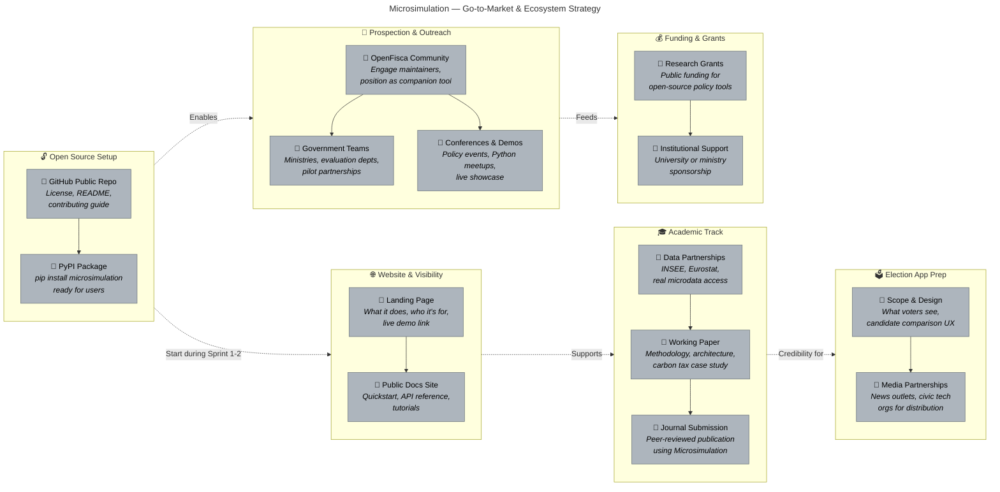

# Microsimulation — Go-to-Market & Ecosystem Strategy

**Author:** Lucas
**Date:** 2026-02-25
**Purpose:** Parallel activities alongside product development — visibility, credibility, adoption, and funding

---

## Legend

- ✅ **Done** — Completed step
- 🔨 **In Progress** — Currently active (update colors as work begins)
- 🔲 **Not Started** — Upcoming work

---

---

## Timing Guide

| When | Product Track | Go-to-Market & Ecosystem |
|------|--------------|--------------------------|
| **Now** | Planning complete, ready to build | Set up GitHub repo, start OpenFisca community conversations |
| **Sprints 1-3** | Building the core engine | Landing page, open-source scaffolding, working paper draft |
| **Sprints 4-6** | Indicators, GUI, pilot | Government outreach with demo-ready product, grant applications |
| **Post Phase 1** | External pilot validated | Conference submissions, journal paper, data partnership asks |
| **Phase 2-3** | Behavioral layer, web UI | Election app groundwork, media partnerships |
