```mermaid
---
title: Microsimulation — Product Delivery Roadmap
---
flowchart TD
    classDef done fill:#2d6a4f,stroke:#1b4332,color:#fff
    classDef upcoming fill:#adb5bd,stroke:#6c757d,color:#000
    classDef milestone fill:#457b9d,stroke:#1d3557,color:#fff

    BS["✅ Brainstorming<br><i>51 ideas explored across<br>5 creative techniques</i>"]:::done
    DR["✅ Domain Research<br><i>Existing frameworks, gaps,<br>and what's missing today</i>"]:::done
    TR["✅ Technical Research<br><i>Data modeling, vectorized<br>engines, architecture options</i>"]:::done

    PB["✅ Product Brief<br><i>Vision, personas, MVP scope,<br>phased roadmap defined</i>"]:::done
    PIVOT["✅ Strategic Pivot<br><i>Drop custom engine →<br>Build on top of OpenFisca</i>"]:::done

    PRD["✅ Product Requirements<br><i>35 features, 21 quality<br>rules, success criteria</i>"]:::done
    UX["✅ UX Design Spec<br><i>Analyst workspace, templates,<br>run governance flows</i>"]:::done
    ARCH["✅ Architecture<br><i>Adapter pattern, step pipeline,<br>vintage tracking design</i>"]:::done
    REVIEW["✅ Stakeholder Brief<br><i>Decision-ready summary<br>for reviewers</i>"]:::done

    BKL["✅ Implementation Backlog<br><i>7 epics, 37 stories,<br>6-sprint delivery plan</i>"]:::done
    READY["✅ Readiness Check<br><i>All planning validated,<br>green light to build</i>"]:::done

    S1["🔲 Sprint 1 · Foundation<br><i>OpenFisca adapter, data<br>ingestion, first templates</i>"]:::upcoming
    S2["🔲 Sprint 2 · Scenarios<br><i>Carbon tax & subsidy packs,<br>orchestrator skeleton</i>"]:::upcoming
    S3["🔲 Sprint 3 · Engine<br><i>Multi-year projections,<br>vintage tracking, governance</i>"]:::upcoming
    S4["🔲 Sprint 4 · Insights<br><i>Impact indicators, scenario<br>comparison, Python API</i>"]:::upcoming
    S5["🔲 Sprint 5 · Interfaces<br><i>Notebooks, no-code GUI,<br>performance benchmarks</i>"]:::upcoming
    S6["🔲 Sprint 6 · Ship It<br><i>Reproducibility checks,<br>pilot package, sign-off</i>"]:::upcoming

    M1(["🏁 Phase 1 Complete<br><i>External pilot validated</i>"]):::milestone
    M2(["🏁 Phase 2 · Expand<br><i>Behavioral responses,<br>advanced populations, CLI</i>"]):::milestone
    M3(["🏁 Phase 3 · Platform<br><i>Election app, web UI,<br>cloud scaling</i>"]):::milestone
    M4(["🏁 Phase 4 · Ecosystem<br><i>Community templates,<br>multi-country, AI assist</i>"]):::milestone

    BS --> DR
    BS --> TR
    DR --> PB
    TR --> PB
    PB --> PIVOT
    PIVOT --> PRD
    PIVOT --> ARCH
    PRD --> UX
    PRD --> ARCH
    UX --> REVIEW
    ARCH --> REVIEW
    REVIEW --> BKL
    BKL --> READY
    READY --> S1
    S1 --> S2 --> S3 --> S4 --> S5 --> S6
    S6 --> M1
    M1 --> M2 --> M3 --> M4
```

# Microsimulation — Product Delivery Roadmap

**Author:** Lucas
**Date:** 2026-02-25
**Purpose:** Full product journey from ideation through Phase 1 build and future phases

---

## Legend

- ✅ **Done** — Completed step
- 🔨 **In Progress** — Currently active (update colors as work begins)
- 🔲 **Not Started** — Upcoming work
- 🏁 **Milestone** — Major delivery checkpoint

---

