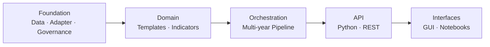

ReformLab welcomes contributions — from policy scenario templates to new computation adapters, indicators, and documentation improvements. Here is how the project is structured and how to get started.



---

## Dev Setup

```bash
git clone https://github.com/reformlab/ReformLab.git
cd ReformLab
uv sync --all-extras
cd frontend && npm install
```

For full setup details and the code of conduct, see [CONTRIBUTING.md](https://github.com/reformlab/reformlab/blob/master/CONTRIBUTING.md).

---

## Quality Checks

All checks must pass before submitting a pull request.

```bash
# Backend
uv run ruff check src/ tests/
uv run mypy src/
uv run pytest

# Frontend
cd frontend
npm run typecheck
npm run lint
npm test
```

---

## What to Contribute

| Area | Where to look |
|------|--------------|
| Policy templates | `src/reformlab/templates/packs/` — add a new YAML pack + `compute.py` |
| Computation adapters | `src/reformlab/computation/` — implement the `ComputationAdapter` protocol |
| Indicators | `src/reformlab/indicators/` — implement a new indicator type |
| Data source loaders | `src/reformlab/population/loaders/` — implement `DataSourceLoader` |
| REST API routes | `src/reformlab/server/routes/` — add a FastAPI router |
| Frontend screens | `frontend/src/components/screens/` — add a React screen |
| Documentation | `docs/src/content/docs/` — edit or add MDX pages |

---

## Adding a Data Source Loader

To add a new institutional data source (e.g., a national statistics agency), create a loader module in `src/reformlab/population/loaders/`. Every loader follows the same pattern:

**1. Define a dataset catalog** — a frozen dataclass with the download URL, column rename mapping, encoding, separator, and null markers:

```python
@dataclass(frozen=True)
class MyProviderDataset:
    dataset_id: str
    description: str
    url: str
    columns: tuple[tuple[str, str], ...]  # (raw_name, project_name)
    encoding: str = "utf-8"
    separator: str = ","

MY_CATALOG: dict[str, MyProviderDataset] = {
    "dataset_name": MyProviderDataset(
        dataset_id="dataset_name",
        description="What this dataset contains",
        url="https://...",
        columns=(("RAW_COL", "project_col"), ...),
    ),
}
```

**2. Define the PyArrow schema** — the expected output types after column renaming:

```python
def _dataset_schema() -> pa.Schema:
    return pa.schema([
        pa.field("project_col", pa.float64()),
        ...
    ])
```

**3. Implement the loader** — extend `CachedLoader`, override `schema()` and `_fetch()`:

```python
class MyProviderLoader(CachedLoader):
    def schema(self) -> pa.Schema:
        return _DATASET_SCHEMAS[self._dataset.dataset_id]

    def _fetch(self, config: SourceConfig) -> pa.Table:
        # Download bytes, parse CSV, rename columns, return pa.Table
        ...
```

The `CachedLoader` base class handles caching, offline mode, and stale-cache fallback automatically. Your `_fetch()` only needs to handle the network download and CSV parsing.

**4. Add factory functions** — `get_*_loader()` and `make_*_config()` for discoverability.

**5. Export from `__init__.py`** — add your loader, catalog, and factories to `src/reformlab/population/__init__.py`.

See `loaders/insee.py` for a complete reference implementation (ZIP extraction, encoding fallback, null markers).

---

For the full contribution workflow, review checklist, and branch naming conventions, see [CONTRIBUTING.md on GitHub](https://github.com/reformlab/reformlab/blob/master/CONTRIBUTING.md).
