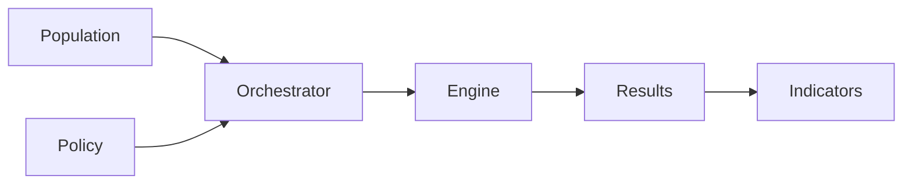

ReformLab is built around six core objects that work together to produce distributional impact analysis. Each object has a clear role in the simulation pipeline.



---

## Population

A population is a dataset of representative households — their income, housing type, vehicle ownership, energy consumption, and demographic characteristics. ReformLab works with synthetic populations built from public data sources (INSEE, Eurostat, ADEME, SDES). You can use a ready-made sample or generate a custom population by fusing multiple data sources through the data fusion workbench. Each household in the population is a unit that flows through the entire simulation pipeline.

<details>
<summary>How it works in code</summary>

Populations are stored as PyArrow Tables keyed by entity type (`individu`, `menage`). The `PopulationPipeline` composes data source loaders and statistical merge methods into a reproducible generation workflow.

```python
@dataclass(frozen=True)
class PopulationData:
    tables: dict[str, pa.Table]              # entity_type -> households
    metadata: dict[str, Any] = field(default_factory=dict)
```

Data sources implement the `DataSourceLoader` protocol; merge strategies implement `MergeMethod`. Four institutional loaders are available: `INSEELoader`, `EurostatLoader`, `ADEMELoader`, `SDESLoader`.

</details>

---

## Policy

A policy defines the reform being evaluated — tax rates, exemptions, thresholds, and redistribution rules. ReformLab provides templates for common instruments: carbon tax, energy subsidy, rebate, feebate, vehicle malus, and energy poverty aid. You configure a template by adjusting its parameters, or combine multiple policies into a portfolio to simulate package deals. Conflict detection flags overlapping parameters so you know when two policies interact.

<details>
<summary>How it works in code</summary>

Policies are built from a `PolicyParameters` base with typed subclasses for each instrument. A `PolicyPortfolio` bundles 2+ policies together with conflict resolution strategies.

```python
@dataclass(frozen=True)
class PolicyParameters:
    rate_schedule: dict[int, float]             # year → EUR/tonne
    exemptions: tuple[dict[str, Any], ...] = ()
    thresholds: tuple[dict[str, Any], ...] = ()
    covered_categories: tuple[str, ...] = ()

# Specializations:
# CarbonTaxParameters, SubsidyParameters, RebateParameters,
# FeebateParameters, VehicleMalusParameters, EnergyPovertyAidParameters
```

Scenarios are version-tracked: each save creates a new immutable version via `ScenarioRegistry`.

</details>

---

## Orchestrator

The orchestrator is ReformLab's coordination layer — it runs your simulation year by year over the projection horizon. For each year, it feeds the current household state through a pipeline of steps: compute taxes, model behavioral responses (e.g., vehicle switching), age asset cohorts, and carry state forward to the next year. The result is a complete multi-year trajectory showing how households evolve under the policy.

<details>
<summary>How it works in code</summary>

The `Orchestrator` runs a pipeline of `OrchestratorStep` instances for each year. Steps are pluggable — any class with `name` and `execute(year, state)` satisfies the protocol.

```python
# Simplified pipeline for one year:
# state₀ → ComputationStep → DiscreteChoiceStep → VintageStep → CarryForward → state₁

@runtime_checkable
class OrchestratorStep(Protocol):
    @property
    def name(self) -> str: ...
    def execute(self, year: int, state: YearState) -> YearState: ...
```

Built-in steps: `ComputationStep`, `DiscreteChoiceStep`, `VintageTransitionStep`, `CarryForwardStep`, `PortfolioComputationStep`.

</details>

---

## Engine

The engine is the computation backend that calculates household-level taxes and benefits for a given policy and year. ReformLab uses OpenFisca France by default, but it is designed to work with other tax-benefit calculators without changing how you run scenarios. You do not interact with the engine directly; the orchestrator calls it automatically for each simulation year.

<details>
<summary>How it works in code</summary>

The engine is accessed through the `ComputationAdapter` protocol — a two-method contract. The orchestrator only sees this protocol, never OpenFisca directly.

```python
@runtime_checkable
class ComputationAdapter(Protocol):
    def compute(
        self, population: PopulationData, policy: PolicyConfig, period: int
    ) -> ComputationResult: ...
    def version(self) -> str: ...
```

`OpenFiscaApiAdapter` is the production implementation. `MockAdapter` provides a test double for orchestrator tests without requiring a live OpenFisca instance.

</details>

---

## Results

Results are the raw output of a simulation — a household-by-year panel dataset capturing every computed variable for every household across every year of the projection. Results are stored on disk as Parquet files and cached in memory for fast access. Each result is tied to a run manifest that records every parameter, seed, and input hash needed to reproduce it exactly.

<details>
<summary>How it works in code</summary>

The main output type is `PanelOutput` — a PyArrow Table with one row per household-year combination. Results are persisted in two tiers: an in-memory LRU cache (`ResultCache`) and a filesystem store (`ResultStore`).

```text
~/.reformlab/results/{run_id}/
├── metadata.json     # Status, row count, manifest ID
├── panel.parquet     # Household-by-year panel (PyArrow)
└── manifest.json     # Full run manifest (seeds, hashes, assumptions)
```

`get_or_load(run_id, store)` checks the cache first, then falls back to disk. Results survive server restarts.

</details>

---

## Indicators

Indicators are the analytics computed from simulation results — they transform raw panel data into meaningful policy metrics. ReformLab computes distributional indicators (per-decile averages, medians, Gini coefficients), fiscal indicators (government revenue, cost, balance), geographic breakdowns, and winner/loser analysis. You can compare indicators across multiple reform scenarios side by side to see which policy performs best on each metric.

<details>
<summary>How it works in code</summary>

Indicators are computed from `PanelOutput` and return `IndicatorResult` — a container holding a sequence of typed indicator objects, metadata, and warnings. Seven indicator types are available:

| Type | What It Computes |
|------|-----------------|
| Distributional | Per-decile metrics (count, mean, median, sum) |
| Geographic | Per-region aggregations |
| Welfare | Winner/loser analysis |
| Fiscal | Revenue, cost, balance, cumulative effects |
| Custom | User-defined formulas over panel columns |
| Comparison | Baseline vs. reform deltas |
| Portfolio | Cross-portfolio ranking on multiple criteria |

</details>

---

## See it in action

The domain model comes alive in the demo application, where you can walk through each concept hands-on — from selecting a population to comparing indicator dashboards.

{/* TODO: update href when app.reformlab.fr is live */}
[Try the demo →](#) or go back to the [getting started guide](/getting-started/) to see the 4-step workflow.
