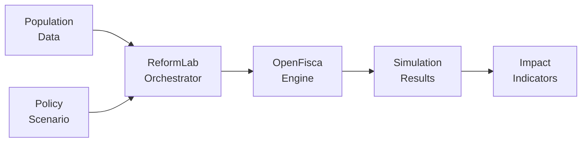

ReformLab connects population data to policy scenarios through OpenFisca, producing distributional impact indicators in minutes — not months.

## How it works

Each box is a core concept you can explore in the [Domain Model](/domain-model/) reference.

## Ready to explore?

{/* TODO: update href when app.reformlab.fr is live */}
See [real-world use cases](/use-cases/) or [try the demo](#).
